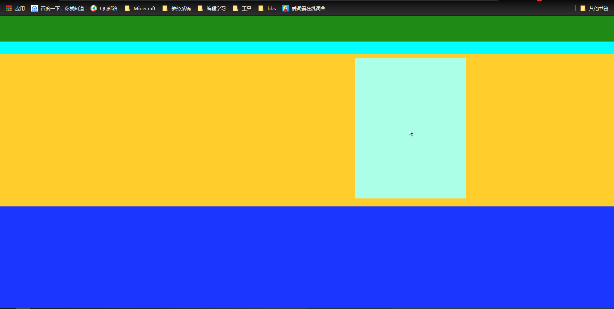

# HTML常用标签

## Head中的子标签

```html
<!--字符集设置-->
<meta charset="utf-8" />
<!--搜索引擎优化-->
<meta name="author" content="朱自清, 李四" />
<meta name="description" content="盼望着盼望着, 东风来了" />
<meta name="keywords" content="盼望, 东风" />

<!--5秒后自动刷新网页-->
<meta http-equiv="refresh" content="5;https:www.baidu.com" />

<!--禁止网页缓存(了解内容)-->
<meta http-equiv="Pragma" content="no-cache"/>
<meta http-equiv="Cache-Control" content="no-cache" />
<!--设置缓存留存时间-->
<meta http-equiv="expires" content="0" />
```

## body中的常用标签

### 标题标签

h1-h6, 自动换行 自动加粗加黑. 可使用align属性调整位置. 默认align=left

### 分割线标签

 默认align居中, 默认换行

#### 可使用属性

width 宽度

size: 垂直方向大小

color: 颜色

```html
<hr width="500px"/>
```

### 段落标签

使用br标签换行, 使用`&nbsp;`表示空格. 默认含有段间距. 一个段落自动换行

```html
<p>
    这是一个段落<br/>
</p>
```

### 预文本标签

灵活性比较大, 一般不使用

```html
<pre>
	这里如果有格式, 那么显示出来就有格式
</pre>
```

## body中常使用的小标签

```html
<u>下划线效果</u>
<i>斜体标签</i>
<b>加粗标签</b>
<del>删除线标签</del>
2<sup>3</sup>  <!--上标签-->
log<sub>2</sub>10 <!--下标签-->
<small>字体变小标签</small>
<big>字体变大标签</big>
<font>字体标签</font><!--可使用color, size, face属性. face属性是指定字体风格-->
<span>行内标签</span>
```

### 列表标签

#### 无序列表

```html
<ol>
    <li>列表项</li>
</ol>
```

#### 有序列表

```html
<ul>
    <li>列表项</li>
</ul>
```

#### 自定义列表

```html
<dl>
    <dt>列表头</dt>
    <dd>列表项</dd>
</dl>
```

#### 作用

1. 树形菜单
2. 导航栏的布局 

### 跑马灯标签

```html
<marquee direction="left" scrollamout="40px">这个一个横向滚动的字体</marquee> <!--向左, 速度40px每秒-->
```

## 超链接标签

不会自动换行

### 超链接标签的作用

1. 实现不同页面之间的跳转
2. 实现锚点功能

```html
<!--跳转到一个网络位置  target打开超链接的位置-->
<a href="http://www.baidu.com" target="_blank">这是一个超链接</a>
<!--跳转到一个本地位置-->
<a href="./xxx">本地位置需要使用相对路径</a>
<!--锚点功能, 使用#加标签name-->
<a href="#">返回顶部</a>
```

## 图片标签

1. src存放图片url路径
2. 图片标签不会自动换行.
3. 之调整一个宽或者一个高的时候, 图片会等比例变化
4. border 图片的边框
5. alt: 图片无法正常显示的时候显示的描述字体
6. align: 在附近需要存在参考元素. 比如字体. 会调整图片相对与字体的位置.

```html

```

## 表格标签

- 表格具有自适应大小的能力
- 默认表格是隐藏的. 需要指定表格边框boder="1px”
- 在表格上指定宽和高一般是不建议的. 因为表格具有自适应的能力. 在指定了表格的宽和高之后. 表格会根据其中的内容, 再次等比例放大和缩小
- 设定表格的宽和高一般是对tr和td进行指定. 对tr指定height, 对td指定width
- 对表格进行align属性指定的时候, 表格会在外部容器中整体剧中.
- 如果需要让表格内部元素居中的话, 需要将align元素指定在tr, 或者td中
- th标题列中, 字体会自动加粗加黑
- cellpadding: 内容和单元格之间的距离. 表格内边距.
- cellspacing: 单元格和单元格之间的距离.
- 列合并使用colspan="合并的列数". 放在td中使用
- 行合并使用rowspan="合并的列数". 放在td中使用
- bgcolor: 可更改背景颜色

```html
<table border="1px">
   	<th><td>这是表格头</td></th>
    <tr><!--这是一行表格-->
        <td>这是一个表格</td>
    </tr>
</table>
```

## 表单标签

- action: 发送信息的服务器地址

- method: 发送信息的方式. 

  get请求发送的参数在url中是可见的(数据长度有限制, 提交数据不安全)

  post会封装成一个数据包. 不可见(数据长度不限)

```html
<!--这是一个表单元素-->
<form action="" method="get">
    <!--普通文本框-->
    <input type="text" name="key1"/>
    <!--密码框-->
    <input type="password" name="pwd"/>
    <!--单选框: 注意, name必须相同才是单选框-->
    男 <input type="radio" name="sex" value="male"/>
    <!--默认被选择-->
    女 <input type="radio" name="sex" checked = "checked" value="female"/>
    <!--多选框-->
    <input type="checkbox" checked="checked" value="1"/>
    <input type="checkboc" value="2"/>
    <!--多行文本框-->
    <textarea row="5" cols="20">
        你好
    </textarea>
    <!--文件选择框-->
    <input type="file" name="file"/>
    <!--隐藏框-->
    <input type="hidden" name="sno" value="2019"/>
    <!--下拉框-->
    <select>
       <option value="1">中国</option>
        <!--此框默认被选择-->
       <option value="2" selected="selected">美国</option>
       <option value="3">日本</option> 
    </select>
    <!--重置按钮-->
    <input type="reset" value="清除"/>
    <!--普通按钮, 没有提交功能-->
    <input type="button" value="提交" />    
    <!--这是一个提交按钮-->
    <input type="submit" value="提交"/>
</form>
```

## 框架标签

`<iframe>`是一个内联框架

```html
<ul>
    <li><a href="https://www.baidu.com" target="ifr">百度</a></li>
    <li><a href="https://www.taobao.com" target="ifr">淘宝</a></li>
    <li><a href="https://www.jd.com" target="ifr">京东</a></li>
</ul>
<!--src是默认打开位置-->
<iframe name="ifr" src="https://www.baidu.com" width="100%" height="600px"></iframe>
```

## 框架集标签

`<frameset>`是一个框架集标签, 是对整个网页进行划分. 不建议使用

```html
<!DOCTYPE html>
<html lang="en">
<head>
    <meta charset="UTF-8">
    <title>frameset框架学习</title>
</head>
<frameset rows="150px,*,100px">
    <!--    noresize标签, 防止用户拖动改变大小  -->
    <frame noresize="noresize">
    <frameset cols="10%, *">
        <frame noresize="noresize" src="admin/left.html">
        <frame noresize="noresize" name="view">
    </frameset>
    <frame noresize="noresize">
</frameset>
</html>
```

## div盒子标签

div标签本身是没有任何意义的. 作用就是把网页进行划分

对网页进行划分

```html
<div class="top"></div>
<div class="waining"></div>
<div class="main">
    <div class="log"></div>
</div>
<div class="bottom"></div>
```

配合css

```css
*{
    margin: 0;
    padding: 0;
}
.top{
    height: 80px;
    width: 100%;
    background-color: #1f8b14;
}
.waining{
    height: 40px;
    width: 100%;
    background-color: aqua;
}
.main{
    height: 476px;
    width: 100%;
    background-color: #ffce2d;
}
.log{
    width: 347px;
    height: 439px;
    background-color: #acffe7;
    position: relative;
    top: 12px;
    left: 1110px;
}
.bottom{
    height: 317px;
    width: 100%;
    background-color: #1b37ff;
}
```

布局出网页如此



