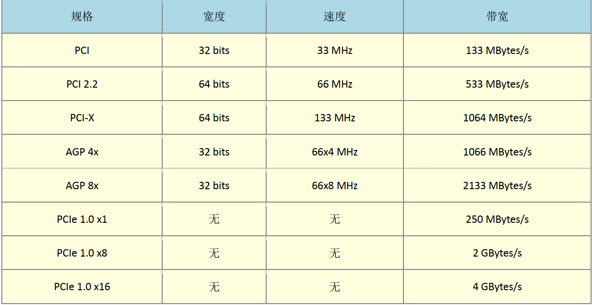
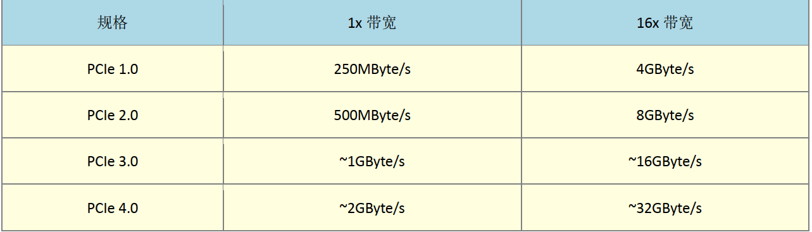

## 计算机硬件概述

### 计算机硬件的五大单元

1. 输入单元: 输入数据. 包括键盘, 鼠标等
2. 输出单元: 显示屏, 打印机等
3. CPU内部的控制单元
4. CPU内部的算数逻辑单元
5. 主存储器

### CPU的架构

#### 精简指令集 RISC

指令精简, 每个指令运行时间短, 但是复杂事情需要多个指令.

例如: 甲骨文(Oracle)的SPARC系列, 通常用于学术的领域, IBM的PowerPC系列, PS3, 安谋公司的ARM CPU系列, 各个厂商的手机, 网络主机等... 世界上使用最广的CPU

#### 复杂指令集 CISC

常见的右AMD Intel  VIA等的x86架构. 被大量用于个人计算机PC. 所以个人计算机又被称为x86计算机, 当然, 现在的64位计算机是x86_64的架构

### 计算机中常用的计算单位

#### 容量单位

计算机中使用的是2进制存储. 0或这1这一个二进制单位就是一个bit, 8bit=1Byte 

- 1Byte = 8 bit
- 1K = 1024Byte
- 1M = 1024K
- 1G = 1024M
- 1T = 1024G
- 1P = 1024T
- 1E = 1024P
- 1Z = 1024E

#### 速度单位

CPU指令使用的是HZ的单位, 一般来说Hz就是秒分之一. 比如MHz, GHz.

网络传输常使用的单位是Mbps, 即每秒多少Mbit. 所以20M宽带, 理论最大传输速度为2.5MByte/s

#### 硬盘最小计量单位

一个硬盘最小的计量单位是扇区Sector, 硬盘的最小物理量为512Byte

### 个人计算机架构

早期的芯片组通常分为两个网桥来控制各个组件的沟通, 分别是: 

- 北桥: 负责链接速度较快的CPU, 主存储器与显示适配器界面等组件
- 南桥: 负责链接速度较慢的接口, 包括硬盘, USB, 网卡等等

不过由于北桥最重要的就是CPU与主存储器之间的桥接, 因此目前的主流架构中, 大多将北桥内存控制器整合到了CPU的封装当中了.

### CPU简述

1. 目前主流的CPU一般是Intel和AMD架构
2. 双核CPU就是一个CPU中有两个运算核心
3. 影响CPU效能的一般看CPU的频率, 当然, 不同CPU不能光靠频率来比较效能. 因为还有微指令的不同, 所以只能用来比较同款的CPU

### 内存

1. 个人计算机的主存储器的主要组件为动态随机存储内存(Dynamic Random Access Memory, DRAM), 通电能用, 断电数据消失.
2. DRAM又分为好多代, 常用的为SDRAM, 和DDR SDRAM两种, DDR就是双倍数据传输速度(Double Date Rate). DDR2是四倍, DDR3是8倍
3. 一般的DDR支持的电压为1.5v, 但是DDR3L支持1.35v. 所以如果再不支持DDR3L的主板中安装, 可能会烧毁

### SRAM

静态随机存储器, 一般用作缓存. 速度比内存快, 但是容量小

### 只读存储器ROM

存储硬件参数, 不同通电就可使用, BIOS就是操作它的一套程序. 主板上有一个额外的电池来作为ROM的电源

### 显示适配器

- 显示适配器又称为VGA(Video Graphics Array)
- 显卡中有一个GPU和一个存储设备

图形接口速率

### 磁盘

机械磁盘一般都是由多个磁盘组成的. 一个磁盘有多个磁道, 一个磁道有多个扇区. 几个磁盘扇面的同一个磁道会形成一个磁柱.

磁盘接口

- SATA接口
- IDE接口(被SATA接口取代)
- SAS接口
- SCSI接口(被SAS接口取代)

