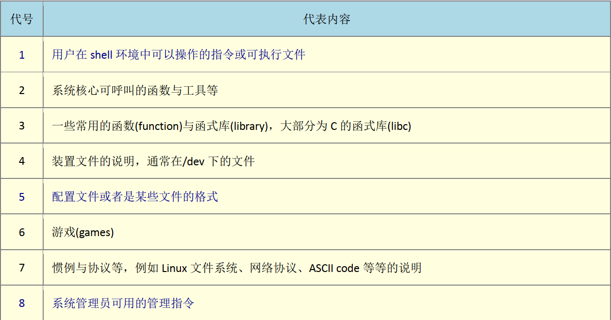
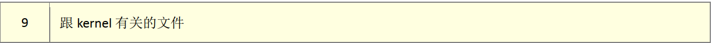
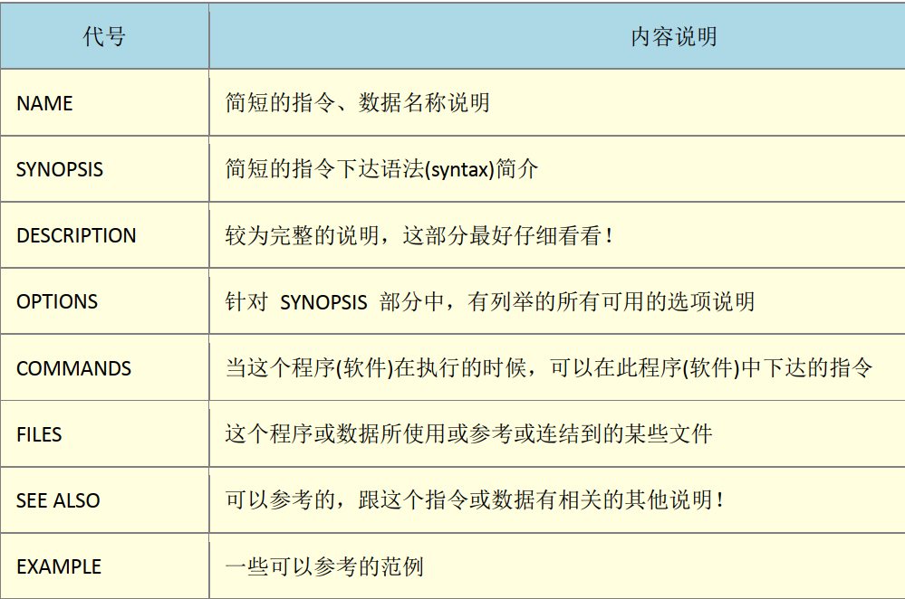
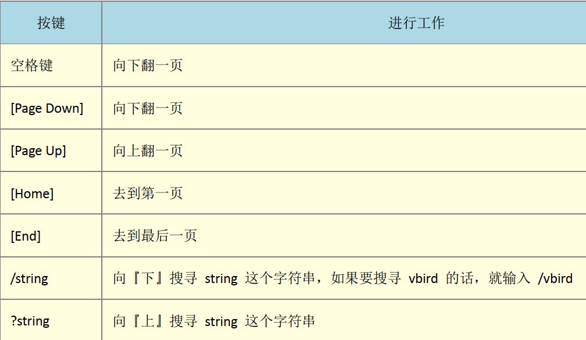
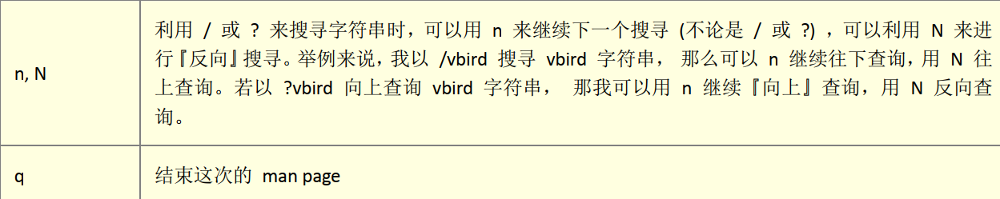
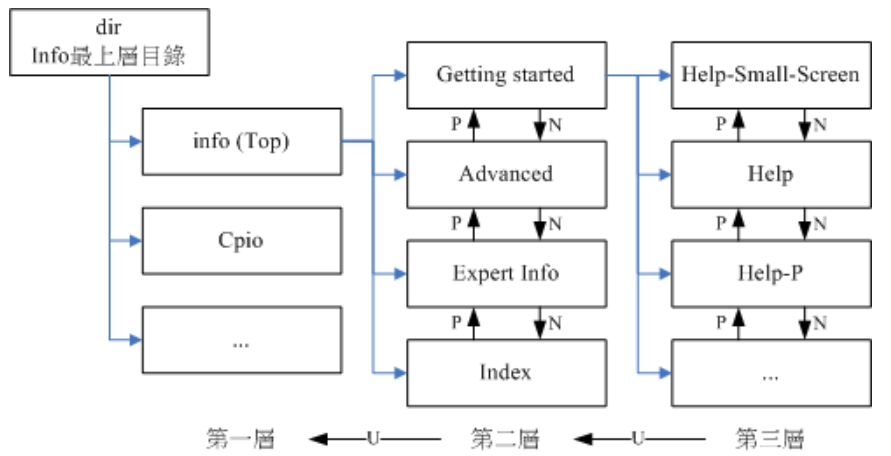
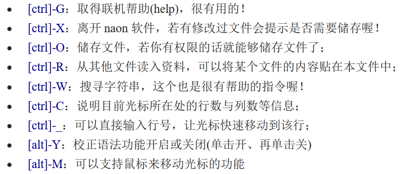
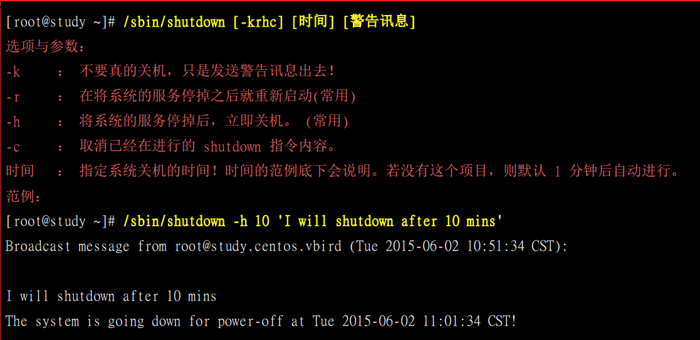
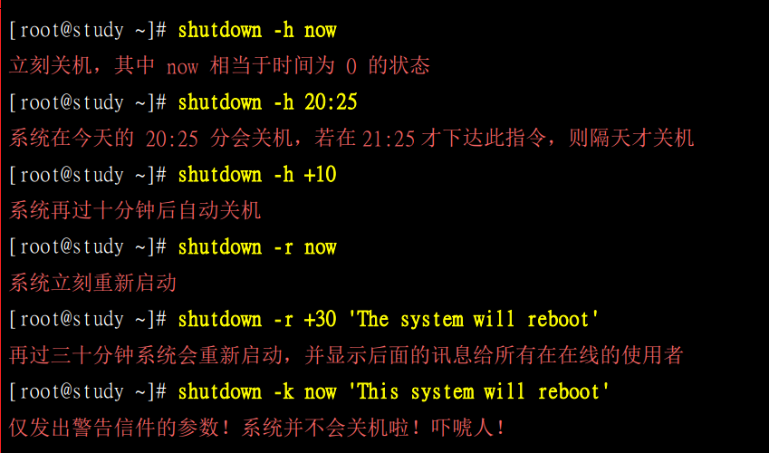

[TOC]

# 基本命令

## 查看目前会话语系和修改

#### 永久修改语系方法: 

修改/etc/locale.conf  使之变成"zh_CN.UTF-8”, 或者修改成英文语系

```shell
[jssd@study ~]$ locale
LANG=zh_CN.UTF-8
LC_CTYPE="zh_CN.UTF-8"
LC_NUMERIC=zh_CN.UTF-8
LC_TIME=zh_CN.UTF-8
LC_COLLATE="zh_CN.UTF-8"
LC_MONETARY=zh_CN.UTF-8
LC_MESSAGES="zh_CN.UTF-8"
LC_PAPER=zh_CN.UTF-8
LC_NAME="zh_CN.UTF-8"
LC_ADDRESS="zh_CN.UTF-8"
LC_TELEPHONE="zh_CN.UTF-8"
LC_MEASUREMENT=zh_CN.UTF-8
LC_IDENTIFICATION="zh_CN.UTF-8"
LC_ALL=
# 修改成英文语系
[jssd@study ~]$ Lang=en_US.UTF-8 # 此选项只能更改输出, 如果其他需要英文环境, 需要同步更改CL_ALL
[jssd@study ~]$ export LC_ALL=en_US.UTF-8
# 只在当前会话有用, 注销登录就会变回去.
```

## 基础指令

### 显示日期

```shell
date
date格式化输出: 
[jssd@study ~]$ date +%Y/%m/%d
2019/09/08
```

### 显示日历

```shell
[jssd@study ~]$ cal 2015
                               2015

       January               February                 March
Su Mo Tu We Th Fr Sa   Su Mo Tu We Th Fr Sa   Su Mo Tu We Th Fr Sa
             1  2  3    1  2  3  4  5  6  7    1  2  3  4  5  6  7
 4  5  6  7  8  9 10    8  9 10 11 12 13 14    8  9 10 11 12 13 14
11 12 13 14 15 16 17   15 16 17 18 19 20 21   15 16 17 18 19 20 21
18 19 20 21 22 23 24   22 23 24 25 26 27 28   22 23 24 25 26 27 28
25 26 27 28 29 30 31                          29 30 31

# cal指令语法
cal [month] [year]
```

### 简单好用的计算器

bc

```shell
+ 加法
- 减法
* 乘法
/ 除法
^ 指数
% 模数

# bc预设输出整数, 如果要输出小数, 那么需要执行scale=number
scale=3
10/100
.100
```

### 联机帮助文档

```shell
date --help
man date
info date
```

#### man指令

```shell
[jssd@study ~]$ man date
DATE(1)                          User Commands                         DATE(1)

NAME
       date - print or set the system date and time

SYNOPSIS
       date [OPTION]... [+FORMAT]
       date [-u|--utc|--universal] [MMDDhhmm[[CC]YY][.ss]]

DESCRIPTION
       Display the current time in the given FORMAT, or set the system date.
```

第一行, 有一个DATE(1), 1代表什么意思呢





上述表格可以通过使用man man指令来查看. 1, 5, 8 这三个比较重要

man page 大致可以分为一下几个部分



man page 常用按键





man page 数据一般情况下存放的位置: /usr/share/man这个目录中. 可修改/etc/man_db.conf(有的版本为man.conf或manpath.conf或man.config)

查看与此指令有关联的说明文件

```shell
[jssd@study ~]$ man -f date
date (1)             - print or set the system date and time
date (1p)            - write the date and time

# 可以看到, 一共有两个说明文件与date相关

# 查看第一个说明文件
man 1 date
# 查看第二个说明文件
man 1p date

# 默认查找数字小的哪个说明文件

# 查看带有指定关键字的说明文件
[jssd@study ~]$ man -k date
config.sub (1)       - validate and canonicalize a configuration triplet
feupdateenv (3)      - floating-point rounding and exception handling
ftime (3)            - return date and time

# 其他两个man page 相关的指令
[jssd@study ~]$ whatis date # 等同于man -f date
date (1)             - print or set the system date and time
date (1p)            - write the date and time

[jssd@study ~]$ apropos date # 等同于man -k date
config.sub (1)       - validate and canonicalize a configuration triplet
feupdateenv (3)      - floating-point rounding and exception handling
ftime (3)            - return date and time

# 注意, 这两个特殊指令如果要使用的话, 需要建立whatis数据库. 这个数据库需要以root身份建立
[root@study ~]# mandb
# 旧版CentOS使用makewhatis, 从CentOS7开始使用mandb
```

#### info指令

info指令是用一个页面一个页面来展示的.

```shell
[jssd@study ~]$ info info
File: info.info,  Node: Top,  Next: Getting Started,  Up: (dir)

Info: An Introduction
*********************

The GNU Project distributes most of its on-line manuals in the "Info
format", which you read using an "Info reader".  You are probably using
an Info reader to read this now.
# 以下省略
```

- File: 代表这个info page的资料使用info.info来提供的
- Node: 代表目前这个页面属于Top节点
- Next: 下一个节点 , 可以使用N按键
- Up 回到上一层节点, 可以使用U节点
- Prev: 前一个节点, 可以使用P节点
- h按键: 打开info使用说明



CentOS将infoPage放在了/usr/share/info/ 目录中

#### 其他有用的说明文档

在/usr/share/doc/目录下

## 常用快捷键

### [tab]快捷键

拥有自动补全和文件补齐的功能

如果安装bash-completion软件, 那么在某些指令后使用tab的时候, 可以进行选项和参数的补齐.

### [Ctrl]-c按键

中断目前程序

### [Ctrl]-d按键

键盘输入结束(End Of File, EOF 或 End Of Input)

可以代替exit指令

### [shift]+{[PageUp]|[Page Down]}

文本界面前后翻页

## Nano编辑器

### 常用快捷点



## 关机方法

### 观察系统使用状态

- who使用, 查看此时谁在线. 
- netstat -a: 查看网络联机状态
- 查看后台执行程序: ps -aux

### 关机指令

- shutdown
- reboot
- halt
- poweroff
- 将数据同步到硬盘的指令 sync

### 更改用户指令

> 关机需要使用root用户

su - root 

### shutdown使用详解





实际上, half, shutdown, poweroff, reboot等关机命令, 都是调用systemctl命令来达到关机或者重启的命令. 

在CentOS中, 系统中所有的服务管理都是systemctl这个指令. 以前的init0~6七个执行等级以及不使用了. 不过现在还保留, 是一个兼容模式.

```shell
systemctl [指令]
指令项目包括如下:
halt 进入系统停止的模式, 屏幕可能会保留一些讯息. 这与你的电源管理模式有关
poweroff  进入系统关机模式, 直接关机没有提供电力
reboot 直接重新启动
suspend  进入休眠模式

例如: 
systemctl reboot
systemclt poweroff
```


