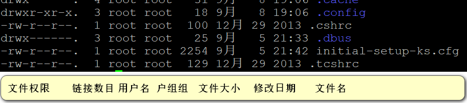
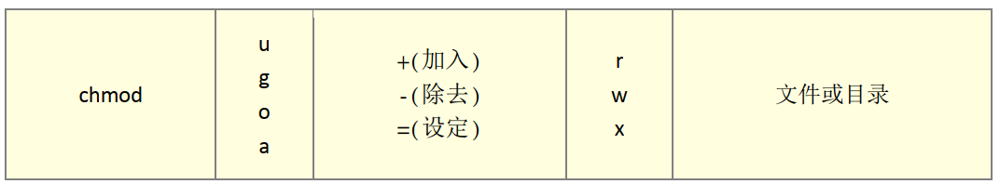

# Linux的文件权限和目录配置

## 使用者和群组

使用者: 每个使用者都是一个用户

群组: 一个或者多个使用者可以组成一个用户组, 一个用户可以有多个用户组.

## 文件属性



### 	文件权限

可以看到, 文件权限那里有10个字母. 

- 第一个字符代表文件的类型
  - 当文件为[d], 则是目录
  - 当为[-] 则是一个文件
  - 当为 [I] 则表示是一个链接文件(link file)
  - 若是[b] 则表示为设备文件中可提供存储的接口设备( 可随机存取装置)
  - 若是[c] 则表示为设备文件中的串行设备. 例如键盘
- 接下来的字符, 以三个为一组, 每一组分别为[rwx]. r则代表可读, w代表可写, x代表可执行.
  - 第一组为文件拥有者具备的权限
  - 第二组为加入此用户组的用户的权限
  - 第三组为非本人且没有加入本群组之其他账号的权限

## 修改文件属性和权限

1. chgrp: 改变文件所属组
2. chown: 改变拥有者
3. chmod: 改变文件权限, SUID, SGID, SBIT等等特性

### chgrp

-r: 递归更改

### chown

更改用户

-r选项: 递归的更改

```shell
# 递归的更改用户和用户组
chown -r root:root fileName
chown -r root.root fileName

# 单纯更改用户组
chown -r .root fineName
```

### chmod

改变权限

数字表示各个权限: r:4 w:2 x:1

例如

1. rwx=7  
2. rw-=6
3. r--=4
4. r-x=5

chmod 770 fileName

a代表全部



chmod u=rwx

