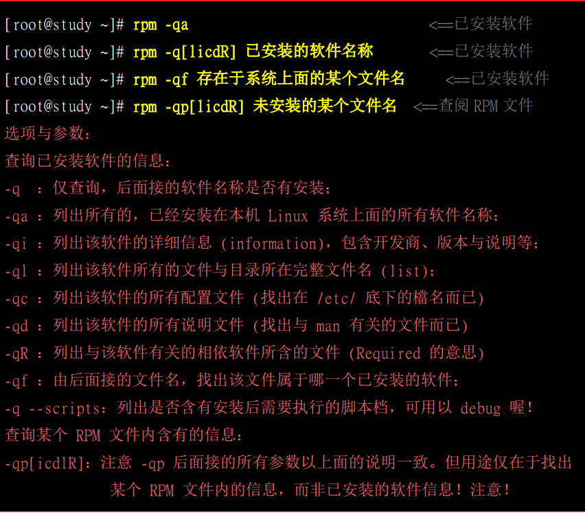
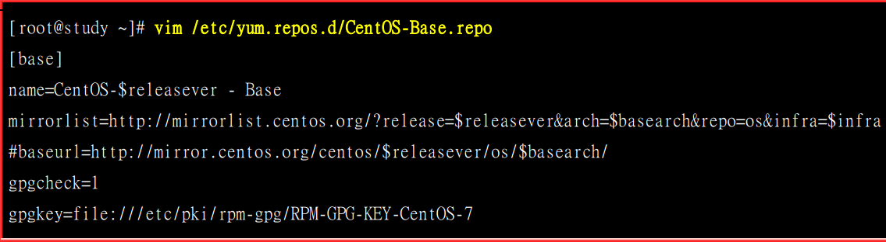

# 软件包管理

## RPM和SRPM

什么是RPM与SRPM

RPM全名是「RedHat Package Manager」简称则为RPM啦! 顾名思义，当初这个软件管理的机制
是由RedHat这家公司发展出来的。RPM是以一种数据库记录的方式来将你所需要的软件安装到
你的Linux系统的一套管理机制。
他最大的特点就是将你要安装的软件先编译过，并 且打包成为RPM机制的包装文件，透过包装好
的软件里头默认的数据库记录，记录这个软件要安装的时候必须具备的相依属性软件，当安装在你
的Linux 主机时，RPM 会先依照软件里头的数据查询Linux 主机的相依属性软件是否满足，若
满足则予以安装，若不满足则不予安装。那么安装的时候就将该软件的信息整个写入RPM的数据
库中，以便未来的查询、验证与反安装!

但是这也造成些许的困扰。由于RPM文件是已经包装好的数据，也就是说，里面的数据已经都「[编
译完成」了!所以，该软件文件几乎只能安装在原本默认的硬件与操作系统版本中。也就是说， 你
的主机系统环境必须要与当初建立这个软件文件的主机环境相同才行! 所以, 不同发行版的RPM不能互相安装

SRPM 就是sourceRMP, 带有源码的RPM, SRPM没有经过编译

通常SRPM的扩展名是以***.src.rpm 这种格式来命名的。不过，既然SRPM提供的是原始码，那
么为什么我们不使用Tarball直接来安装就好了?这是因为SRPM虽然内容是原始码，但是他仍然
含有该软件所需要的相依性软件说明、以及所有RPM文件所提供的数据。同时，他与RPM不同
的是，他也提供了参数配置文件(就是configure 与makefile)。 所以，如果我们下载的是SRPM，
那么要安装该软件时，你就必须要:

- 先将该软件以RPM管理的方式编译，此时SRPM会被编译成为RPM文件;
- 然后将编译完成的RPM文件安装到Linux 系统当中

```
rp-pppoe  3.11 -       5             e17.x86_ 64     rpm
软件名称   软件的版本信息  释出的次数     适合的硬件平台     扩展名
```

## RPM指令

### 安装

选项与参数:

-i : install的意思

-y: 察看更细部的安装信息画面

-h:以安装信息列显示安装进度

### 升级和更新

```shiell
RPM -Uvh
后面接的软件即使没有安装过，则系统将予以直接安装;若后面接的软件有安装过旧版，则系统自动更
新至新版;

rpm -Fvh
如果后面接的软件并未安装到你的Linux 系统上，则该软件不会被安装;亦即只有已安装至你Linux 系统
内的软件会被「升级」!
```

### RMP查询



查询软件是否被安装(不需要加版本)

```sell
[root@VM_158_108_centos ~]# rpm -q nginx
package nginx is not installed
```

### 重建数据库

```
rpm --rebuilddb
```

## yum指令

### 安装和升级

```shell
选项与参数:
install :后面接要安装的软件!
update :后面接要升级的软件，若要整个系统都升级，就直接update 即可
```

### 常用参数

```shell
选项与参数:
[option]:主要的选项，包括有: 
-y :当yum要等待用户输入时，这个选项可以自动提供yes的响应;
--installroot=/some/path :将该软件安装在/some/path 而不使用默认路径

[查询工作项目] [相关参数]:这方面的参数有:
search : 搜寻某个软件名称或者是描述(description) 的重要关键字;
list:列出目前yum所管理的所有的软件名称与版本，有点类似rpm -qa;
info:同上，不过有点类似rpm -qai 的执行结果;
provides:从文件去搜寻软件!类似rpm -qf的功能!
```

### 移除软件

yum remove packageName

## yum配置



```
●[base]: 代表软件库的名字!中括号- -定要存在，里面的名称则可以随意取。但是不能有两个相同的软件库
名称，否则yum会不晓得该到哪里去找软件库相关软件列表文件。
●name:只是说明一下这个软件库的意 义而已，重要性不高!
●mirrorlist=: 列出这个软件库可以使用的映射站台，如果不想使用，可以批注到这行;
●baseurl=: 这个最重要，因为后面接的就是软件库的实际网址! mirrorlist 是由yum程序自行去捉映像站
台，baseurl则是指定固定的-一个软件库网址!我们刚刚找到的网址放到这里来啦!
●enable=1:就是让这个软件库被启动。如果不想启动可以使用enable=0 喔!
●gpgcheck=l: 还记得RPM的数字签名吗?这就是指定是否需要查阅RPM文件内的数字签名!
●gpgkey=: 就是数字签名的公钥文件所在位置!使用默认值即可
```

### 查看软件库

yum repolist all

### 清理旧数据

```
[ root@study ~]# yum clean [ packages Iheaders |all]
选项与参数:
packages:将已下载的软件文件删除
headers:将下载的软件文件头删除
all
将所有软件库数据都删除!
范例一:删除已下载过的所有软件库的相关数据( 含软件本身与列表)
[ root@study ~]# yum clean all
```

