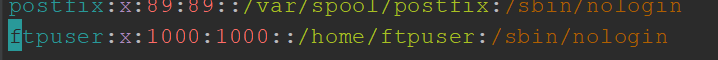
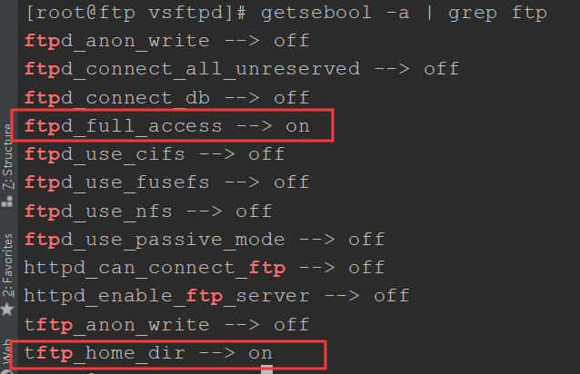

# CentOS7 安装及配置vsftpd

1. 执行命令

   ```
   yum install vsftpd -y
   ```

2. 添加ftp用户

   ```
   user add ftpuser
   ```

3. 给ftpuser用户设置密码

   ```
   passwd ftpuser
   ```

4. 禁止用户通过ssh登录

   ```
   vim /etc/password
   ```

   

5. 修改selinux

   ```
   getsebool -a | grep ftp
   ```

   

6. 将圈住的两个改为on

   ```
   setsebool -P ftpd_full_access on
   setsebool -P tftp_home_dir on
   ```

7. 关闭匿名访问并且设置被动模式

   ```
   vim /etc/vsftpd/vsftpd.conf
   ```

   

   在文件的最后添加

   

8. 修改访问

   ```
   vim /etc/pam.d/vsftpd
   ```

   将`auth required pam_shells.so`修改为->`auth required pam_nologin.so` 或者将`auth required pam_shells.so注释`

9. 启动vsftpd

   ```
   systemctl start vsftpd.service
   ```

10. 测试连接

    打开cmd, 测试

    ```
    $ ftp 192.168.2.204
    连接到 192.168.2.204。
    220 (vsFTPd 3.0.2)
    200 Always in UTF8 mode.
    用户(192.168.2.204:(none)): ftpuser
    331 Please specify the password.
    密码:
    230 Login successful.
    ftp>
    ```

    