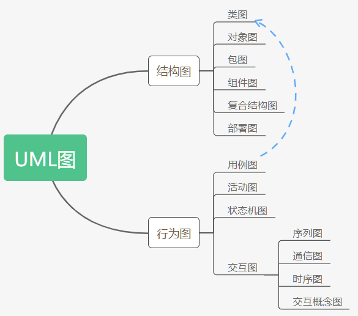

# 面向对象和UML

## 统一软件过程

### 概念理解

> 统一软件过程 (Rational Unified Process, RUP) 
>
> 统一建模语言 (Unified Modeling Language, UML)

### 软件开发过程基础

> 软件开发过程是指软件开发周期中明确定义的一系列活动的集合

1. 指定计划
2. 需求分析 (需要软件需求规范  Software Requirements Specification, SRS)
3. 设计(应用程序设计文档) , 编码, 测试

### 软件开发过程模型

#### 瀑布模型

> 1970年提出的线性顺序开发模型

优点: 如果事先知道了顺序, 则易于以阶段化的线性顺序开发产品

缺点: 

1. 开发人员可能无法提前了解需求
2. 产品只在软件生命周期结束的时候可供客户使用, 客户的反馈信息来的太迟, 因此可能无法在以后的阶段解决错误或任何需求下滑的情况
3. 重新进行分析和测试可能会导致成本的增加和时间延迟

哪些项目可以用它来开发?

1. 语言编译器, 解释器
2. 操作系统
3. 设备驱动

#### 增量模型

> 整个软件被分解为各种功能的增量, 按照优先级增量开发

优点:

1. 增量交付时基于系统功能的
2. 客户的定期反馈可以根据增量进行
3. 随着高优先级功能首先开发, 项目的整体功能风险降低了

缺点:

1. 由于规范不具体, 每个增量之后不能进行完备的系统功能测试
2. 软件变化频繁, 没有很好的架构
3. 项目开销和时间增加

哪些项目可以用它来开发?

1. 客户机服务器应用程序
2. 用于内联网的web应用程序, 及在某个组织内运行的应用程序

#### 演化模型

> 一种增量式的, 迭代式的模型. 包含软件开发周期的所有周期. 最重要的特点是风险评估. 

优点:

1. 风险分析
2. 用户参与全部生命周期过程
3. 在每次螺旋结束时会进行需求的验证

缺点: 

1. 如果客户不满意, 那么迭代的次数会大大增加
2. 风险评估应该严格执行, 否则项目会失败

哪些项目需要它来开发?

1. 风险很高的应用程序, 如病人监护系统, 原子反应堆系统等等
2. 高风险的实时系统. 如银行系统

#### 敏捷模型

> 敏捷模型侧重于与客户的持续合作, 因为变化时不可避免的. 客户和开发人员会持续交互, 代码也是通过重构技术开发的

优点: 

1. 适合与客户交流频繁的中小型项目
2. 高度积极的小型开发团队使软件开发更快
3. 杰出团队可以根据用户来频繁的更新软件
4. 测试驱动的开发, 有助于软件的整体质量
5. 由于他强调最终产品, 因此永远不会忽略软件的功能

缺点: 

1. 敏捷模式不强调文档, 不断变化的客户需求会导致频繁的更改, 因此不适合大型项目
2. 技术经验丰富的人才是敏捷开发团队的关键需求
3. 代价昂贵, 没有正确的计划会导致紊乱
4. 测试通常会非常困难

哪些类型的项目使用它来开发?

1. 标准应用程序  如会计软件 Tally, 具有庞大用户群体的门户网站
2. 社交网站 Facebook等

### 统一过程模型

> 和其他生命周期过程模型一样, RUP也包括4个主要阶段,即:
>
> 1. 初始阶段
> 2. 细化阶段
> 3. 构造阶段
> 4. 交付阶段

#### 初始阶段

需要做的工作

1. 与客户进行沟通, 捕捉初步的需求
2. 分析项目的目的和目标, 进行技术, 经济和资源方面的项目可行性分析, 做出决定/购买决策等工作
3. 项目规划, 包括各种成本估算
4. 产品范围, 愿景文档, 业务案例准备

产生的阶段性工作产品

1. 需求规范文档: 包含系统的目标, 范围, 功能需求和技术需求
2. 主用例图: 捕获了系统的功能需求, 描述了外部实体与功能的交互方式. 该图一般用于捕获功能需求
3. 补充规范文档: 捕获为功能需求和其他不可表达的功能需求
4. 术语表
5. 愿景说明: 项目目标的概述
6. 业务规则或域规则
7. 测试规范文档

#### 细化阶段

需要的工作

1. 完成架构和需求分析和开发
2. 分析人员从逻辑视角的角度构造一些模型. 例如用例模型和领域模型. 用例模型包括用例场景, 主用例图, 次用例图, 用例实现等. 领域模型包括逻辑视图中的类图
3. 架构师要准备架构模型, 如MVC  Struts  Hibernate

产生的阶段性工作产品

1. 用例描述. 包括以下
   - 与相应的主用例图向关联的主要和次要参与者列表
   - 主要场景描述
   - 基于过程结构的正常和备选流
2. 详细的用例图: 每个用例场景, 都会有一个相应的用例图
3. 域模型或域类图: 对实体, 动作或进程的关键抽象列表进行识别并分类, 确定这些类之间的关系
4. 系统序列图: 显示了参与者和系统之间的交互行为, 以及域中不同实体之间的消息传递过程
5. 活动图: 用来显示与用例图中指定的每个进程相关联的内部活动. 
6. 状态图: 用于根据运行过程中发生的各种事件显示系统的状态
7. 包图: 相关类的分组
8. 组件图
9. 部署图

#### 构造阶段

需要的工作

1. 确定目标编程语言
2. 编码
3. 单元测试

产生的阶段性工作产品

1. 源代码
2. 目标代码或中间代码
3. 测试报告

#### 交付阶段

需要的工作

1. 进行用户的验收测试和部署
2. 通过Alpha测试和Beta测试

产生的阶段性工作产品

1. 可执行文件
2. 用户手册和文档
3. 测试用例库
4. 测试文档
5. 测试报告

## 面向对象的开发理论基础

### 结构化方法

1. 自上而下的方法
2. 自下二上的方法
3. 混合方法

缺点: 

不支持可重用性和可扩展性

### 面向对象方法

## UML 建模

可视化建模的优点

1. 以明确的方式在不同的利益相关者之间传递信息
2. 指定与目标语言无关的设计
3. 提供解决问题的结构
4. 提供机制(抽象, 视图, 过滤, 结构) 来管理复杂性
5. 能够轻松地试验并探索多种解决方案
6. 能在以虚拟形式构建一些东西, 并在提交资源以构建实物之间验证其有效性

UML定义的13种类型图

1. 类图
2. 对象图
3. 包图
4. 组件图
5. 复合结构图
6. 部署图
7. 用例图
8. 活动图
9. 状态机图
10. 序列图
11. 通信图
12. 交互概览图
13. 时序图

以上又可分为两大类, 结构图和行为图. 具体分类如下

### 结构图

> 结构图显示了系统的静态结构, 它包括不同的抽象和实现级别以及它们之间的关系

类图: 最重要的静态结构图, 描述了系统的结构中最低级别的类, 结构等, 显示了系统的类, 类的属性以及包与包之间的关系

对象图: 描述了类的实例和实例之间的链接

包图: 展示了包以及包与包之间的相互依赖

组件图: 揭示了各种组件, 以及类与模块之间的相互依赖. 他在基于组件的开发种经常被使用到

复合结构图: 可以用来显示一个类的内部结构, 以及类与类之间的协作行为

部署图: 显示了系统执行适用的架构, 展示了如何将软件工件分配到部署目标

### 行为图

> 行为图描绘了一个系统中对象的动态行为, 即系统随时间变化的一系列更改

用例图: 最重要的行为图, 用于描述正在开发的特定系统执行的被称为"用例" 的一组动作, 与系统中称为"参与者" 的一个或多个外部用户相关联, 以便提供可观察和有用的结果给系统的参与者或其他利益相关者

活动图: 表达了协调类的低级行为的顺序和条件, 也可以称为控制流和对象流模型

状态机图: 通过有限状态转换来模拟系统的离散行为. 此外, 状态机还表示了系统的每个部分的使用规则

交互图: 行为图的核心部分, 包含以下类型的图

1. 序列图: 关注系统中对象之间的消息交换
2. 通信图/协作图: 表示对象之间的交互, 更倾向于内部架构以及对象之间如何进行消息传递. 
3. 交互概览图: 提供整个系统的控制流程的概述.

## 面向对象分析--基于场景的模型

### 用例图

## 逻辑模型

### 类图

## 交互图

> 交互是类. 组件, 系统或参与者的典型实例之间发送的一系列消息. 交互图的作用就是形象展现系统的交互行为

### 序列图

### 协作图

