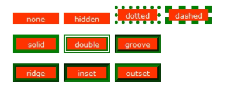

# CSS属性

## CSS常用属性

### 字体(font)

- 字体的颜色
  color: gray;
- 字体的大小
  font-size: 12px;
- 字体的加粗 font-weight: bold;
- 使用的字体 font-family: 宋体;
- 字体的风格 font-style: italic;

### 文本(text)

- 下划线展示 text-decoration: underline; 
- 去除下划线 text-decoration: none; 
- 文本居中 text-align: center; 

### 行高

line-height

### border的属性

- border-color

- border-width

- border-style

- 统一

  border: 1px solid red;

风格:

### 背景

- 图片背景 background-image: url(“”)
- 设置背景图片不重复 background-reqeat: no-repeat;
- 调整图片位置 background-position: center;
- 调整背景图片的大小  宽 高(不建议使用, 会使图片失真): background-size: 300px 500px
- 背景颜色: background-color: red

### 调整透明度

opacity: 0.4

### 超出的部分设置

- 超出部分隐藏: overflow: hidden;
- 超出部分出现滑动条: overflow: auto

##  其他标签

### 行内元素

多个标签位于同一行

span font 小标签 img(可看作行内块元素)

一般不支持持宽和高. 可使用display: block转成块级元素

### 块元素

标签可以自动换行的元素时块元素

div h1-h6 ul p等

使用display: inline转成行内元素.

当display:none时, 标签隐藏

### 浮动

float: left|right

### 列表清除格式

list-style:none

