# idea自定义Maven骨架

> 自定义一个web类型的maven项目骨架. 使用自带的老是不满意, 需要改一些这个那个的. 

## 步骤

1. 创建一个简单的maven空项目

2. 打开项目设置, 添加一个web框架

   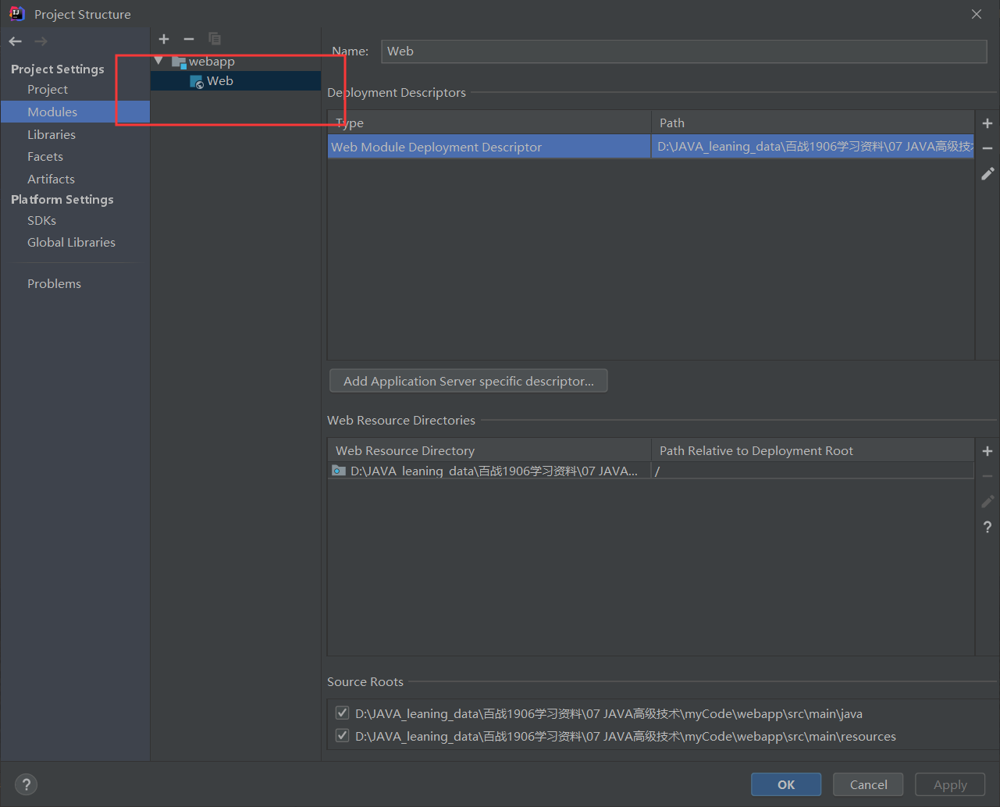

3. 退出, 将项目中新添加的web目录移动到main目录下

4. 并且shift+f6 将web改名为webapp

5. 打开项目设置, 将web根目录改为webapp

   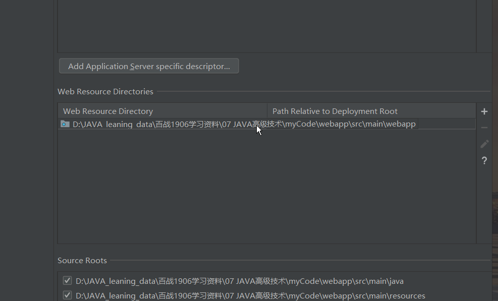

6. 更改pom文件, packing改为war类型

   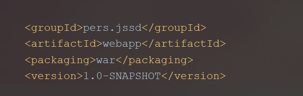

7. 此时, 项目搭建完成. 把此项目自定义成maven骨架, 那么我每次新建这个骨架项目的时候, 都是这个结构

8. pom中添加一个插件

   ```xml
   <build>
       <plugins>
           <plugin>
               <groupId>org.apache.maven.plugins</groupId>
               <artifactId>maven-archetype-plugin</artifactId>
               <version>3.0.0</version>
           </plugin>
       </plugins>
   </build>
   ```

9. 执行此插件的命令`create-from-project`

   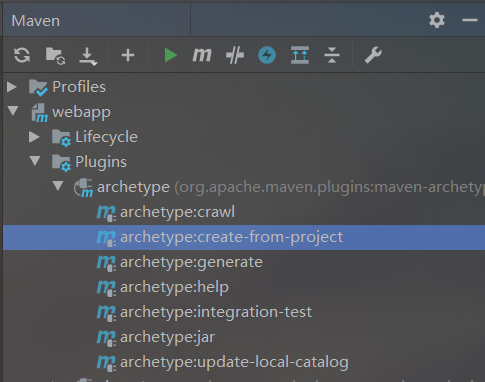

10. 执行完之后, 项目中出现target目录, 是这样的

    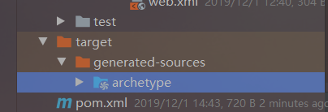

11. 之后, 再次执行maven命令, 作用域是archetype目录

    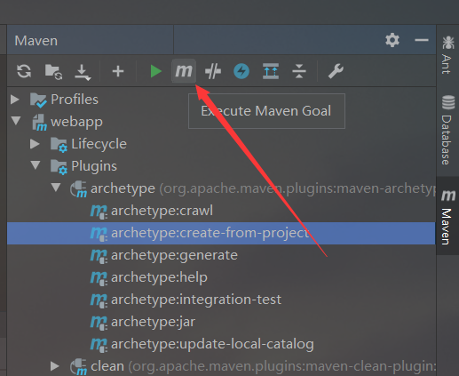

    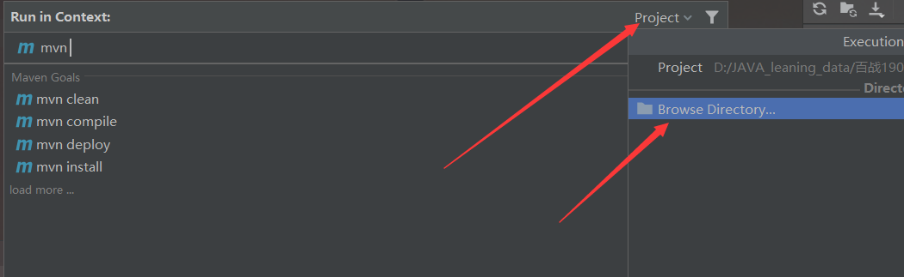

    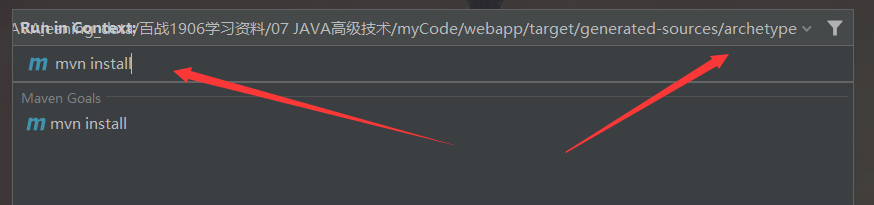

12. 最后执行命令crawl

    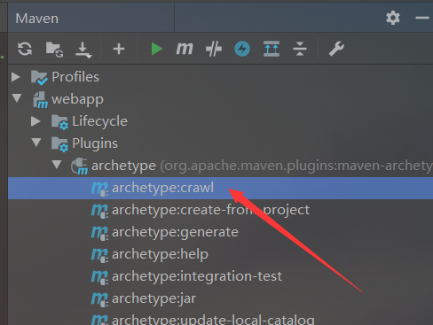

13. 此时, 在你的本地库中, 会有一个名为archetype-catalog.xml的文件, 打开它

14. 可以看到你新配置的骨架信息

    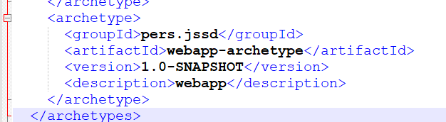

15. 大功告成, 新建一个项目测试一下

    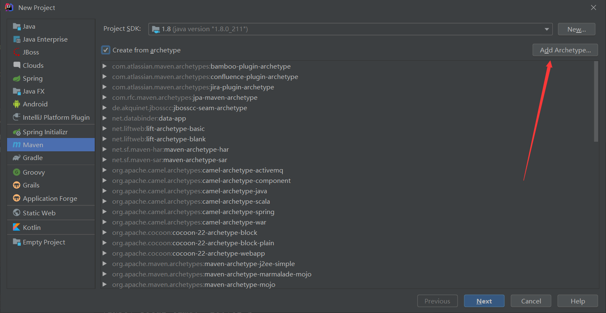

    添加那个xml中出现的信息

    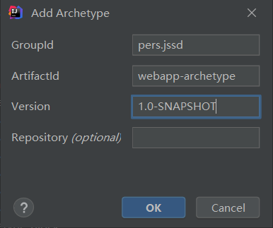

    ok, 此时你会看到你的骨架信息

    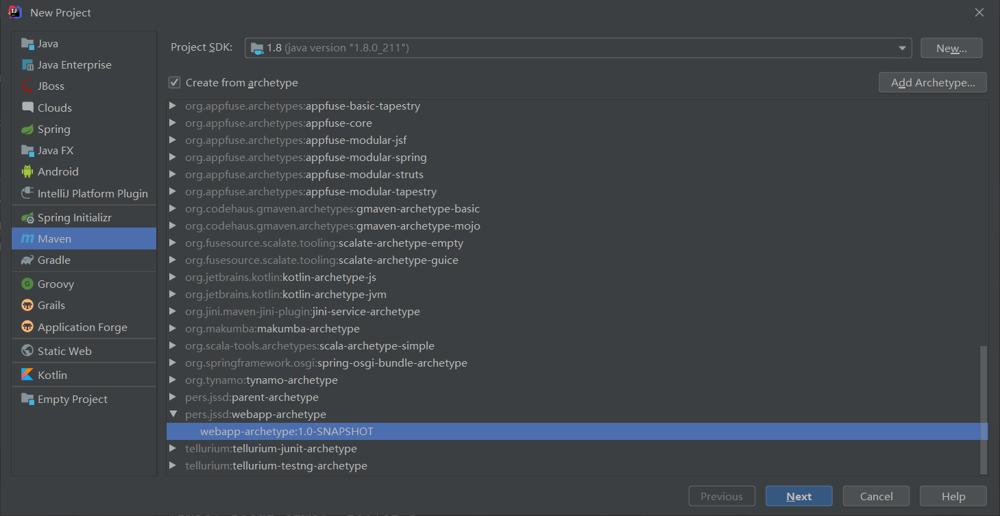

    

