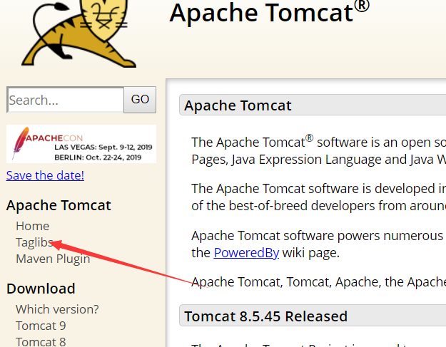
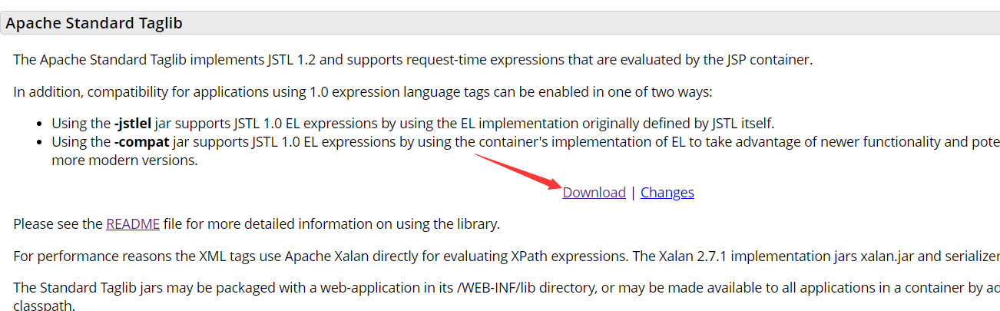
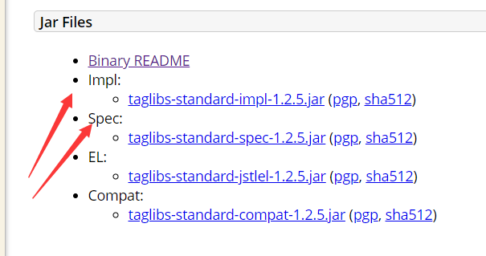
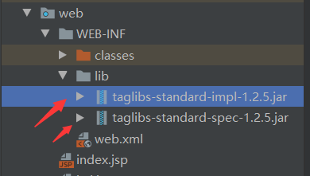
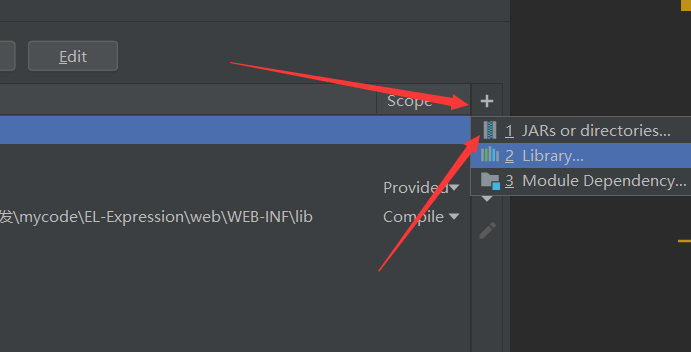
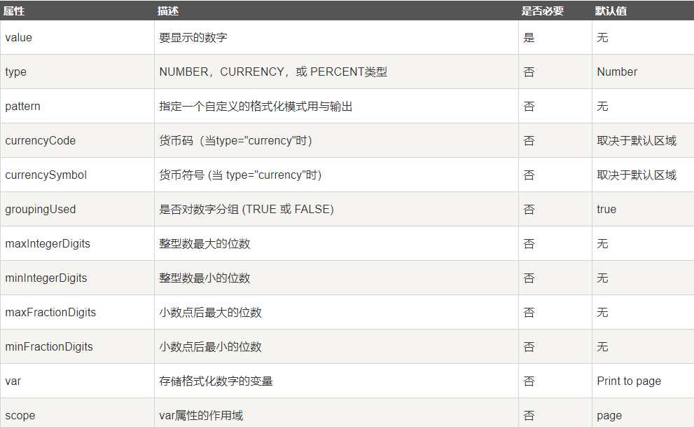
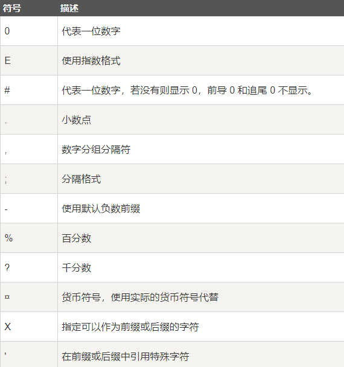
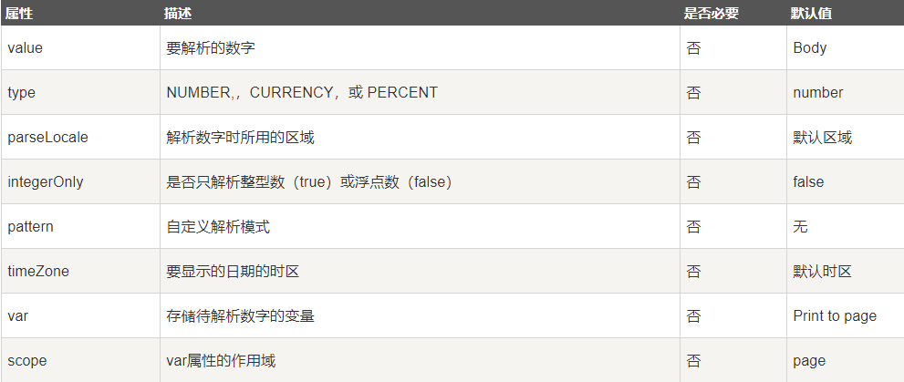
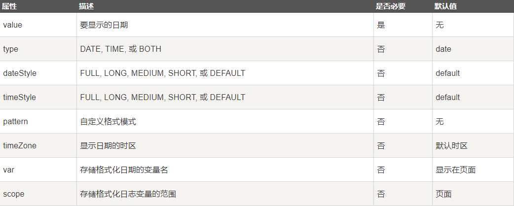
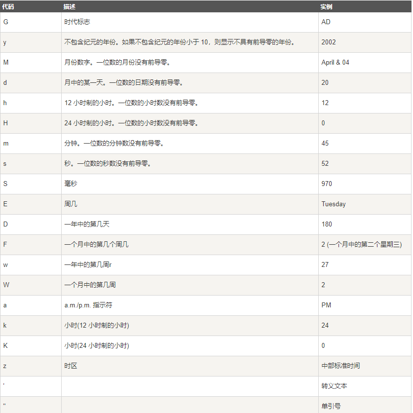

[TOC]

# JSTL标签库

## 什么是JSTL标签库

JSTL 是apache堆EL表达式的扩展(也就是JSTL依赖EL), JSTL是标签语言! JSTL标签使用起来非常方便, 他与JSP动作标签一样, 只不过他不是JSP
内置的标签, 需要我们自己导包. 以及指定标签库.

## IDEA jstl1.2 引入

1. 打开tomcat官网[http://tomcat.apache.org/](http://tomcat.apache.org/)

2. 点击右侧taglibs

   

3. 页面上有个很明显的download

   

4. 下前两个jar文件一般就够用了

   

5. 下载下来放入web文件夹下WEB-INF下的lib文件夹下

   

6. 点开项目配置

   

7. 添加jars or directories, 选择lib文件夹, directory添加. 即部署到了项目中

## JSTL核心标签

### jstl引入

在jsp标签头部添加jstl核心库

```jsp
<%@taglib prefix="c" uri="http://java.sun.com/jsp/jstl/core" %>
```

### jstl核心库使用

#### c:out标签

```jsp
<%--设置一些数据提供EL表达式使用--%>
<%
    pageContext.setAttribute("str", "使用EL表达式获取数据");
%>
<%--输出一个字符串--%>
<c:out value="测试数据"/> <br>
<%--通过EL表达式输出一个字符串--%>
<c:out value="${str}"/> <br>
<%--没有此数据可以使用default属性设置默认输出--%>
<c:out value="${str2}" default="没有此数据"/> <br>
```

#### c:set标签和remove标签

set标签用来设置数据, remove标签用来删除数据

```jsp
<%--set标签和remove标签--%>
<c:set var="setValue" value="set设置的数据"/>
<%--输出'set设置的数据'--%>
<c:out value="${setValue}" default="没有此数据"/> <br>

<c:remove var="setValue" scope="page"/>
<%--删除之后输出'没有此数据'--%>
<c:out value="${setValue}" default="没有此数据"/> <br>
```

#### c:catch标签

可以使用catch标签获取产生的异常, 存在var属性的对象中, 实际上, 这个异常对象存储到了pageContext的作用域中, 使用getAttribute可以取得.

```jsp
<h2>catch标签的使用</h2>
<c:catch var="Exce">
    <%
        int i = 5 / 0;
    %>
</c:catch>

<%
    System.out.println("pageContext取数据");
    System.out.println(pageContext.getAttribute("Exce"));
%>

<c:if test="${Exce != null}">
    <c:out value="产生了异常"/> <br>
    <c:out value="${Exce}"/> <br>
</c:if>
```

#### c:if标签

if标签就是一个单分支判断标签

```jsp
<h2>c:if标签</h2>
<p>
    test 属性: 其中存放EL表达式 <br>
    var 属性: 存放表达式结果的变量 <br>
    scope属性: 将var变量存储到哪个作用域中, 默认是page <br>
</p>
<c:set var="number" value="5"/>
<%--test结果放在了session中的flag的Attrebute中--%>
<c:if test="${number < 10}" var="flag" scope="session">
    <c:out value="number < 10"/> <br>
</c:if>
<%--输出true--%>
<c:out value="${sessionScope.flag}" default="没有值"/> <br>
<%--输出没有值--%>
<c:out value="${requestScope.flag}" default="没有值"/> <
```

#### c:choose, c:when, c:otherwise标签

相当于java中的swith case的使用

```jsp
<h2>多分支判断标签</h2>
<c:set var="number" value="10"/>
<c:choose>
    <c:when test="${number > 5}">
        <c:out value="number > 5"/>
    </c:when>
    <c:when test="${number > 1}">
        <c:out value="number > 1"/>
    </c:when>
    <c:otherwise>
        <c:out value="number <= 1"/>
    </c:otherwise>
</c:choose>
```

#### c:import 标签

```jsp
<h2>c:import 标签的使用</h2>
<b>使用jsp:include动态引入一个页面</b>
<jsp:include page="header.jsp"/>
<b>使用@jsp:include静态引入一个页面</b>
<%@include file="header.jsp"%>
<b>使用c:import 动态引入一个页面</b>
<c:import url="header.jsp" charEncoding="utf-8"/>
<%--可以引入外部资源, 引入了百度页面--%>
<c:import url="https://www.baidu.com" charEncoding="utf-8"/>
```

#### c:forEach标签和c:forTokens标签

迭代功能

forEach标签

```jsp
<h2>forEach标签</h2>
<%--迭代一个变量--%>
<c:forEach var="i" begin="0" end="10" varStatus="status" step="2">
    <c:out value="迭代下标: ${i}"/>
    <br>
    <c:out value="迭代次数: ${status.count}"/>
    <br>
    <c:out value="迭代步长: ${status.step}"/>
    <br><br>
</c:forEach>

<hr>
<%--迭代一个容器--%>
<%
    List<Integer> list = new ArrayList<>();
    list.add(10);
    list.add(20);
    list.add(30);
    list.add(40);
    list.add(50);

    pageContext.setAttribute("list", list);
%>
<c:forEach items="${list}" varStatus="status">

    <c:out value="迭代当前的元素: ${status.current}"/>
    <br>
    <c:out value="迭代次数: ${status.count}"/>
    <br>
    <c:out value="迭代容器的下标 ${status.index}"/>
    <br>
    <c:out value="迭代步长: ${status.step}"/>
    <br> <br>
</c:forEach>
```

forTokens标签, 遍历一个字符串, 指定字符分隔成数组

```jsp
<h2>forTokens标签</h2>
<%
    String str = "java, c++, python, php";
    pageContext.setAttribute("str", str);
%>
<c:forTokens items="${str}" delims="," varStatus="status">
    <c:out value="${status.current}"/>
</c:forTokens>
```

#### c:url 和 c:param标签

创建一个url, 可拼接参数

```jsp
<h2>c:url 和 c:param标签</h2>
<c:url value="https://www.baidu.com" var="baiDu">
    <c:param name="wd" value="java"/>
</c:url>
<a href="${baiDu}">这是一个百度查询java的链接</a>
```

点击链接, 会发送`https://www.baidu.com?wd=java`

#### c:redirect 标签

值得注意的是, 原生servlet的请求转发的模式, 当页面转发之后, 当前页面会继续执行, 除非手动return; jstl请求转发解决了这个问题, 使用jstl请求转发之后, 不会继续往当前页面之下继续执行

```jsp
<h2>重定向标签</h2>
<c:redirect url="/red">
    <c:param name="wd" value="java"/>
</c:redirect>
```

## JSTL常用格式化标签

### 格式化标签的引入

```jsp
<%@taglib prefix="fmt" uri="http://java.sun.com/jsp/jstl/fmt" %>
```

### 常用格式化标签的使用

#### 格式化数字, 百分比, 货币

属性如下



pattern符号如下



```jsp
<c:set var="balance" value="120000.2309"/>
<h4>格式化数字(1)</h4>
<fmt:formatNumber value="${balance}" maxIntegerDigits="3" type="number"/>
<h4>格式化数字(2)</h4>
<fmt:formatNumber value="${balance}" maxFractionDigits="3" type="number"/>
<h4>格式化数字(3)</h4>
<fmt:formatNumber value="${balance}" groupingUsed="false" type="number"/>
<h4>格式化货币(1)</h4>
<fmt:formatNumber type="currency" value="${balance}"/>
<h4>格式化货币(2)</h4>
<fmt:setLocale value="en_US" />
<fmt:formatNumber type="currency" value="${balance}"/>
<h4>格式化百分数</h4>
<fmt:formatNumber type="percent" value="${balance}" maxIntegerDigits="3"/>
<h4>使用patten格式化</h4>
<fmt:formatNumber type="number" value="${balance}" pattern="########.###"/>
```

#### 解析数字, 百分比, 货币

属性如下



```jsp
<c:set var="str" value="-1555468.55"/>
<fmt:parseNumber value="${str}" type="number" var="parseStr"/>
<c:out value="${parseStr}"/>
```

#### 解析和格式化日期时间

fmt:formatDate格式化日期标签

属性如下



格式化模式如下



```jsp
<h4>格式化日期</h4>
<c:set var="date" value="<%= new Date()%>"/>
<%--Wednesday, September 11, 2019 10:32:01 AM CST--%>
<fmt:formatDate value="${date}" timeStyle="FULL" type="both" dateStyle="FULL"/> <br>

<%--10:33:33 AM CST--%>
<fmt:formatDate value="${date}" timeStyle="LONG" type="TIME"/> <br>

<%--September 11, 2019--%>
<fmt:formatDate value="${date}" dateStyle="LONG" type="DATE"/> <br>

<%--9/11/19--%>
<fmt:formatDate value="${date}" dateStyle="SHORT" type="DATE"/> <br>
```

解析一个日期

```jsp
<h4>解析一个日期</h4>
<c:set value="2016-08-08 22:01:55" var="dateStr"/>
<%--解析格式一定要正确, 不然会报错--%>
<fmt:parseDate value="${dateStr}" pattern="yyyy-MM-dd HH:mm:ss" var="varDate"/>
<c:out value="${varDate}"/>
```

## JSTL 函数库

JSTL包含一系列标准函数，大部分是通用的字符串处理函数。

### JSTL函数库的引入

#### contains函数

语法

```jsp
${fn:contains(<原始字符串>, <要查找的子字符串>)}
```

实例:

```jsp
<h4>contains函数, containsIgnoreCase函数(不区分大小写)</h4>
<c:if test="${fn:contains('beijing', 'jing')}" var="flag1"/>
<c:if test="${fn:containsIgnoreCase('beijing', 'BEI')}" var="flag2"/>
<c:out value="flag1 = ${flag1}"/> <br>
<c:out value="flag2 = ${flag2}"/> <br>
```

#### endWith函数和startWith函数

返回结尾或者开头是否可以匹配某个字符串

```jsp
<!-返回true-->
<c:out value="${fn:endsWith('beijing', 'jing')}"/> <br>
```

#### escapeXml函数

默认的字符串中如果出现了xml标签样式, 会被浏览器解析, 如果不想被解析, 需要使用secapeXml函数

```jsp
<h4>escapeXml()函数, 此函数不会去除可以作为xml标签的标记. 默认xml标签会被浏览器解析</h4>
<%--输出this <abx> is a test </abc>--%>
<c:out value="${fn:escapeXml('this <abx> is a test </abc>')}"/>
<%--输出 this is a test--%>
<c:out value="${'this <abx> is a test </abc>'}"/>
```

#### split函数和join函数

split(字符串, 分隔符); 此函数可以将一个字符串通过分隔符分隔成一个数组

join(数组, 分隔符), 可以将一个数组组成一个字符串, 期间使用指定的分隔符分隔.

```jsp
<h4>将数组中的元素分隔合并 split(字符串, 分隔符) join(数组, 分隔符)</h4>
<%--先分隔成数组--%>
<c:set var="arr" value="${fn:split('1,2,3,4,5,6', ',')}"/>
<%--再合并成字符串--%>
<c:out value="${fn:join(arr , ',')}"/>
```

### length函数

length函数可以返回字符串长度

```jsp
<h4>length函数</h4>
<c:out value="${fn:length('this is a string')}"/>
```

#### repalce函数

replace(原始字符串, 要替换的字符串, 替换的字符串)

相当于java中的repalceAll

```jsp
<h4>replace函数</h4>
<%--会将两个am全部替换--%>
<c:out value="${fn:replace('I am am a human', 'am', '233')}"/>
```

#### 获取字字符串的函数

subString(原始字符串, 开头位置, 结尾位置)

subStringAfter(原始字符串, 指定的字符串) 返回指定字符串之后的字符串

subStringBefore(原始字符串, 指定的字符串) 返回指定的字符串之前的位置.

```jsp
<h4>subString 函数, subStringAfter, subStringBefore</h4>
<%--返回chinese--%>
<c:out value="${fn:substring('I am a chinese', 7, 15)}"/> <br>
<%--返回 a chinese--%>
<c:out value="${fn:substringAfter('I am a chinese', 'am')}"/> <br>
<%--返回 I--%>
<c:out value="${fn:substringBefore('I am a chinese', 'am')}"/> <br>
```

#### 大小写转换函数

```jsp
<h4>转大小写函数</h4>
<c:out value="${fn:toLowerCase('I AM A CHINESE')}"/> <br>
<c:out value="${fn:toUpperCase('i am a chinese')}"/> <br>
```

#### 移除首尾空格

```jsp
<h4>移除首尾空格</h4>
<c:out value="${fn:trim('              移除首位空格               ')}"/>
```