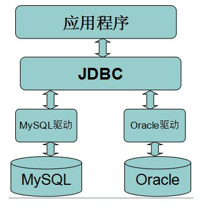
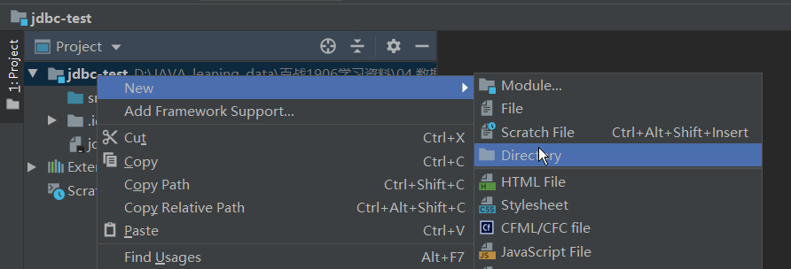
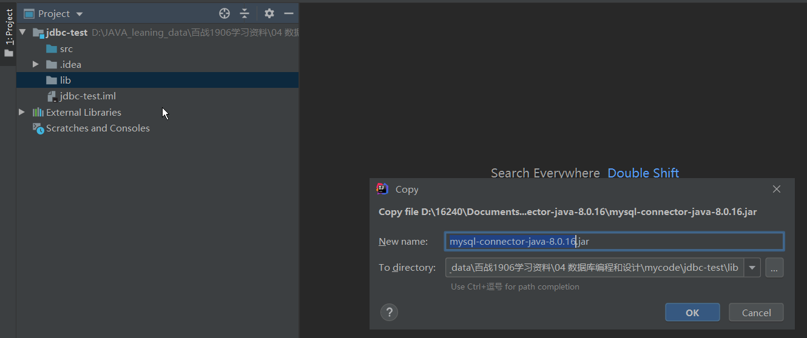
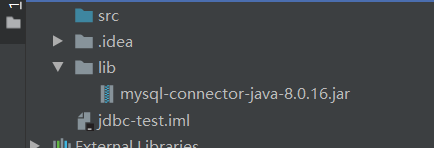
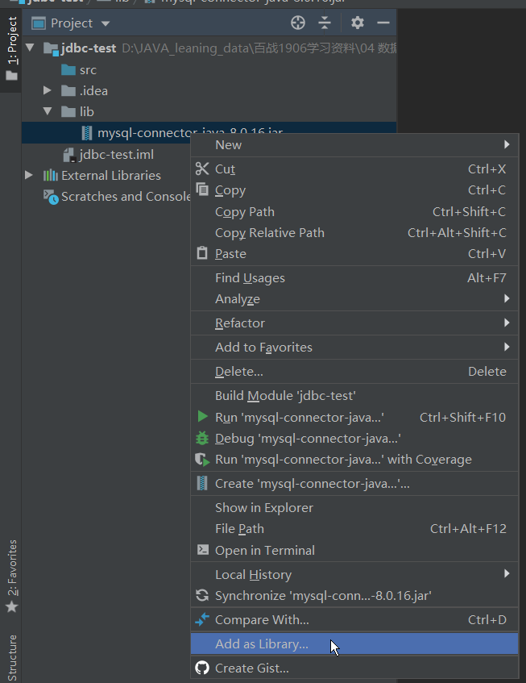
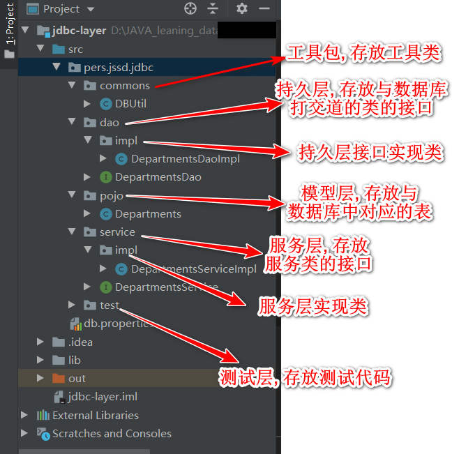

[TOC]

# 一. JDBC简介

## 1. 什么是JDBC

- JDBC(java DateBase Connectivity) java数据库连接
- 是javaEE平台下的技术规范
- 定义了在JAVA语言中连接数据库, 执行SQL语句的标准
- 可以为多种关系数据库提供统一访问

## 2. 什么是数据库驱动程序

- 数据库厂商对 JDBC 规范的具体实现
- 不同数据产品的数据库驱动名字有差异
- 在程序中需要依赖数据库驱动来完成对数据库的操作 

## 3. 程序操作数据库流程



# 二. JDBC3.0标准中的常用接口与类

## 1. Driver 接口

Driver接口的作用是来定义数据库驱动应该具备的一些能力. 比如与数据库建立连接的方法的定义所有支持java语言连接的数据库都实现了该接口, 实现该接口的类我们称之为数据库驱动类. 在程序中要连接数据库, 必须先通过JDK的反射机制加载数据库驱动类, 将其实例化. 不同的数据库驱动类的类名有区别

加载MySQL5驱动: Class.forName(“com.mysql.jdbc.Driver”);

加载MySQL8驱动: Class.forName("com.mysql.cj.jdbc.Driver");

加载Oracle驱动: Class.forName(“oracle.jdbc.driver.OracleDriver”);

## 2. Driver Manager类

Driver Manager通过实例化的数据库驱动对象, 能够建立应用程序与数据库之间连接. 并返回Connection接口类型的数据库连接对象

### 2.1 常用方法

- getConnection(String jdbcUrl, String user, String password)

  该方法通过访问数据库的URL, 用户名, 以及密码, 返回对应的数据库的Connection对象

### 2.2 JDBC URL

与数据库连接时, 用来连接到指定数据库标识符. 在URL中包括了该数据库的类型, 地址, 端口, 库名称等信息. 不同品牌数据库的连接URL不同

## 3. Connection 接口

Connection与数据库的连接(会话) 对象. 我们可以通过该对象执行sql语句并返回结果.

- 连接 MySql 数据库：

  ```java
  Connection conn = DriverManager.getConnection("jdbc:mysql://host:port/database?serverTimezone=GMT", "user",
  "password");
  ```

- 连接 Oracle 数据库：

    ```java
    Connection conn = DriverManager.getConnection("jdbc:oracle:thin:@host:port:database",
    "user", "password");
    ```
    
- 连接 SqlServer 数据库：

    ```java
    Connection conn = DriverManager.getConnection("jdbc:microsoft:sqlserver://host:port;DatabaseName=database", "user", "password"); 
    ```

### 3.1 常用方法

- createStatement(): 创建向数据库发送SQL的Statement接口类型的对象
- preparedStatement(sql): 创建向数据库发送预编译sql的PreparedStatement接口类型的抓了
- prepareCall(sql): 创建执行存储过程的CallableStatement接口类型的对象
- setAutoCommit(boolean autoCommit): 设置事务是否自动提交
- commit(): 在链接上手动提交事务
- rollback(): 在此链接上回滚事务

## 4. Statement接口

用于执行静态SQL语句并返回它所生成结果的对象

由 createStatement 创建， 用于发送简单的 SQL 语句（不支持动态绑定） 。 

### 4.1 常用方法

- execute(String sql): 执行参数中的SQL, 返回时否有结果集  boolean
- executeQuery(String sql): 运行select语句, 返回ResultSet对象
- executeUpdate(String sql): 运行insert/update/delete操作, 返回更新的行数
- addBatch(String sql): 把多条sql语句放入一个批处理中
- executeBatch(String sql): 向数据库发送一批sql语句执行.

## 5. PreparedStatement接口

继承自Statement接口, 有PreparedStatement创建, 用于发送含有一个或多个参数的SQL语句. PreparedStatement对象比Statement对象的效率要更高, 并且可以防止SQL注入, 所以我们一般都使用PreparedStatment.

### 5.1 常用方法

- addBatch() 把当前SQL语句加入到一个批处理中
- execute() 执行当前SQL 返回一个boolean值
- executeUpdate() 运行insert/update/delete操作, 返回更新的行数
- executeQuery() 执行当前的查询, 返回一个结果集对象
- setDate(int parameterIndex, Date x) 指定位置绑定一个java.sql.Date对象
- setxxx(int parameterIndex, xxx): 指定位置绑定一个xxx类型的值

## 6. ResultSet接口

ResultSet 提供检索不同类型字段的方法。 

### 6.1 常用方法

- getString(int index)、 getString(String columnName)
  获得在数据库里是 varchar、 char 等类型的数据对象。
- getFloat(int index)、 getFloat(String columnName)
  获得在数据库里是 Float 类型的数据对象。
- getDate(int index)、 getDate(String columnName)
  获得在数据库里是 Date 类型的数据。
- getBoolean(int index)、 getBoolean(String columnName)
  获得在数据库里是 Boolean 类型的数据。
- getObject(int index)、 getObject(String columnName)
  获取在数据库里任意类型的数据。 

### 6.2ResultSet 对结果集进行滚动的方法

- next()： 移动到下一行。
- Previous()： 移动到前一行。
- absolute(int row)： 移动到指定行。
- beforeFirst()： 移动 resultSet 的最前面。
- afterLast() ： 移动到 resultSet 的最后面。 

## CallableStatement接口

继承自PreparedStatement接口, 由方法prepareCall创建, 用于调用数据库的存储过程.

# 三. JDBC的使用

加载数据库驱动程序 → 建立数据库连接 Connection → 创建执行 SQL 的语句
Statement → 处理执行结果 ResultSet → 释放资源 

## 1. 下载驱动

### 1.1 MySQL驱动

MySQL驱动下载地址: [https://dev.mysql.com/downloads/connector/j/ ](https://dev.mysql.com/downloads/connector/j/ )

### 1.2 Oracle驱动

数据库安装目录\oracle\product\11.2.0\dbhome_1\jdbc\lib 

## 2. 往项目中添加驱动并配置路径

### 往idea添加mysql的jdbc

新建一个目录, 起名为lib



将库文件拷贝到lib目录下





右击添加过来的jdbc, 作为库文件添加. 这个时候就将jdbc添加到项目了



## 3. 执行sql语句代码实现

新建一个类JdbcDemo.java. 向departments表添加一条数据. 当然, 更新也是一样的操作. 只是sql语句不同

```java
package pers.jssd.jdbc.test;

import java.sql.Connection;
import java.sql.DriverManager;
import java.sql.SQLException;
import java.sql.Statement;

public class JdbcDome {
    public static void main(String[] args) {
        Connection con = null;
        Statement statement = null;
        try {
            // 注册驱动
            Class.forName("com.mysql.cj.jdbc.Driver");
            // 取得数据库连接
            con = DriverManager.getConnection("jdbc:mysql://localhost:3306/myemployees?useUnicode=true&characterEncoding=utf-8&serverTimezone=UTC", "root", "root");
            statement = con.createStatement();
            String sql = "insert into departments values (default, 'Tes', 200, 1700)";
            int i = statement.executeUpdate(sql);
            System.out.println("i = " + i);
        } catch (ClassNotFoundException | SQLException e) {
            e.printStackTrace();
        } finally {
            try {
                if (statement != null) {
                    statement.close();
                }
            } catch (SQLException e) {
                e.printStackTrace();
            }
            if (con != null) {
                try {
                    con.close();
                } catch (SQLException e) {
                    e.printStackTrace();
                }
            }
        }
    }
}
```

## 4. 封装数据库操作的工具类

```java
package pers.jssd.jdbc.util;

import java.sql.Connection;
import java.sql.DriverManager;
import java.sql.SQLException;
import java.util.ResourceBundle;

/**
 * 数据库连接对象
 *
 * @author jssd
 */
public class DBUtil {

    private static String URL;
    private static String USER;
    private static String PWD;

    static {
        ResourceBundle db = ResourceBundle.getBundle("db");
        String DRIVER = db.getString("driver");
        URL = db.getString("url");
        USER = db.getString("user");
        PWD = db.getString("pwd");
        // 注册驱动
        try {
            Class.forName(DRIVER);
        } catch (ClassNotFoundException e) {
            e.printStackTrace();
        }
    }

    /**
     * 取得连接对象
     *
     * @return 返回连接对象
     */
    public static Connection getConnection() {
        Connection con = null;
        // 取得数据库连接
        try {
            con = DriverManager.getConnection(URL, USER, PWD);
        } catch (SQLException e) {
            e.printStackTrace();
        }
        return con;
    }

    /**
     * 关闭资源
     *
     * @param closeable 实现了AutoCloseable的可关闭变量
     */
    public static void close(AutoCloseable... closeable) {
        for (AutoCloseable autoCloseable : closeable) {
            try {
                if (autoCloseable != null) {
                    autoCloseable.close();
                }
            } catch (Exception e) {
                e.printStackTrace();
            }
        }
    }
}
```

资源文件如下

```properties
driver = com.mysql.cj.jdbc.Driver
url = jdbc:mysql://localhost:3306/myemployees?useUnicode=true&characterEncoding=utf-8&serverTimezone=UTC
user = root
pwd = 1624022009.a
```

## 5. 使用Statment和ResultSet查询数据

```java
package pers.jssd.jdbc.test;

import pers.jssd.jdbc.util.DBUtil;

import java.sql.Connection;
import java.sql.ResultSet;
import java.sql.SQLException;
import java.sql.Statement;

public class JdbcDome3 {
    public static void main(String[] args) {
        selectDepartmentsById(272);
    }

    private static void selectDepartmentsById(int department_id) {
        String sql = "select * from departments where department_id = " + department_id;
        Connection connection = DBUtil.getConnection();
        Statement statement = null;
        ResultSet resultSet = null;
        try {
            statement = connection.createStatement();
            resultSet = statement.executeQuery(sql);
            while (resultSet.next()) {
                String department_name = resultSet.getString("department_name");
                System.out.println("department_name = " + department_name);
            }
        } catch (SQLException e) {
            e.printStackTrace();
        } finally {
            DBUtil.close(resultSet, statement, connection);
        }
    }
}
```

## 6. ResultSet详解

注意 ResultSet 中封装的并不是我们查询到的所有的结果集， 而是返回了查询到的结果
集的数据库游标。 通过 ResultSet 中的 next()方法操作游标的位置获取结果集 

## 7. 通过使用ResultSet实现逻辑分页

物理分页: 使用数据库查询实现查询分页

逻辑分页: 查询到的结果集不变, 只是通过游标取得某些数据

```java
package pers.jssd.jdbc.test;

import pers.jssd.jdbc.util.DBUtil;

import java.sql.Connection;
import java.sql.ResultSet;
import java.sql.SQLException;
import java.sql.Statement;

/**
 * 使用ResultSet查询数据, 并分页
 *
 * @author jssdjing@gmail.com
 * @create 2019-08-07 22:02:32
 *
 */
public class JdbcDome4 {
    public static void main(String[] args) {
        selectDepartmentsById(2, 5);
    }

    private static void selectDepartmentsById(int currentPage, int pageCount) {
        String sql = "select * from departments";
        Connection connection = DBUtil.getConnection();
        Statement statement = null;
        ResultSet resultSet = null;
        try {
            statement = connection.createStatement();
            resultSet = statement.executeQuery(sql);
            int start = (currentPage - 1) * pageCount;
            int end = start + pageCount;
            int cur = 0;
            while (resultSet.next()) {
                if (cur >= start && cur < end) {
                    int anInt = resultSet.getInt(1);
                    System.out.println("anInt = " + anInt);
                    String string = resultSet.getString(2);
                    System.out.println("string = " + string);
                    if (cur == end - 1) {
                        break;
                    }
                }
                cur ++;
            }
        } catch (SQLException e) {
            e.printStackTrace();
        } finally {
            DBUtil.close(resultSet, statement, connection);
        }
    }
}
```

## 8. SQL注入

### 什么是SQL注入

所谓 SQL 注入， 就是通过把含有 SQL 语句片段的参数插入到需要执行的 SQL 语句中，
最终达到欺骗数据库服务器执行恶意操作的 SQL 命令。 

### SQL注入案例

```java
private static void selectDepartmentsByIdAndName(String name, int id) {
    String sql = "select * from departments where department_name = '" + name + "' and department_id = " + id;
    System.out.println("sql = " + sql);
    Connection connection = DBUtil.getConnection();
    Statement statement = null;
    ResultSet resultSet = null;
    try {
        statement = connection.createStatement();
        resultSet = statement.executeQuery(sql);
        while (resultSet.next()) {
            System.out.println("resultSet.getObject(1) = " + resultSet.getObject(1));
            System.out.println("resultSet.getObject(2) = " + resultSet.getObject(2));
            System.out.println("resultSet.getObject(3) = " + resultSet.getObject(3));
        }
    } catch (SQLException e) {
        e.printStackTrace();
    } finally {
        DBUtil.close(resultSet, statement, connection);
    }
}
```

可以看到这个函数可以根据department_name和department_id 查询到一行数据. 但是当我们调用此函数是这样传参

```java
selectDepartmentsByIdAndName("Te2' or 1=1 -- ", 272);
```

打印出来sql语句是这样的. 查询的是1=1, 永真的数据. 也就是全部的数据. 而传递过去的-- 则把后面的条件注释了. 这就是一个典型的SQL注入问题

```sql
select * from departments where department_name = 'Te2' or 1=1 -- ' and department_id = 272
```

## 9. PreparedStatement的使用

### 9.1 PreparedStatement特点

- PreparedStatment接口继承Statement接口
- PreparedStatement效率高于Statement
- PreparedStatement支持动态绑定参数
- PreparedStatement具备SQL语句预编译的能力
- 使用PreparedStatement可防止出现SQL注入问题

### 9.2 通过PreparedStatement对象向表中插入数据

```java
 private static void insertDepartment(String department_name) {
     // 通过使用? 进行占位处理, 实现动态绑定数据, 防止sql注入
     String sql = "insert into departments (department_id, department_name, manager_id, location_id) values (default, ?, ?, ?)";
     Connection connection = DBUtil.getConnection();
     PreparedStatement statement = null;
     ResultSet resultSet = null;
     try {
         statement = connection.prepareStatement(sql);
         statement.setString(1, department_name);
         statement.setInt(2, 205);
         statement.setInt(3, 2400);
         statement.execute();
     } catch (SQLException e) {
         e.printStackTrace();
     } finally {
         DBUtil.close(statement, connection);
     }
 }
```

### 9.3 使用PreparedStatement查询一条数据

```java
	/**
     * 查询一条数据
     * @param departmentId 从数据库中查询一条数据
     * @return 返回查询到的一条数据
     */
private static Departments selectDepartment(int departmentId) {
    String sql = "select * from departments where department_id = ?;";
    Connection conn = null;
    PreparedStatement statement = null;
    Departments departments = null;
    try {
        conn = DBUtil.getConnection();
        statement = conn.prepareStatement(sql);
        statement.setInt(1, departmentId);
        ResultSet resultSet = statement.executeQuery();
        while (resultSet.next()) {
            departments = new Departments();
            departments.setDepartmentId(resultSet.getInt(1));
            departments.setDepartmentName(resultSet.getString(2));
            departments.setLocationId(resultSet.getInt(3));
            departments.setManagerId(resultSet.getInt(4));
        }
    } catch (SQLException e) {
        e.printStackTrace();
    }
    return departments;
}
```

### 9.4 使用PreparedStatement查询多条数据

```java
/**
     * 查询多条数据
     * @param departmentName 模糊查询的字符串, 匹配department_name
     * @return 返回查询到的多条数据的容器
     */
private static List<Departments> selectDepartments(String  departmentName) {
    String sql = "select * from departments where department_name like ?;";
    Connection conn = null;
    PreparedStatement statement = null;
    List<Departments> list = new ArrayList<>();
    try {
        conn = DBUtil.getConnection();
        statement = conn.prepareStatement(sql);
        statement.setString(1, "%" + departmentName + "%");
        ResultSet resultSet = statement.executeQuery();
        while (resultSet.next()) {
            Departments departments = new Departments();
            departments = new Departments();
            departments.setDepartmentId(resultSet.getInt(1));
            departments.setDepartmentName(resultSet.getString(2));
            departments.setLocationId(resultSet.getInt(3));
            departments.setManagerId(resultSet.getInt(4));
            list.add(departments);
        }
    } catch (SQLException e) {
        e.printStackTrace();
    }
    return list;
}
```

9.5 使用PreparedStatement批量添加数据

```java
/**
     * 批量添加数据
     * @param list 添加的数据容器
     */
private static void addBatch(List<Departments> list){
    String sql = "insert into departments (department_id, department_name, manager_id, location_id) values (default, ?, ?, ?);";
    Connection conn = null;
    PreparedStatement statement = null;

    try {
        conn = DBUtil.getConnection();
        statement = conn.prepareStatement(sql);
        for (Departments departments : list) {
            statement.setString(1, departments.getDepartmentName());
            statement.setInt(2, departments.getManagerId());
            statement.setInt(3, departments.getLocationId());
            statement.addBatch();
        }
        statement.executeBatch();
    } catch (SQLException e) {
        e.printStackTrace();
    } finally {
        DBUtil.close(statement, conn);
    }
}
```


## 10. PreparedStatement的预编译能力

### 10.1 什么是预编译

#### 10.1.1 SQL语句的执行步骤

1. 语法和语义解析
2. 优化sql语句, 指定执行计划
3. 执行并返回结果

但是很多情况, 我们的一天sql语句可能会反复执行, 或者每次执行的时候只有个别的值不同(比如select的where字句值不同, update的set字句值不同,insert的values值不同). 如果每次都需要经过上面的词法语义解析, 语句优化, 指定执行计划等, 则效率就明显不行了.

所谓预编译语句就是将这类语句中的值用占位符替代, 可以视为将sql语句模板化或者说参数化

预编译语句的优势在于： 一次编译、 多次运行， 省去了解析优化等过程； 此外预编译语
句能防止 sql 注入 

#### 10.1.2 解析过程

- 硬解析 (statement使用形式)

  在不开启缓存执行计划的情况下, 每次sql的处理都要经过: 语法和语义的解析, 优化处理器处理sql, 生成执行计划. 整个过程我们称之为硬解析.

- 软解析 (PreparedStatement使用形式)

  如果开启了缓存执行计划， 数据库在处理 sql 时会先查询缓存中是否含有与当前 SQL
  语句相同的执行计划， 如果有则直接执行该计划 

### 10.2 预编译方式

#### 10.2.1 依赖数据库驱动完成预编译(建议)

如果我们没有开启数据库服务端编译, 那么默认使用的是数据库驱动完成sql的预编译

#### 10.2.2 依赖数据库服务器完成预编译

我们可以通过修改连接数据库的 URL 信息， 添加 useServerPrepStmts=true 信息开启服
务端预编译。 

## 11. JDBC中的事务处理

在 JDBC 操作中数据库事务默认为自动提交。 如果事务需要修改为手动提交， 那么我们
需要使用 Connection 对象中的 setAutoCommit 方法来关闭事务自动提交。 然后通过
Connection 对象中的 commit 方法与 rollback 方法进行事务的提交与回滚。 

```java
//事务处理
public void deleteDempartments(String depratmentName){
    Connection conn = null;
    PreparedStatement ps = null;
    try{
        conn = JdbcUtil.getConnection();
        //关闭事务的自动提交
        conn.setAutoCommit(false);
        ps = conn.prepareStatement("delete from departments where department_name like ?");
        ps.setString(1, "%"+depratmentName+"%");
        ps.executeUpdate();
        ps = conn.prepareStatement("insert into departments values(default,'开发部',2)");
        ps.executeUpdate();
        String str = null;
        str.length();
        conn.commit();
    }catch(Exception e){
        e.printStackTrace();
        JdbcUtil.rollback(conn);
    }finally{
    	JdbcUtil.closeResource(ps, conn, null);
	}
}
```

## 12. SQL进阶-动态sql

动态查询： 根据用户给定的条件来决定执行什么样的查询。 

### 代码

```java
/**
     * 根据用户提供的数据进行查询
     * @param departments 封装查询数据的departments对象
     * @return 返回查询到的departments对象容器
     */
private static List<Departments> selectDepartmentsByProperty(Departments departments) {
    Connection conn = null;
    Statement statement = null;
    List<Departments> list = new ArrayList<>();
    ResultSet resultSet = null;
    try {
        conn = DBUtil.getConnection();
        statement = conn.createStatement();
        String sql = genSql(departments);
        resultSet = statement.executeQuery(sql);
        while (resultSet.next()) {
            Departments dept = new Departments();
            dept = new Departments();
            dept.setDepartmentId(resultSet.getInt(1));
            dept.setDepartmentName(resultSet.getString(2));
            dept.setManagerId(resultSet.getInt(3));
            dept.setLocationId(resultSet.getInt(4));
            list.add(dept);
        }
    } catch (SQLException e) {
        e.printStackTrace();
    } finally {
        DBUtil.close(resultSet, statement, conn);
    }
    return list;
}

/**
     * 根据departments对象生成sql查询语句
     * @param departments 封装用户查询数据的departments对象
     * @return 返回生成的sql查询语句
     */
private static String genSql(Departments departments) {
    StringBuilder sql = new StringBuilder("select * from departments where 1=1");
    if (departments.getDepartmentId() != null && departments.getDepartmentId() > 0) {
        sql.append(" and department_id = ").append(departments.getDepartmentId());
    }
    if (departments.getDepartmentName() != null) {
        sql.append(" and department_name = ").append(departments.getDepartmentName());
    }
    if (departments.getLocationId() != null && departments.getLocationId() != 0) {
        sql.append(" and location_id = ").append(departments.getLocationId());
    }
    if (departments.getManagerId() != null && departments.getManagerId() != 0) {
        sql.append(" and manager_id = ").append(departments.getManagerId());
    }
    System.out.println("sql = " + sql);
    return sql.toString();
}
```

# 四: 程序的分层使用

## 1. 什么是应用分层

应用程序通过创建不同的包来实现项目的分层, 将项目中的代码根据功能做具体划分, 并放在不同的包下.

## 2. 分层的优点

- 分层结构将应用系统划分为若干层， 每一层只解决问题的一部分， 通过各层的协作
  提供整体解决方案。 大的问题被分解为一系列相对独立的子问题， 局部化在每一层中， 这样
  就有效的降低了单个问题的规模和复杂度， 实现了复杂系统的第一步也是最为关键的一步分
  解。 
- 分层结构具有良好的可扩展性， 为应用系统的演化增长提供了一个灵活的支持， 具
  有良好的可扩展性。 增加新的功能时， 无须对现有的代码做修改， 业务逻辑可以得到最大限
  度的重用。 
- 分层架构易于维护。 在对系统进行分解后， 不同的功能被封装在不同的层中， 层与
  层之间的耦合显著降低。 因此在修改某个层的代码时， 只要不涉及层与层之间的接口， 就不
  会对其他层造成严重影响 

## 3. 三层结构

三层结构就是将整个业务应用划分为: 界面层(User Interface lagyer), 业务逻辑层(business logic Layer), 数据访问层(Date access layer). 区分层次的目的即为了"高内聚, 低耦合"的思想. 在软件体系架构的设计中, 分层结构式最常见, 也是最重要的一种结构.

## 4. 项目分层图解



## 5. 分层代码

### 模型层代码

```java
package pers.jssd.jdbc.pojo;

/**
 * @author jssdjing@gmail.com
 * @create 2019/8/8 15:20
 */
public class Departments {
    private Integer departmentId;
    private String departmentName;
    private Integer managerId;
    private Integer locationId;

    public Departments() {
    }

    public Departments(Integer departmentId, String departmentName, Integer managerId, Integer locationId) {
        this.departmentId = departmentId;
        this.departmentName = departmentName;
        this.managerId = managerId;
        this.locationId = locationId;
    }

    public Integer getDepartmentId() {
        return departmentId;
    }

    public void setDepartmentId(Integer departmentId) {
        this.departmentId = departmentId;
    }

    public String getDepartmentName() {
        return departmentName;
    }

    public void setDepartmentName(String departmentName) {
        this.departmentName = departmentName;
    }

    public Integer getManagerId() {
        return managerId;
    }

    public void setManagerId(Integer managerId) {
        this.managerId = managerId;
    }

    public Integer getLocationId() {
        return locationId;
    }

    public void setLocationId(Integer locationId) {
        this.locationId = locationId;
    }

    @Override
    public String toString() {
        return "Departments{" +
                "departmentId=" + departmentId +
                ", departmentName='" + departmentName + '\'' +
                ", managerId=" + managerId +
                ", locationId=" + locationId +
                '}';
    }
}
```

### 工具层代码

```java
package pers.jssd.jdbc.commons;

import java.sql.Connection;
import java.sql.DriverManager;
import java.sql.SQLException;
import java.util.ResourceBundle;

/**
 * 数据库连接对象
 *
 * @author jssd
 */
public class DBUtil {

    private static String URL;
    private static String USER;
    private static String PWD;

    static {
        ResourceBundle db = ResourceBundle.getBundle("db");
        String DRIVER = db.getString("driver");
        URL = db.getString("url");
        USER = db.getString("user");
        PWD = db.getString("pwd");
        // 注册驱动
        try {
            Class.forName(DRIVER);
        } catch (ClassNotFoundException e) {
            e.printStackTrace();
        }
    }

    /**
     * 取得连接对象
     *
     * @return 返回连接对象
     */
    public static Connection getConnection() {
        Connection con = null;
        // 取得数据库连接
        try {
            con = DriverManager.getConnection(URL, USER, PWD);
        } catch (SQLException e) {
            e.printStackTrace();
        }
        return con;
    }

    /**
     * 关闭资源
     *
     * @param closeable 实现了AutoCloseable的可关闭变量
     */
    public static void close(AutoCloseable... closeable) {
        for (AutoCloseable autoCloseable : closeable) {
            try {
                if (autoCloseable != null) {
                    autoCloseable.close();
                }
            } catch (Exception e) {
                e.printStackTrace();
            }
        }
    }

    public static void rollback(Connection conn) {
        try {
            if (conn != null) {
                conn.rollback();
            }
        } catch (SQLException e) {
            e.printStackTrace();
        }
    }
}

```

### 持久层代码

接口: 

```java
package pers.jssd.jdbc.dao;

import pers.jssd.jdbc.pojo.Departments;

import java.util.List;

/**
 * Departments表的持久层接口
 *
 * @author jssdjing@gmail.com
 */
public interface DepartmentsDao {

    /**
     * 通过departments_name查找, 返回一个存储查找数据的容器
     *
     * @param DepartmentName 查找的DepartmentsName
     * @return 返回存储查找数据的容器, 如果没有找到, 则容器size为0
     */
    List<Departments> selectByDepartmentsName(String DepartmentName);

    /**
     * 向Departments表中添加数据
     *
     * @param departments 存储添加数据的departments表
     */
    void InsertDepartments(Departments departments);

}
```

实现类

```java
package pers.jssd.jdbc.dao.impl;

import pers.jssd.jdbc.commons.DBUtil;
import pers.jssd.jdbc.dao.DepartmentsDao;
import pers.jssd.jdbc.pojo.Departments;

import java.sql.Connection;
import java.sql.PreparedStatement;
import java.sql.ResultSet;
import java.sql.SQLException;
import java.util.ArrayList;
import java.util.List;

/**
 * Departments 持久层的实现类
 *
 * @author jssdjing@gmail.com
 */
public class DepartmentsDaoImpl implements DepartmentsDao {

    @Override
    public List<Departments> selectByDepartmentsName(String departmentName) {
        List<Departments> list = new ArrayList<>();
        Connection conn = null;
        PreparedStatement statement = null;
        ResultSet resultSet = null;
        String sql = "select * from departments d where d.department_name = ?";

        try {
            conn = DBUtil.getConnection();
            statement = conn.prepareStatement(sql);
            statement.setString(1, departmentName);
            resultSet = statement.executeQuery();
            while (resultSet.next()) {
                Departments d = new Departments();
                d.setDepartmentId(resultSet.getInt(1));
                d.setDepartmentName(resultSet.getString(2));
                d.setManagerId(resultSet.getInt(3));
                d.setLocationId(resultSet.getInt(4));
                list.add(d);
            }
        } catch (SQLException e) {
            e.printStackTrace();
        } finally {
            DBUtil.close(resultSet, statement, conn);
        }
        return list;
    }

    @Override
    public void InsertDepartments(Departments departments) {
        Connection conn = null;
        PreparedStatement statement = null;
        String sql = "insert into departments (department_id, department_name, manager_id, location_id) values (default, ?, ?, ?);";
        try {
            conn = DBUtil.getConnection();
            conn.setAutoCommit(false);
            statement = conn.prepareStatement(sql);
            statement.setString(1, departments.getDepartmentName());
            statement.setInt(2, 201);
            statement.setInt(3, 1800);
            statement.execute();
            conn.commit();
        } catch (SQLException e) {
            e.printStackTrace();
            DBUtil.rollback(conn);
        } finally {
            DBUtil.close(statement, conn);
        }
    }
}
```

### 服务层代码

接口: 

```java
package pers.jssd.jdbc.service;

import pers.jssd.jdbc.pojo.Departments;

/**
 * @author jssdjing@gmail.com
 */
public interface DepartmentsService {

    /**
     * 添加一个departments
     * @param departments 要添加的departments
     */
    void addDepartments(Departments departments);
}
```

实现代码

```java
package pers.jssd.jdbc.service.impl;

import pers.jssd.jdbc.dao.DepartmentsDao;
import pers.jssd.jdbc.dao.impl.DepartmentsDaoImpl;
import pers.jssd.jdbc.pojo.Departments;
import pers.jssd.jdbc.service.DepartmentsService;

/**
 * @author jssdjing@gmail.com
 */
public class DepartmentsServiceImpl implements DepartmentsService {
    @Override
    public void addDepartments(Departments departments) {
        DepartmentsDao departmentsDao = new DepartmentsDaoImpl();
        departmentsDao.InsertDepartments(departments);
    }
}
```

### 测试层代码

```java
package pers.jssd.jdbc.test;

import pers.jssd.jdbc.pojo.Departments;
import pers.jssd.jdbc.service.DepartmentsService;
import pers.jssd.jdbc.service.impl.DepartmentsServiceImpl;

/**
 * @author jssdjing@gmail.com
 */
public class TestAddDepartments {
    public static void main(String[] args) {
        DepartmentsService departmentsService = new DepartmentsServiceImpl();
        Departments departments = new Departments(0, "开发部", 0, 0);
        departmentsService.addDepartments(departments);
    }
}
```

## 6. 使用BaseDao. 通用SQL模板

新建立一个接口

```java
package pers.jssd.jdbc.dao;

import java.sql.ResultSet;
import java.util.List;

/**
 * @author jssdjing@gmail.com
 */
public interface BaseDao {

    /**
     * 通用DML执行语句
     *
     * @param sql 执行的sql语言
     * @param os 执行的参数数组
     * @return 返回执行成功的条数, 不成功事务会回滚, 返回0条
     */
    int executeUpdate(String sql, Object... os);

    /**
     * 通用DQL执行语句
     *
     * @param sql DQL查询sql
     * @param clz List存储的内容class对象
     * @param os 执行查询的参数数组
     * @param <T> 泛型方法, 传递List存储的内容
     * @return 返回执行成功后存储对象的list
     */
    <T> List<T> executeQuery(String sql, Class<T> clz, Object... os);
}

```

实现这个接口

```java
package pers.jssd.jdbc.dao.impl;

import org.apache.commons.beanutils.BeanUtils;
import pers.jssd.jdbc.commons.DBUtil;
import pers.jssd.jdbc.dao.BaseDao;
import pers.jssd.jdbc.pojo.Dept;

import java.lang.reflect.InvocationTargetException;
import java.lang.reflect.Method;
import java.sql.*;
import java.util.ArrayList;
import java.util.List;

/**
 * @author jssdjing@gmail.com
 */
public class BaseDaoImpl implements BaseDao {

    @Override
    public int executeUpdate(String sql, Object... os) {
        Connection conn = null;
        PreparedStatement statement = null;
        int count = 0;
        try {
            conn = DBUtil.getConnection();
            conn.setAutoCommit(false);
            statement = conn.prepareStatement(sql);

            // 取得statement执行的sql语句中查询了多少列
            ParameterMetaData metaData = statement.getParameterMetaData();
            for (int i = 0; i < metaData.getParameterCount(); i++) {
                statement.setObject(i + 1, os[i]);
            }
            count = statement.executeUpdate();
            conn.commit();
        } catch (SQLException e) {
            e.printStackTrace();
            DBUtil.rollback(conn);
        } finally {
            DBUtil.close(statement, conn);
        }

        return count;
    }

    @Override
    public <T> List<T> executeQuery(String sql, Class<T> clz, Object... os) {
        List<T> list = new ArrayList<>();
        Connection conn = null;
        PreparedStatement statement = null;
        ResultSet resultSet = null;

        try {
            conn = DBUtil.getConnection();
            statement = conn.prepareStatement(sql);

            ParameterMetaData parameterMetaData = statement.getParameterMetaData();
            for (int i = 0; i < parameterMetaData.getParameterCount(); i++) {
                statement.setObject(i + 1, os[i]);
            }
            resultSet = statement.executeQuery();

            ResultSetMetaData metaData = resultSet.getMetaData();
            while (resultSet.next()) {
                T t = clz.newInstance();
                for (int i = 0; i < metaData.getColumnCount(); i++) {
                    String columnName = metaData.getColumnName(i + 1);

                     setValueInObject(t, columnName, resultSet.getObject(i + 1), Class.forName(metaData.getColumnClassName(i + 1)));

                    //BeanUtils.setProperty(t, columnName, resultSet.getObject(i + 1));
                }
                list.add(t);
            }
        } catch (Exception e) {
            e.printStackTrace();
        } finally {
            DBUtil.close(resultSet, statement, conn);
        }
        return list;
    }

    /**
     * 和BeanUtils一样的效果, 通过反射给对象的属性符值
     */
    private <T> void setValueInObject(T obj, String columnName, Object value, Class<?> columnClassType) {
        Method method;
        try {
            method = obj.getClass().getDeclaredMethod("set" + upperFirstLetter(columnName), columnClassType);
            method.invoke(obj, value);
        } catch (NoSuchMethodException | IllegalAccessException | InvocationTargetException e) {
            e.printStackTrace();
        }
    }

    /**
     * 首字母大写
     */
    private String upperFirstLetter(String name) {
        char[] cs = name.toCharArray();
        cs[0] -= 32;
        return String.valueOf(cs);
    }

    public static void main(String[] args) {
        String sql = "insert into departments (department_id, department_name, manager_id, location_id) values (default, ?, ?, ?)";
        String sql2 = "select * from departments d where d.department_name like ?";
        BaseDaoImpl dao = new BaseDaoImpl();
       /* int i = dao.executeUpdate(sql, "调研部2", 204, 2700);
        System.out.println("\"执行了: \" + i + \"次\" = " + "执行了: " + i + "次");*/
        List<Dept> depts = dao.executeQuery(sql2, Dept.class, "%研发%");
        for (Dept dept : depts) {
            System.out.println("dept = " + dept);
        }
    }
}
```

DepartmentsDaoImol继承此类

```java
package pers.jssd.jdbc.dao.impl;

import pers.jssd.jdbc.dao.DepartmentsDao;
import pers.jssd.jdbc.pojo.Departments;
import pers.jssd.jdbc.pojo.Dept;

import java.util.List;

/**
 * Departments 持久层的实现类
 *
 * @author jssdjing@gmail.com
 */
public class DepartmentsDaoImpl extends BaseDaoImpl implements DepartmentsDao {

    @Override
    public List<Dept> selectByDepartmentsName(String departmentName) {
        String sql = "select * from departments where department_name = ?";
        return this.executeQuery(sql, Dept.class, departmentName);
    }

    @Override
    public void InsertDepartments(Departments departments) {
        // 插入Departments表的sql语句
        String sql = "insert into departments (department_id, department_name, manager_id, location_id) values (default, ?, ?, ?);";
        Object[] os = new Object[]{departments.getDepartmentName(), departments.getManagerId(), departments.getLocationId()};
        int count = this.executeUpdate(sql, os);
        System.out.println("插入执行成功, 共插入了" + count + "条");
    }
}
```

实体类必须和表名一致

```java
package pers.jssd.jdbc.pojo;

/**
 * @author jssdjing@gmail.com
 */
public class Dept {
    private Integer department_id;
    private String department_name;
    private Integer manager_id;
    private Integer location_id;

    public Dept() {
    }

    public Dept(Integer department_id, String department_name, Integer manager_id, Integer location_id) {
        this.department_id = department_id;
        this.department_name = department_name;
        this.manager_id = manager_id;
        this.location_id = location_id;
    }

    @Override
    public String toString() {
        return "Dept{" +
                "department_id=" + department_id +
                ", department_name='" + department_name + '\'' +
                ", manager_id=" + manager_id +
                ", location_id=" + location_id +
                '}';
    }

    public Integer getDepartment_id() {
        return department_id;
    }

    public void setDepartment_id(Integer department_id) {
        this.department_id = department_id;
    }

    public String getDepartment_name() {
        return department_name;
    }

    public void setDepartment_name(String department_name) {
        this.department_name = department_name;
    }

    public Integer getManager_id() {
        return manager_id;
    }

    public void setManager_id(Integer manager_id) {
        this.manager_id = manager_id;
    }

    public Integer getLocation_id() {
        return location_id;
    }

    public void setLocation_id(Integer location_id) {
        this.location_id = location_id;
    }
}
```

