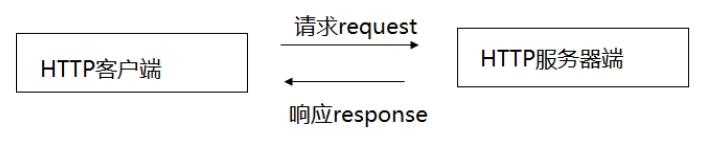

## 协议简介

> HTTP: hypertext Transfer Protocol 超文本传输协议, 是网络应用层的协议, 建立在TCP/IP协议基础上, HTTP使用可靠的TCP连接, 默认端口为80

用户打开web浏览器(常见的HTTP客户端), 输入URL地址, 就能接收到HTTP服务器发送过来的网页, 即HTTP遵循请求(Request)/应答(Response)模型, web浏览器向Web服务器发送请求, Web服务器处理请求并返回适当的应答, 所有HTTP连接都被构造成一套请求与应答



## 请求格式

1. 请求方式, URI(统一资源定位符), HTTP协议/版本
2. 请求头: Request Header
   - 请求头包含许多有关客户端环境和请求正文的游泳信息, 例如, 请求头可以声明浏览器所用的语言, 请求正文的长度等
3. 请求正文 Requet Content (只有在 post 方式才有)请求头和请求正文之间必须有符号行（回车符或行结束符），请请求头分开。 这个行非常重要， 它表示请求头已结束， 接下来的是请求正文。 通常 post 方式的数据存放于此， 请求正文中可以包含客户提交的查询字符串等信息。在实际应用中，HTTP 请求正文可以包含更多的内容 

```
POST / HTTP/1.1
Host: localhost:9999
Connection: keep-alive
Content-Length: 0
Cache-Control: max-age=0
Upgrade-Insecure-Requests: 1
Origin: null
Content-Type: application/x-www-form-urlencoded
User-Agent: Mozilla/5.0 (Windows NT 10.0; Win64; x64) AppleWebKit/537.36 (KHTML, like Gecko) Chrome/75.0.3770.142 Safari/537.36
Accept: text/html,application/xhtml+xml,application/xml;q=0.9,image/webp,image/apng,*/*;q=0.8,application/signed-exchange;v=b3
Accept-Encoding: gzip, deflate, br
Accept-Language: zh-CN,zh;q=0.9,en;q=0.8

请求正文
```

## HTTP响应格式

1. HTTP协议版本, 状态代码, 描述
2. 响应头 Response Head
3. 响应正文 Respose Context

```
HTTP/2.0 200 OK
server: JSP3/2.0.14
date: Mon, 08 Jul 2019 11:24:17 GMT
content-type: text/css
content-encoding: gzip
etag: W/"5c7e1b2f-63c6"
last-modified: Tue, 05 Mar 2019 06:46:07 GMT
expires: Fri, 12 Jul 2019 01:01:59 GMT
age: 439862
accept-ranges: bytes
cache-control: max-age=2592000
vary: Accept-Encoding
ohc-response-time: 1 0 0 0 0 0
ohc-cache-hit: chengdcm102 [4]
X-Firefox-Spdy: h2
```

