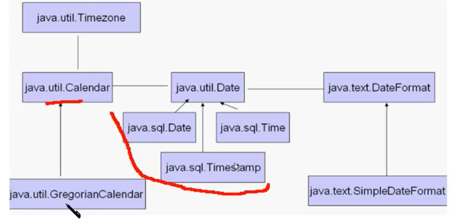

# java.util.Date



## 时区

> GMT(Greenwich Mean Time)代表格林尼治标准时间，这个大家都知道。 
>
> 而CST却同时可以代表如下 4 个不同的时区： 
>
> - Central Standard Time (USA) UT-6:00
> - Central Standard Time (Australia) UT+9:30
> - China Standard Time UT+8:00
> - Cuba Standard Time UT-4:00

## java.util.Date基本使用

### 初始化

```java
Date date = new Date();
Date date1 = new Date(1000L);
// 默认创建一个本地时间, long类型
// Date date = new Date(System.currentTimeMillis());
// 从1970-1-1 0:0:0开始
```

### 输出时间

```java
System.out.println(date1);
// 打印出北京时间 Thu Jan 01 08:00:01 CST 1970
System.out.println(date1.toGMTString());
// 打印出格林标准时间 1 Jan 1970 00:00:01 GMT
```

### 输出时差

```java
// 返回与格林时间的时差, 以分钟计时, 正好是8个小时, 此函数输出-480   则北京时间-480分钟等于格林时间
date1.getTimezoneOffset();
```

### 打印毫秒数

```java
long m = date1.getTime();
// 打印出date到1970年1月1日的毫秒数
System.out.println("m = " + m);
```

### 比较时间

```java
// 比较时间
// 返回boolean类型
date.after(date1);
date.before(date1);
// 返回-1 1 0
date.compareTo(date1);
```

## java.util.Date的子类

### java.sql.Date的使用

```java
// sql包的date类, 接收一个毫秒值
java.sql.Date sqldate = new java.sql.Date(1000L);
// 输出一个这样的字符串 1970-01-01
System.out.println(sqldate);
// 转换成格林时间和util中date输出一样
System.out.println(sqldate.toGMTString());
```

### java.sql.Timestamp使用

```java
java.sql.Timestamp timestamp = new Timestamp(2000L);
// 返回的均为本地时间
//1970-01-01 08:00:02.0
//1970-01-01T08:00:02
System.out.println(timestamp);
System.out.println(timestamp.toLocalDateTime());

// 返回一个格林瞬时时间
// 1970-01-01T00:00:02Z
System.out.println(timestamp.toInstant());
```

### java.sql.Time使用

```java
java.sql.Time time = new Time(3000L);
// 返回一个不带日期的本地时间  08:00:03
System.out.println(time);
```

## SimpleDateFormat使用

```java
Date date = new Date();
// 指定格式输出时间
// yyyy 年   MM 月   dd日   h 12小时制   H  24小时制0-23   ss秒     SSS毫秒
DateFormat dateFormat = new SimpleDateFormat("yyyy-MM-dd hh:mm:ss.SSS");
System.out.println(dateFormat.format(date));

// 将指定格式的字符串转化成Date
// "2018-05-26 09:03:22.658"
DateFormat dateFormat1 = new SimpleDateFormat("yyyy-MM-dd HH:mm:ss.SSS");
try {
   date = dateFormat1.parse("2018-05-26 09:03:22.658");
   // 输出 date = Sat May 26 09:03:22 CST 2018
   System.out.println("date = " + date);
} catch (ParseException e) {
   e.printStackTrace();
}
```

## Calender 使用

GregorianCalendar类中存放了各国的标准日历

```java
Calendar calendar = new GregorianCalendar();

// 设置日历时间
calendar.set(Calendar.YEAR, 2019);
calendar.set(Calendar.MONTH, 5);
calendar.set(Calendar.DAY_OF_MONTH, 26);

//使用Date类设置calendar时间
calendar.setTime(new Date());

//取得日历时间 calendar.getTime();  返回一个Date对象
// 输出Wed Jun 26 12:58:42 CST 2019
System.out.println(calendar.getTime().toString());

//使用日历取得时间偏移
// 输出Tue Jun 26 12:58:42 CST 2029
calendar.add(Calendar.YEAR, 10);
System.out.println(calendar.getTime().toString());
```

# java8 新特性—java.time包  时间处理类

## LocalDate类

```java
// 本地日期
LocalDate localDate = LocalDate.of(2019, 2, 14);
System.out.println(localDate);
int year = localDate.getYear(); //那一年
System.out.println("year = " + year);
Month month = localDate.getMonth(); // 第几个月
System.out.println("month = " + month);
int dayOfMonth = localDate.getDayOfMonth(); //一个月的第几天
System.out.println("dayOfMonth = " + dayOfMonth);
DayOfWeek dayOfWeek = localDate.getDayOfWeek(); //一周的第几天
System.out.println("dayOfWeek = " + dayOfWeek);
int lenth = localDate.lengthOfMonth(); // 一个月的天数
System.out.println("lenth = " + lenth);
boolean leapYear = localDate.isLeapYear(); // 是否是闰年
System.out.println("leapYear = " + leapYear);

//获取当前日期
System.out.println("LocalDate.now() = " + LocalDate.now());
```

## LocalTime 类

```java
// LocalTime 包含具体时间
LocalTime localTime = LocalTime.of(22, 10, 59);
System.out.println("localTime = " + localTime);
```

## LocalDateTime 类

```java
// LocalDateTime包括LocalDate和LocalTime
LocalDateTime localDateTime = LocalDateTime.of(localDate, localTime);
System.out.println("localDateTime = " + localDateTime);

//LocalDateTime 和 LocalDate, LocalTime 相互转换
LocalDate localDate1 = localDateTime.toLocalDate();
LocalTime localTime1 = localDateTime.toLocalTime();
```

## Instant类

```java
// 一个时间戳
Instant instant = Instant.now();
System.out.println("instant = " + instant);
```

## Duration类

```java
// 一个时间段
Duration duration = Duration.between(localDateTime, localTime1);
long toDays = duration.toDays(); // 这个时间段中有几天
long toHours = duration.toHours(); // 这个时间段中有几个小时

// 通过of创建时间段
Duration duration1 = Duration.of(5, ChronoUnit.DAYS);
```

## Period类

```java
// 以年月日来表示时间段
Period period = Period.between(localDate, localDate1);
```

## 时间加减操作

```java
// 时间加减操作
LocalDate date = LocalDate.now();
LocalDate localDate2 = date.minusDays(5);
LocalDate localDate3 = date.plusYears(10);
date.plus(5, ChronoUnit.DAYS);
System.out.println("localDate3 = " + localDate3);
System.out.println("localDate2 = " + localDate2);
```