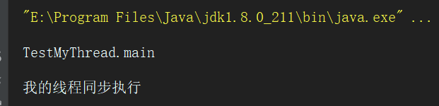
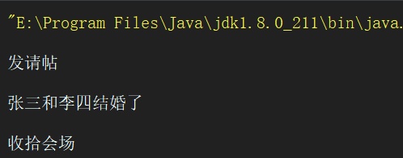

# 多线程

## 概念

> 程序: Program,是一个指令的集合 
>
> 进程:Process,(正在执行中的程序)是一个静态的概念进程是程序的一次静态态执行过程, 占用特定的地址空间.每个进程都是独立的, 由 3 部分组成 cpu,data,code 
> 缺点: 内存的浪费, cpu的负担
>
> 线程:是进程中一个“单一的连续控制流程”, 线程又被称为轻量级进程(lightweight process)。 一个进程可拥有多个并行的concurrent)线程.  一个进程中的线程共享相同的内存单元/内存地址空间. 可以访问相同的变量和对象，而且它们从同一堆中分配对象, 通信、
> 数据交换、同步操作. 
> 	由于线程间的通信是在同一地址空间上进行的， 所以不需要
> 额外的通信机制， 这就使得通信更简便而且信息传递的速度
> 也更快 

## 进程和线程之间的区别

> CPU调度执行的是线程

### 根本区别

- 进程: 是资源分配的基本单位
- 线程: 调度和执行的单位

### 开销区别

- 进程: 每个进程都有独立的代码和数据空间(进程上下文), 进程间的切换会有较大的开销
- 线程: 可以看做轻量级的进程, 同一类线程共享代码和数据空间每个线程有独立的运行栈和程序计数器(PC), 线程切换的开销小. 

### 所处环境

- 进程: 在操作系统中能同时运行多个任务(程序)
- 线程: 在同一程序中, 有多个顺序流同时执行

### 分配内存

- 进程: 系统在运行的时候, 会为每个进程分配不同的内存区域
- 除了CPU之外, 不会为线程分配内存(线程所使用的资源是它所属的进程的资源), 线程组只能共享资源

### 包含关系

- 进程: 没有线程的进程是可以被看做是单线程的, 如果一个进程内拥有多个线程, 则执行过程不是一条线的, 而是多条线(线程)共同完成的. 
- 线程: 线程是进程的一部分, 所以线程有的时候被称为是轻权进程或者是轻量进程

## JAVA实现多线程

### 继承Thread类

java中可以继承Thread类实现多线程. 缺点是java是单继承的语言, 继承了Thread类之后不能再继承其他的类

使用方法如下:

```java
// 继承Thread类, 重写run方法, run方法中是同步执行的线程代码
public class MyThread extends Thread {
	@Override
	public void run() {
		System.out.println("我的线程同步执行");
	}
}
```

主方法通过类.start方法启动线程同步执行

```java
public class TestMyThread {
	public static void main(String[] args) {
		// 创建线程类
		MyThread my = new MyThread();
		// 开始执行多线程
		my.start();
		// 主方法中的线程
		System.out.println("TestMyThread.main");
	}
}
```

执行结果如下



### 实现Runnable接口

可以实现Runnable接口中的run方法来使用多线程, Runnable接口就是实现了多线程代码的接口, Thread的本质上也是实现了Runnable接口. 其实Thread类是Runnable类的代理类, java使用Thread底层使用了代理设计模式

实现Runnable接口

```java
public class MyRunnable implements Runnable {
	@Override
	public void run() {
        // 多线程同步运行代码
		for (int i = 0; i < 10; i++) {
			System.out.println("MyRunnable.run" + i);
		}
	}
}
```

主线程使用Thread代理类接收Runnable

```java
public static void main(String[] args) {
    // 创建Runnable类, 内部含有线程代码
    MyRunnable my = new MyRunnable();
    // 创建线程, 接收Runnable
    Thread thread = new Thread(my);
    // 启动线程
    thread.start();
    // 主线程代码
    for (int i = 0; i < 10; i++) {
        System.out.println("TestRunnable.main" + i);
    }
}
```

## 代理模式详解

Thread是一个代理类, Thread代理了Runnable的执行代码

什么是代理设计模式, 举个例子. 你要结婚, 我设计一个接口, 结婚的接口 

```java
public interface Marry {
	void marry();
}
```

结婚的具体人员 You类

```java
public class You implements Marry {
	@Override
	public void marry() {
		System.out.println("张三和李四结婚了");
	}
}
```

这个时候你结婚可以这样测试了

```java
public class TestProxy {
	public static void main(String[] args) {
		Marry you = new You();
		you.marry();
	}
}
```

没错, 你结婚了. 但是~~~, 婚前的请帖呢? 婚后的会场整理呢?

我需要一个代理类, 这个代理类实现了Marry接口, 同时, 它还具有需要Marry的对象的引用, 代理的marry方法, 就调用了需要marry的对象的方法. 当然, 代理类也具有自己的方法, 比如发请帖啊, 收拾会场啊~~

```java
public class MarryProxy implements Marry {
	private Marry marryMember = null;

	public MarryProxy(Marry marryMember) {
		this.marryMember = marryMember;
	}

	@Override
	public void marry() {
		before();
		marryMember.marry();
		after();
	}
	
	private void before() {
		System.out.println("发请帖");
	}
	
	private void after() {
		System.out.println("收拾会场");
	}
}
```

这个时候, 测试类就可以这样写了

```java
public class TestProxy {
	public static void main(String[] args) {
		Marry marry = new MarryProxy(new You());
		marry.marry();
	}
}
```

请帖也发了, 会场也收拾了



### 代理模式在java中的运用

很明显, 我们这个线程就使用了代理模式, 当我们需要使用多线程的时候, 只需要专注于Runnable的接口实现就行了, 因为Runnable就是实现同步代码的地方. 而Thread类, 是Runnable的代理类, 它可以做到运行多线程之前的一些功能. 

### 和装饰模式的区别

> - **代理模式**（Proxy Pattern），为其它对象提供一种代理以控制对这个对象的访问。
> - **装饰模式**（Decorator Pattern），动态地给一个对象添加一些额外的职责。

如果你学过装饰模式, 你会发现代理模式和装饰模式惊人的相似
事实上, 如果你实现了一个继承Thread的类, 添加一些beforeAction()的方法, 重写run方法的时候, 将beforeAction放在runnable.run()的前边. 这个代理模式不就变成了装饰模式么?  显然我们可以把装饰当作对一个事件的代理. 比如我们把婚庆公司理解成是一个对结婚事件装饰的公司, 同时它不也是一个婚庆代理公司吗?, 只是, 他们使用的方式是不同的. 

我们使用代理模式的时候, 是为了专注于代理类处理的那个事件
我们使用装饰模式的时候, 是为了专注于事件添加的功能

敲一敲两种模式的代码, 你会发现区别的.    0.0….

## 线程的状态


### 新生状态

当一个线程类被new出来的时候, 就是一个线程的新生

### 就绪状态

当执行了start方法, 这个线程就就绪了.

### 运行状态

jvm执行了run方法中的代码, 线程进入运行状态
但是假如cpu正在执行一个非常重要的功能, 不能让这个线程执行, 这个线程就会等待, 
当CPU执行完那个重要的功能的时候, 会重新给线程执行的资格

### 终止状态

- 当线程执行完run里边的代码
- 手动调用了stop方法(已过时)
- 线程抛出了没有被捕获的异常

### 线程进入阻塞状态的情况

- 不知道什么时候会被选中执行
- 遇到IO或其他耗时的工作, 或者需要不需要CPU的阻塞
- 在这个时间片中没有执行完, 轮转时间片, 等待下一次执行

### 关于线程状态得一些方法

```java
// 获取当前线程
Thread.currentThread();

// 打印当前线程, toString()方法, 默认输出线程名字-线程优先级-线程组
Thread.currentThread().toString();

// 取得线程的名字
Thread.currentThread().getName();

// 线程可以自己命名
MyRunnable run = new MyRunnable();
Thread thread = new Thread(run, "这是一个线程的名字");

// 查看线程是否在活动状态
Thread.currentThread().isAlive();
```

## 线程的安全性问题

### 共享资源中的异步访问问题

我有5张票需要卖

```java
public class Ticket implements Runnable {
	private int ticket = 5;
	@Override
	public void run() {
		for (int i = 0; i < 10; i++) {
			if (ticket > 0) {
				System.out.println("正在卖第" + ticket -- + "张票");
				// 模拟卖票延迟
				try {
					Thread.sleep(500);
				} catch (InterruptedException e) {
					e.printStackTrace();
				}
			}
		}
	}
}
```

在测试方法卖票

```java
public class TestTicket {
   public static void main(String[] args) {
      // 共享数据, 5张票
      Ticket ticket = new Ticket();

      Thread t1 = new Thread(ticket, "A窗口卖票");
      Thread t2 = new Thread(ticket, "B窗口卖票");
      Thread t3 = new Thread(ticket, "C窗口卖票");
      t1.start();
      t2.start();
      t3.start();
   }
}
```

可以看到, 当不同的线程访问同一个共享资源的时候, 有可能会出问题. 这里就是卖了两张第二张票


### 安全问题解决

要解决这类问题, 需要用到一个关键字 synchronized

使用方法一:

```java
// 使用synchronized方法块进行加锁
synchronized(共享资源的对象 obj) {
    // 共享资源的处理逻辑语句
}
```

例如: 

```java
public void run() {
    synchronized (this) {
        for (int i = 0; i < 10; i++) {
            if (ticket > 0) {
                System.out.println("正在卖第" + ticket-- + "张票");
                // 模拟卖票延迟
                try {
                    Thread.sleep(500);
                } catch (InterruptedException e) {
                    e.printStackTrace();
                }
            }
        }
    }
}
```

这样, 会对共享的对象进行加锁, 每当有一个线程访问同步的这段逻辑,这个对象就会加锁, 其他的线程不能同时访问这段逻辑代码. 只有当此线程访问完毕之后, 释放锁, 其他线程才能再次访问. 

使用方法二: 

```java
// 使用同步方法进行加锁

@Override
public void run() {
   saleTicket();
}

// 同步方法, 默认将加锁对象设置为当前对象 this
private synchronized void saleTicket() {
   for (int i = 0; i < 10; i++) {
      if (ticket > 0) {
         System.out.println("正在卖第" + ticket-- + "张票");
         // 模拟卖票延迟
         try {
            Thread.sleep(500);
         } catch (InterruptedException e) {
            e.printStackTrace();
         }
      }
   }
}
```

再次运行测试代码, 可以看到卖票已然正常. 

### 死锁

当线程中请求多个含有锁的对象时, 很容易发生死锁

```java
public class DeadLock extends Thread {
	private Object money;//钱
	private Object water;//水
	public boolean flag;//标识持有对象锁
	
	public DeadLock(Object money, Object water) {
		super();
		this.money = money;
		this.water = water;
	}

	@Override
	public void run() {
		if(flag){//true时，持有“钱”的锁
			synchronized (money) {
				System.out.println("有钱,等水");
				try {
					Thread.sleep(300);
				} catch (InterruptedException e) {
					// TODO Auto-generated catch block
					e.printStackTrace();
				}
				synchronized (water) {
					System.out.println("有水，等钱");
				}
			}
		}else{
			synchronized (water) {
				System.out.println("有水，等钱");
				try {
					Thread.sleep(300);
				} catch (InterruptedException e) {
					// TODO Auto-generated catch block
					e.printStackTrace();
				}
				synchronized (money) {
					System.out.println("有钱，等水");
				}
			}
			
		}
	}
}
```
当有多个此线程运行的时候, 第一个线程有钱, 等待水. 第二个线程有水, 等待钱. 两个互相等待, 就会发生死锁. 

解决办法时让他们互斥

```java
public class DeadLock2 extends Thread {
	private Object money;//钱
	private Object water;//水
	public boolean flag;//标识持有对象锁
	
    public DeadLock2(Object money, Object water) {
        super();
        this.money = money;
        this.water = water;
    }

    @Override
    public void run() {
        if(flag){//true时，持有“钱”的锁
            synchronized (money) {
                System.out.println("有钱,等水");
                try {
                    Thread.sleep(300);
                } catch (InterruptedException e) {
                    // TODO Auto-generated catch block
                    e.printStackTrace();
                }

            }
            synchronized (water) {
                System.out.println("有水，等钱");
            }
        }else{
            synchronized (water) {
                System.out.println("有水，等钱");
                try {
                    Thread.sleep(300);
                } catch (InterruptedException e) {
                    // TODO Auto-generated catch block
                    e.printStackTrace();
                }

            }
            synchronized (money) {
                System.out.println("有钱，等水");
            }

        }
    }
}
```


## 线程中使用的常用方法

### join方法

调用该方法的线程强制执行，其它线程处于阻塞状态，该线程执行完毕后，其它线程再执行

```java
public static void main(String[] args) {
   // 测试线程执行
   MyRunnable my = new MyRunnable();
   Thread thread = new Thread(my, "测试线程1");
   thread.start();

   // 主线程执行
   for (int i = 0; i < 10; i++) {
      System.out.println("TestJoin.main" + i);
      if (i == 3) {
         try {
            thread.join();
         } catch (InterruptedException e) {
            e.printStackTrace();
         }
      }
   }
}
```

可以看到运行效果, 在测试线程执行完成之后, 主线程才会执行


### sleep方法

线程休眠方法, 可以让线程休眠n毫秒

### yield 方法

线程礼让方法, 线程停止一次, 进入就绪状态, 不会进入阻塞状态

### stop方法

线程停止, 此方法,不建议使用. 中断执行的线程

### wait方法

使用wait方法可以让此对象上的线程等待, 直到此对象调用notify方法唤醒, 方可继续执行

### notify方法

可以用来唤醒wait方法等待的线程

### notifyAll方法

唤醒所有等待的线程

## 线程的优先级

线程的优先级越高, 越有可能先被CPU调用, 越先执行. 当然, 这不是绝对的, 只是概率问题.

### 三个优先级常量

```java
// 最高优先级 10
Thread.MAX_PRIORITY

// 默认优先级  5
Thread.NORM_PRIORITY

// 最小优先级  1
Thread.MIN_PRIORITY
```

### 优先级的取得和设置

```java
public static void main(String[] args) {
   Thread thread = new Thread(new MyRunnable());
   System.out.println("取得默认优先级: " + thread.getPriority());

   // 设置优先级
   thread.setPriority(Thread.MAX_PRIORITY); // 设置成最高优先级 10

   System.out.println("此时优先级为: " + thread.getPriority());
}
```

