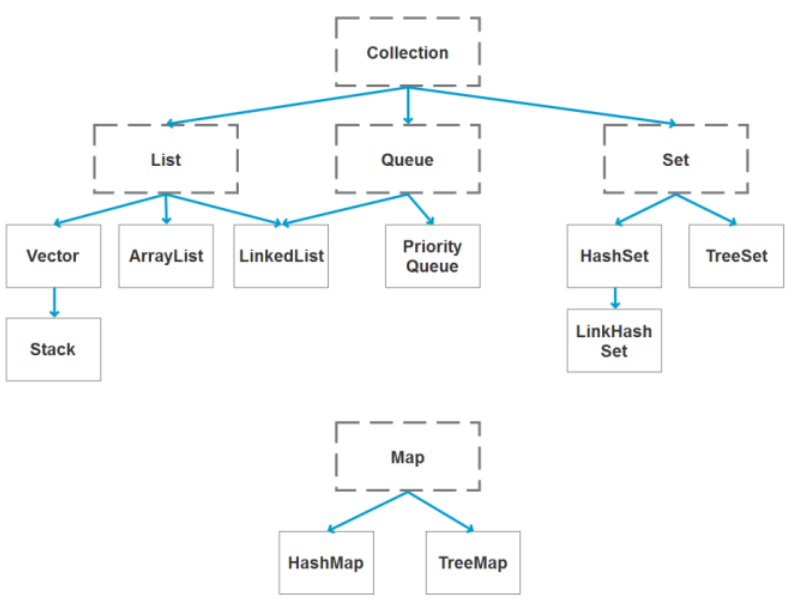

# 容器

## 集合框架



Collection接口, 子接口 list接口和set接口

Collection接口内容不唯一, 无序
List接口内容不唯一, 有序
Set接口内容唯一, 无序

## Collection中的常用方法

```java
// 查看是否为空
isEmpty();
// 返回一个iterator迭代器, 来自Iterable父类
iterator();
//是否含有对象O
boolean contains(Object o);
// 将容器内容转化为Object数组
Object[] toArray();
T[] toArray(T[] a);
// 添加元素
boolean add(E e);
// 删除元素
boolean remove(Object o);
// 是否包含所有元素
boolean containsAll(Collection<?> c);
// 添加所有元素
boolean addAll(Collection<? extends E> c);
// 删除所有元素
boolean removeAll(Collection<?> c);
// 删除满足某些条件的元素, jdk1.8 提供了默认实现
default boolean removeIf(Predicate<? super E> filter);
// 删除非共有的元素, 比如list1有a,b,c list2有 a, b  则list1.retainAll(list2) 则会删除c
boolean retainAll(Collection<?> c);
// 清除所有元素
void clear();
```

## List接口类

list中常用的方法均为collection中的方法, 无非是多处了一些包含索引的方法

注意

```java
//list中存在 
remove(index);
//Collection存在 
remove(Object);

// 当list.remove(1)的时候,删除的是索引指向的元素
// 如果想删除一个int类型的元素的话, 需要remove(Integer(123)) 这样调用

// list中add方法重载了add(index, Object)方法, 将指定元素添加到指定位置

listIterator()方法
// list中存在listIterator方法, 可以逆向遍历list容器
```

### ArrayList 实现类

源码分析: (看一看源码吧)

默认初始化容量为0, 当添加一个元素的时候, 容量增长为10, 每次扩容为10 + 10 >> 1;

```java
// 索引添加
add(int index, Object obj);
//通过System.copyarray(), 将原数组拷贝到了一个新的数组, 并后移了一位
//具体代码为
System.arraycopy(elementData, index, elementData, index + 1,size - index);

// 根据索引获取对象
get(int index);
return elementDate[index];

// 获取元素个数
size();
return size;

// 根据索引设置元素
E set(int index, E element) {
    E oldElement = elementDate[index];
	elementDate[index] = element;
	return oldElement;
}

// 根据索引删除元素
remove(int index)
int numMoved = size - index - 1;
if (numMoved > 0)
    System.arraycopy(elementData, index+1, elementData, index,
                     numMoved);
elementData[--size] = null; 

// 清空
clear();
for (int i = 0; i < size; i++)
        elementData[i] = null;
```

### LinkedList 实现类

底层用双向链表实现, 同时实现了Queue中的Deque接口

源码无非是对双向链表进行操作

```java
// 取得第一个元素,而且并不删除此元素 如果列表为空, 则抛出异常
getFirst();
Element();
// 与getFirst() 一样, 不同的是, 如果列表为空, 则返回null
peek();

// 删除第一个元素, 并返回, 如果列表为空, 抛出异常
removeFirst();
remove();
// 与remove() 方法一样, 不同的是, 如果列表为空, 则返回null
pool();
```


### Vector实现类

使用方法与ArrayList基本相同;  底层实现是数组

Vector初始容量是10, 每次扩充增加一倍. 
ArrayList初始化容量为0, 第一次添加扩充为10, 每次扩充为0.5倍

### Stack类

stack类继承了vector类, 实现的是栈结构, 与数据结构中stack一致.

不过值得注意的是, LinkedList 可以实现Stack的使用规则. 根据数据结构Stack的特性, 只操作尾部元素, 理论上说LinkedList的操作会比Stack效率高

## Queue 接口类

### 特有的常用方法

```java
// 添加一个元素, 如果添加成功的话, 返回true. 如果添加失败的话, 返回false
offer(E): boolean;

//返回队首元素, 并删除, 如果没有成功, 抛出一个异常
remove(): E;

// 和remove效果相同, 但是如果不成功的话, 会返回一个null
poll():E;

// 返回查看队首元素, 如果没有的话, 抛出一个异常
element():E;

// 和element() 方法一致, 如果没有的话, 返回一个null
peek():E;
```

### Deque接口类

双向队列
两种实现方法, 一种是数组实现, 实现类是ArrayDeque
另一种是链表实现,实现类是LinkedList类

特有方法

```java
// 添加
addFirst(E):void;
addLasht(E):void;
offerFirst(E):boolean;
offerLast(E):boolean;

// 删除
removeFirst():E;
removeLast():E;
pollFirst():E;
pollLast():E;

//查看
peekFirst():E;
peekLast():E;

// 压栈
push(E):void;
//弹栈
pop():E;
```

## Set接口

存储数据唯一, 且无序

添加重复元素的时候, 会覆盖

### HashSet 实现类

底层数据结构是Hash表
如果HashSet中存放的是自定义对象, 那么必须重写HashCode和equals方法
源码实现是map, set就是map的key, 无序的, 唯一的值

### TreeSet 实现类

有顺序, 必须实现内部比较累Comparable接口或者外部比较器Comparator接口

底层是BST, 二叉搜索树, 利用TreeMap实现.  间接使用了TreeMap来实现了TreeSet

## Map接口

Map是一组键值对, 键不能重复

常用方法

```java
// 大小
size();

// 是否含有
containsKey(Object):boolean;
containsValue(Object):boolean;

// 取出
get(Key):value;
//压入
put(key, value):value;
putAll(Map):void;

//删除
remove(Object):value;

// 清空
clear();

// 取出键集合
keySet():set;
// 取出值集合
values():collection;
// 取出键值对集合
entrySet():set;

//替换--> jdk8 提供了默认实现
replace(K, oldV, newV):boolean;
replace(K, V):boolean;
```

### HashMap实现类和HashTable实现类

1. HashMap jdk1.2添加, HashTable 在jdk1.1添加
2. HashMap继承了AbstactMap实现了Map接口, HashTable 继承了Dictionary实现了Map接口
3. HashMap允许null值和null键, 但是null键只允许一个, HashTable不允许null键和null值
4. HashMap不是线程同步的,效率高, HashTable 是线程同步的, 效率低, 安全性高

底层源码分析

底层使用hash表存储, 数组加链表结构. 扩容的装填因子为0.75

1. 计算Object对象的hashCode值
2. 根据y=k(x) 函数, 计算存储位置, x是hashcode()值, y是存储位置
3. 如果该位置上有元素, 需要调用equals()方法比较元素的内容是否相同, 如果不同, 使用链表连接, 如果相同, 则不再添加

哈希函数的选择

1. 直接定值法
2. 平方取中法
3. 折叠法
4. 除留取余法

jdk1.8开始, 当链表的个数>8个的时候, 就会将链表转化为红黑树, 目的是为了减少查询比较的次数

### TreeMap 类

底层源码实现, 红黑树
treemap的key是有序的, 升序

如果TreeMap使用自定义类作为key的时候, 必须要指定外部比较器, 否则会报错