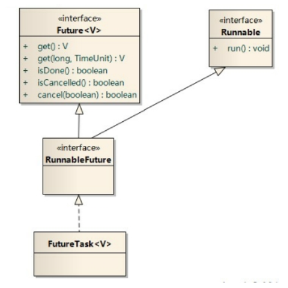

[TOC]

## 传统多线程的一些缺点

我们知道传统java实现多线程有两种方法, 实现Runnable接口和继承Thread类

1. 没有返回值
2. 不能抛出异常
3. 不支持泛型

## 实现多线程的第三种方法

实现Callable接口, 重写call方法

Callable功能更加强大

1. Future接口位于java.util.concurrent包中, 可以对具体Runnable, Callable的任务执行结果进行取消(cancel方法, 尝试取消此任务), 查询时否完成(isDone方法), 获取返回结果(get方法, 等待完成, 人后检索其他结果)等
2. FutrueTask是Futrue接口的唯一实现类  (被称作任务管理器)
3. FutrueTask同时实现了Runnable, Futrue接口, 他既可以作为Runnable被线程执行, 又可以作为Futrue得到Callable的返回值



### 使用代码举例

任务类, 实现Callable接口

```java
package pers.jssd.callable;

import java.util.concurrent.Callable;

/**
 * 实现Callable的多线程任务类
 * 注意: 此类能返回值, 也能抛出异常
 *
 * @author jssd
 * Create 2019-07-13 16:37
 */
public class MyCallable implements Callable<String> {

	@Override
	public String call() throws Exception {
		String[] num = {"first", "second", "third", "fourth", "fifth"};
		int random = (int) (Math.random() * 5);
		return num[random];
	}
}
```

测试类, 用到了实现Futrue接口的FutrueTesk类

```java
package pers.jssd.callable;

import java.util.concurrent.ExecutionException;
import java.util.concurrent.FutureTask;

/**
 * @author jssd
 * Create 2019-07-13 16:41
 */
public class Test1 {
	public static void main(String[] args) {
		//新建一个任务
		MyCallable myCallable = new MyCallable();
		/* 新建任务管理器FutureTask */
		FutureTask<String> futureTask = new FutureTask<>(myCallable);
		// 创建代理类执行
		Thread thread = new Thread(futureTask);
		thread.start();

		try {
			String result = futureTask.get();
			System.out.println("result = " + result);
		} catch (InterruptedException | ExecutionException e) {
			e.printStackTrace();
		}
	}
}
```

## 线程同步的第三种方法

传统意义上的线程同步无非就是synchronized代码块和synchronized方法, 其实还有第三种线程同步方法, 手动加锁.

Lock 锁, 对需要上锁的地方上锁, 锁的不是一个对象, 是一个代码块

1. JDK1.5后新增的功能
2. 与Synchronized相比, Lock可提供多种锁方案, 更灵活
3. java.util.concurrent.lock种的Lock是一个接口, 它的实现类是一个java类, 而不是作为语言的特性(关键字)来实现

### 使用步骤

1. 创建Lock对象
2. 调用lock()方法上锁
3. 调用unlock()方法解锁

### Lock与Synchronized的区别

1. Lock是显示锁(手动开启和关闭锁, 别忘关闭锁), sychronized是隐式锁
2. Lock 只有代码块锁, synchronized有代码块锁和方法锁
3. 使用Lock锁, JVM将花费较少的时间来调度线程, 性能更好, 并且具有更好的扩展性(提供更多的子类)
4. Lock确保当一个线程处于代码的临界区时, 另一个线程不进入临界区, 如果其他线程试图进入锁定的代码, 则它将一直等待(即被阻止), 知道该对象被释放. lock()方法会对lock实例对象进行加锁, 因此所有对该对象调用lock()方法的线程都会被阻塞, 直到Lock对象的unlock()方法被调用

使用方法举例

传统方法

```java
public class MyRunnable implements Runnable {
	private int count = 0;

	@Override
	public void run() {
		test();
	}

	private synchronized void test() {
		for (int i = 0; i < 10; i++) {
			count++;
			try {
				Thread.sleep(300);
			} catch (InterruptedException e) {
				e.printStackTrace();
			}
			System.out.println(Thread.currentThread() + "   :" + count);
		}
	}
}
```

使用Lock

```java
/**
 * @author jssd
 * Create 2019-07-13 17:04
 */
public class MyRunnable implements Runnable {
   private int count = 0;
   Lock lock = new ReentrantLock();
   @Override
   public void run() {
      test();
   }

   private synchronized void test() {
      lock.lock();
      for (int i = 0; i < 10; i++) {
         count++;
         try {
            Thread.sleep(300);
         } catch (InterruptedException e) {
            e.printStackTrace();
         }
         System.out.println(Thread.currentThread() + "   :" + count);
      }
      lock.unlock();
   }
}
```

## 使用线程池提高并发执行效率

### 什么时线程池

存放大量已经新建好的线程容器, 使用时可以直接调用, 不需要重新建立, 提高效率

### 线程池的好处

1. 提高响应速度(减少了创建新线程的时间)
2. 降低资源消耗(重复利用线程池中线程, 不需要每次都创建)
3. 提高线程的可管理性, 避免线程无限制创建, 从而销毁系统资源, 降低系统稳定性, 甚至内存溢出或者CPU耗尽

### 应用场合

1. 需要大量线程, 并且完成时间短
2. 对性能要求苛刻
3. 接受突发性的大量请求

### 使用线程池执行大量的Runnable命令

```java
package pers.jssd.threadpool;

import java.util.concurrent.ExecutorService;
import java.util.concurrent.Executors;

/**
 * @author jssd
 * Create 2019-07-13 17:39
 */
public class Test {
   public static void main(String[] args) {
      // 获取只有一个单独线程的线程池
//    ExecutorService executorService = Executors.newSingleThreadExecutor();
      // 获取有固定线程的线程池
//    ExecutorService executorService = Executors.newFixedThreadPool(10);
      // 获取动态自动创建的线程池
      ExecutorService executorService = Executors.newCachedThreadPool();

      // 执行20次一个共享资源
      for (int i = 0; i < 20; i++) {
         int finalI = i;
         // 使用lambda表达式替换匿名内部类
         Runnable command = () -> System.out.println("开始执行" + finalI);
         executorService.submit(command);
      }
      executorService.shutdown();
   }
}
```

### 使用线程池执行大量的Callable任务

```java
package pers.jssd.threadpool;

import java.util.ArrayList;
import java.util.List;
import java.util.concurrent.*;

/**
 * @author jssd
 * Create 2019-07-13 17:47
 */
public class Test2 {
   public static void main(String[] args) throws ExecutionException, InterruptedException {
      // 获取只有一个单独线程的线程池
//    ExecutorService executorService = Executors.newSingleThreadExecutor();
      // 获取有固定线程的线程池
//    ExecutorService executorService = Executors.newFixedThreadPool(10);
      // 获取动态自动创建的线程池
      ExecutorService executorService = Executors.newCachedThreadPool();

      List<FutureTask> list = new ArrayList<>();
      // 执行20次一个共享资源
      for (int i = 0; i < 20; i++) {
         Callable<Double> command = () -> Math.random()*5;
         FutureTask<Double> f = new FutureTask<>(command);
         // 将任务存储到list中, 等执行完再获取返回值, 以提升效率
         list.add(f);
         executorService.submit(f);
      }
      for (FutureTask futureTask : list) {
         System.out.println("futureTask.get() = " + futureTask.get());
      }
      executorService.shutdown();
   }
}
```

## 任务调度

### 什么时调度

任务: 就是事情

调度: 在不同的时间点或者指定的时间点或者间隔多长时间我去运行这个任务, 就是生活中的闹钟

### 相关的类

Timer类: 位于java.util包中

### 简单使用

实现时间的动态刷新

```java
public class MyClock extends TimerTask {
   // 时钟执行的方法
   @Override
   public void run() {
      Date date = new Date();
      System.out.println(date.toInstant().toString());
   }
}
```

测试类: 

```java
public class Test {
   public static void main(String[] args) {
      Timer timer = new Timer();
      // 一秒后执行, 每隔一秒执行一次
      timer.schedule(new MyClock(), 1000, 1000);
   }
}
```

