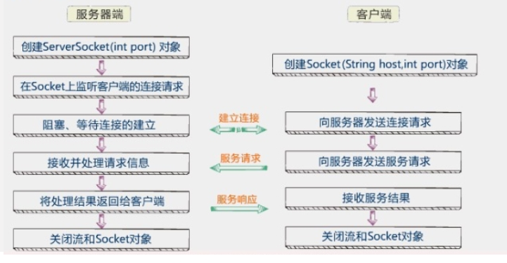
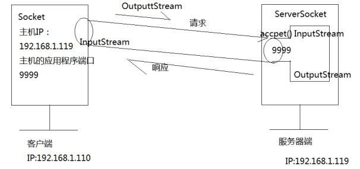
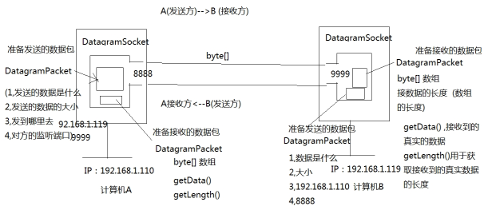

# 网络编程

## 网络编程的基本概念

### 网络的基本概念

> 网络: 一组相互连接的计算机, 多台计算机组成, 使用物理线路进行连接

### 网络的功能

 - 交换数据
 - 共享资源

### 网络三要素

1. IP地址: 唯一标识网络上的每一台计算机, 两台计算机之间通信的必备要素
2. 端口号: 计算机中应用的标号(代表一个应用程序), 0-1024系统使用或保留端口, 端口号占2个字节, 所以有效端口0-65535
3. 通信协议: 通信的规则 TCP UDP

### Socket

> Socket被称为"套接字", 是计算机之间通信的一种约定或一种方式. 通过Socket这种约定, 一台计算机可以接收其他计算机的数据. 也可以向其他计算机发送数据. 

如果你想写封邮件发给远方的朋友， 如何写信、将信打包，属于应用层。信怎么写，怎么打包完全由我们做主；而当我们将信投入邮筒时， 邮筒的那个口就是套接字， 在进入套接字之后， 就是传输层、 网络层等（邮局、 公路交管或者航线等） 其它层次的工作了 

## TCP和UDP传输区别

### TCP

> 一种面向连接的, 可靠的, 基于字节流的运输层通信协议

特点:

1. 面向连接
2. 点到点的通信
3. 高可靠性: 三次握手
4. 占用系统资源多, 效率低

生活案例: 打电话

### UDP

> 一种无连接的传输层协议, 提供面向事物的简单不可靠信息传送服务

特点:

1. 非面向连接, 传输不可靠, 可能丢失
2. 发送不管对方是否准备好, 接收方收到也不确认
3. 数据报的大小限制在64k以内
4. 非常简单的协议, 开销小

生活案例: 发短信, 发电报

## 协议数据传递细节

### TCP

> 服务器创建ServerSocket, 在指定端口监控并处理请求客户端创建Socket, 向服务器发送请求

通信过程如下: 



假如我有一个客户端, 要与服务器进行通信, 如下图.

- 我的客户端IP为: 192.168.1.110
  我的客户端端口为: 10000
- 我的服务器IP为: 192.168.1.119
  我的服务器端口为: 9999

通信步骤: 

1. 服务器开启监听, 使用ServerSocket中的accept方法监听9999端口
2. 客户端通过创建Socket向服务器发送请求
3. 服务器监听到客户端发来的连接请求, 确认并连接
4. 客户端通过输出流OutputStream向服务器发送信息
5. 服务器通过输入流InputStream接收客户端的信息
6. 服务器通过输出流OutputStream向客户端发送响应信息
7. 客户端通过输入流InputSream接收客户端的响应信息
8. 一次信息交互完成



### UDP

> UDP不需要有服务器的存在, 每一台主机都可能是发送方, 另一方就是接收方

1. 不需要利用IO流实现数据的传输
2. 每个数据发送单元被统一封装成数据包的方式, 发送方将数据包发送到网络中, 数据包在网络中区寻找它的目的地
3. DatagramSocket: 用于发送或接收数据包
4. DatagramPacket: 数据包

假如我有两台主机需要通信

- 计算机A的IP: 192.168.1.110

  计算机A的端口: 8888

- 计算机B的IP: 192.168.1.119

  计算机B的端口: 9999

通信步骤: 

1. 计算机A将发送得数据, 封装成数据包
2. 数据包中包含信息如下
   - 发送得数据是什么
   - 发送得数据大小
   - 发到哪里去
   - 对方得端口号
3. 通过DatagramPacket发送到主机B
4. 主机B接收数据包
5. 主机B拆包, 取得主机A发送得原始信息
6. 一次信息发送成功. 主机B回复信息重复此类流程



## 相关类及使用方法

### InetAdress类

> 封装计算机得IP地址, 不包含端口号

常用方法

1. String getHostAddress()  获取IP地址
2. String getHostName()   获取主机名
3. static InetAddress getByName(String host)  根据主机名/域名/IP地址获取InetAddress对象

使用示例: 

```java
public static void main(String[] args) {
    InetAddress ia;
    try {
        // 取得本地主机的InetAddress对象
        ia = InetAddress.getLocalHost();

        System.out.println("本地主机的IP地址" + ia.getHostAddress());
        System.out.println("本地主机的主机名" + ia.getHostName());

        // 通过IP获得InetAddress对象, 一般这个时候获取主机名都是IP地址
        ia = InetAddress.getByName("39.156.66.18");
        System.out.println("本地主机的IP地址" + ia.getHostAddress());
        System.out.println("本地主机的主机名" + ia.getHostName());

        // 通过域名获取InetAddress对象, 此时获取的主机名是域名
        ia = InetAddress.getByName("www.baidu.com");
        System.out.println("百度的IP地址" + ia.getHostAddress());
        System.out.println("百度的主机名" + ia.getHostName());
    } catch (UnknownHostException e) {
        e.printStackTrace();
    }
}
```

### InetSocketAddress类

> 此类用于实现IP套接字地址(IP地址+端口号), 用于socket通信

常用方法: 

1. InetAddress getAddress()   获取InetAddress对象
2. int getPort()   获取端口号
3. String getHostName()    获取主机名

使用示例: 

```java
public static void main(String[] args) {
   InetSocketAddress isa = null;
   try {
      isa = new InetSocketAddress(InetAddress.getByName("localhost"), 9999);
      System.out.println("本机的主机名" + isa.getHostName());
      System.out.println("isa.getHostString() = " + isa.getHostString());
      System.out.println("isa.getPort() = " + isa.getPort());
   } catch (UnknownHostException e) {
      e.printStackTrace();
   }
}
```

### URL类

> URL (Uniform Resource Locator): 统一资源定位符, 用于定位网络上的资源
>
> 资源可以是简单的文件或目录， 也可以是对更为复杂的对象的引用，例如对数据库或搜索引擎的查询 

例如: https://www.baidu.com/index.html#aa?uname=wjj&pwd=123456

格式为: 协议://域名/资源路径#锚点?参数&参数

常用方法:

1. String getProtocal()   获取此URL的协议名称
2. String getHost()   获取此URL的主机名字(如果适用)
3. int getPort()   获取URL的端口号, 如果没有写, 返回-1
4. int getDefaultPort()   返回默认端口号
5. String getFile()   获取此URL的文件名
6. String getPath()   获取URL的路径部分
7. InputStream openStream()   打开到此URL的连接并返回一个从该连接读入的InputStream

使用实例: 

```java
public static void main(String[] args) {
   URL url;
   try {
      url = new URL("https://www.baidu.com/index.html");
      System.out.println("url.getFile() = " + url.getFile());
      System.out.println("url.getPath() = " + url.getPath());
      System.out.println("url.getProtocol() = " + url.getProtocol());
      System.out.println("url.getUserInfo() = " + url.getUserInfo());
      System.out.println("url.getHost() = " + url.getHost());
      /*
      以上输出:
         url.getFile() = /index.html
         url.getPath() = /index.html
         url.getProtocol() = https
         url.getUserInfo() = null
         url.getHost() = www.baidu.com
       */


      // 网络爬虫, 爬下百度首页
      BufferedReader br = new BufferedReader(new InputStreamReader(url.openStream()));
      BufferedWriter bw = new BufferedWriter(new OutputStreamWriter(new FileOutputStream("./baidu.html")));
      String line;
      while ((line = br.readLine()) != null) {
         bw.write(line);
         bw.newLine();
         bw.flush();
      }
   } catch (IOException e) {
      e.printStackTrace();
   }
}
```

## TCP 连接

TCP使用需要有一个服务器, 客户端通过连接服务器进行信息交互

信息交互基于IO流进行

### Client端

```java
/**
 * 网络编程客户端
 *
 * @author jssd
 * Create 2019-07-08 20:44
 */
public class TestClient {
	public static void main(String[] args) {
		Socket socket = null;
		DataInputStream dis = null;
		DataOutputStream dos = null;
		try {
			socket = new Socket("localhost", 9999);
			dis = new DataInputStream(socket.getInputStream());
			dos = new DataOutputStream(socket.getOutputStream());
			dos.writeUTF("给你发个消息你知道不?");
			dos.flush();
			System.out.println(dis.readUTF());
		} catch (IOException e) {
			e.printStackTrace();
		} finally {
			TestServer.close(socket, dis, dos);
		}
	}
}
```

### 服务器端

```java
/**
 * 网络编程服务器端
 *
 * @author jssd
 * Create 2019-07-08 20:48
 */
public class TestServer {
	public static void main(String[] args) {
		Socket client = null;
		DataInputStream dis = null;
		DataOutputStream dos = null;
		try {
			ServerSocket ss = new ServerSocket(9999);
			client = ss.accept();
			dis = new DataInputStream(client.getInputStream());
			dos = new DataOutputStream(client.getOutputStream());
			System.out.println(dis.readUTF());
			dos.writeUTF("我接收到了");
			dos.flush();
		} catch (IOException e) {
			e.printStackTrace();
		} finally {
			close(client, dis, dos);
		}
	}

	public static void close(Socket client, DataInputStream dis, DataOutputStream dos) {
		try {
			if (dis != null) {
				dis.close();
			}
		} catch (IOException e) {
			e.printStackTrace();
		}
		try {
			if (dos != null) {
				dos.close();
			}
		} catch (IOException e) {
			e.printStackTrace();
		}
		try {
			if (client != null) {
				client.close();
			}
		} catch (IOException e) {
			e.printStackTrace();
		}
	}
}
```

## UDP连接

UDP连接两边主机都是处于同等地位, 都使用DatagramSocket监听, 使用DatagramPacket进行数据包传递

### Computer1

```java
public class Test1 {
	//一次双向通信
	/**一发
	 * 一收
	 * @throws IOException */
	public static void main(String[] args) throws IOException {
		System.out.println("咨询者");
		//创建DatagramSocket对象
		DatagramSocket ds=new DatagramSocket(8888);//本应用程序的端口
		//准备要发送的数据
		byte[] buf="helloworld".getBytes();
		//创建数据报对象
		                            //发送的数据，  发多少，发到哪台主机，主机程序使用的端口
		DatagramPacket dp=new DatagramPacket(buf, buf.length, InetAddress.getByName("localhost"), 9999);
		
		//发送
		ds.send(dp);
		
		/**接收数据*/
		byte [] buf2=new byte[1024];
		DatagramPacket dp2=new DatagramPacket(buf2, buf2.length);
		// 借助String的构造方法查看
		ds.receive(dp2);
		String str=new String(dp2.getData(),0,dp2.getLength());
		System.out.println("客服说:"+str);
		
		ds.close();
	}
}
```

### Computer2

```java
public class Test1 {
	//接收方
    /** 一收，
	 * 一发
	 * @throws IOException 
	 */
	public static void main(String[] args) throws IOException {
		System.out.println("客服人员");
		DatagramSocket ds=new DatagramSocket(9999);
		//准 备接收数据
		byte [] buf=new byte[1024];
		//准 备数据报接收
		DatagramPacket dp=new DatagramPacket(buf, buf.length);
		
		//接收
		ds.receive(dp);
		
		//查看接收到的数据
		String str=new String(dp.getData(),0,dp.getLength());
		System.out.println("客户说:"+str);
		
		
		/**回复数据*/
		byte [] buf2="welcome to beijing".getBytes();
		DatagramPacket dp2=new DatagramPacket(buf2, buf2.length, dp.getAddress(), dp.getPort());
		ds.send(dp2);
		//关闭
		ds.close();
	}
}
```

