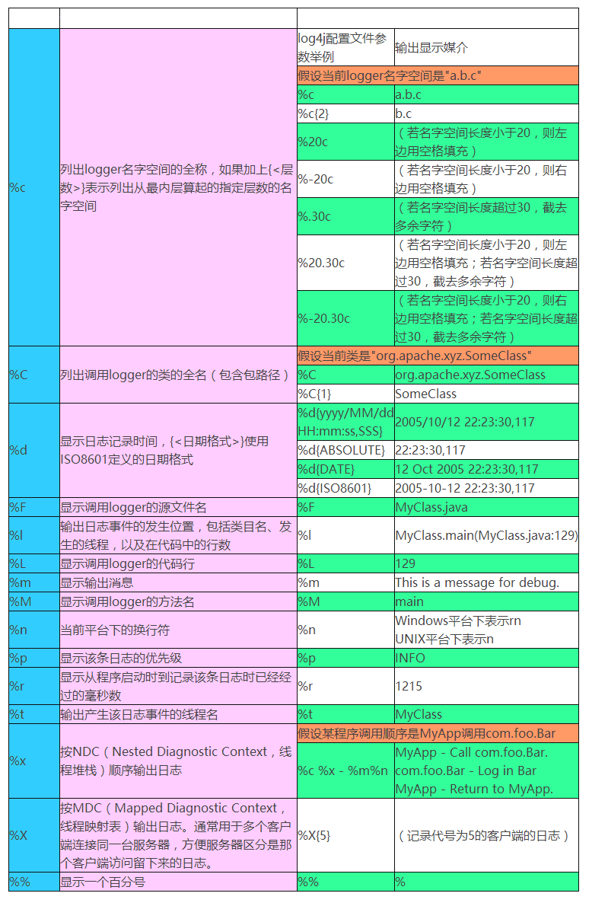

# Log4J使用

## 1. Log4J简介

- Log4J是Apache提供的一款记录日志的工具
- Log4J既可以将日志信息打印在控制台, 也可以打印输出到一个日志文件中
- Log4J可以定制日志的输出格式
- Log4J可以定制日志级别

## 2. 日志级别

设置日志级别之后, 高于或等于设置的日志级别都会输出.

### 2.1 TATAL

致命的, 表示非常严重的错误, 一般是系统错误

### 2.2 ERROE

错误, 表示代码错误, 比较严重

### 2.3 WARN

警告, 不影响程序的运行, 但是可能存在风险

### 2.4 INFO

信息, 表示一个普通的输出信息

### 2.5DEBUG

调试, 表示程序员人为的一些调试信息

## 3. Log4J的使用

### 3.1 导包

- log4j-1.2.17.jar
- log4j-api-2.0-rc1.jar
- log4j-core-2.0-rc1.jar 

### 3.2 配置文件

使用一个叫 log4j.properties 的配置文件, 会设定 log4j 的
设置信息, 例如日志级别, 日志输出方式, 日志格式等等. 

eclipse自带此文件, 在eclipse的安装目录下, 搜索log4j.*就能找到

```properties
# Set root category priority to INFO and its only appender to CONSOLE.
log4j.rootCategory=DEBUG, CONSOLE
#log4j.rootCategory=INFO, CONSOLE, LOGFILE

# CONSOLE is set to be a ConsoleAppender using a PatternLayout.
log4j.appender.CONSOLE=org.apache.log4j.ConsoleAppender
# 此处是单独设置控制台的日志级别
#log4j.appender.CONSOLE.Threshold=INFO
log4j.appender.CONSOLE.layout=org.apache.log4j.PatternLayout
log4j.appender.CONSOLE.layout.ConversionPattern=- %m%n

# LOGFILE is set to be a File appender using a PatternLayout.
log4j.appender.LOGFILE=org.apache.log4j.FileAppender
log4j.appender.LOGFILE.File=axis.log
log4j.appender.LOGFILE.Append=true
log4j.appender.LOGFILE.Threshold=INFO
log4j.appender.LOGFILE.layout=org.apache.log4j.PatternLayout
log4j.appender.LOGFILE.layout.ConversionPattern=%-4r [%t] %-5p %c %x - %m%n
```

#### 3.2.1 设置日志级别为INFO, 并且输出在控制台

log4j.rootCategory=INFO, CONSOLE

#### 3.2.2 设置控制台日志格式

```properties
log4j.appender.CONSOLE.layout=org.apache.log4j.PatternLayout
log4j.appender.CONSOLE.layout.ConversionPattern=- %m%n
```

```properties
	%n - 换行
	%m - 日志内容   
	%p - 日志级别(FATAL,   ERROR,   WARN,   INFO,   DEBUG   or   custom)    
	%r - 程序启动到现在的毫秒数 
	%% - percent   sign   in   output
	%t - 当前线程名
	%d   -  日期和时间, 常用的格式有 %d{DATE}, %d{ABSOLUTE}, %d{HH:mm:ss,SSS}, %d{ddMMyyyy HH:mm:ss,SSS}。。。
	%l - 同 %F%L%C%M
	%F - java源文件名
	%L - java源码行数 	%C - java类名,%C{1} 输出最后一个元素
	%M-java方法名
 

示例：
Java代码
[%d{HH\:mm\:ss\:SSS}][%p] (%c\:%L) - %m%n  
[%d{HH\:mm\:ss\:SSS}][%p] (%c\:%L) - %m%n
输出格式为：[08:58:59:412][INFO] (com.soon.action:35) - 服务器启动
```



#### 3.2.3 输出到文件

文件位置

log4j.appender.LOGFILE.File=D:/test.log

是否追加

log4j.appender.LOGFILE.Append=true

### 3.3 测试一下

在log4j.properties中的配置下, 可以看到, 会输出不同级别的日志. (注意, log4j.properties配置文件应该放在src目录下)

```java
package pers.jssd.log4j.test;

import org.apache.log4j.Logger;

/**
 * @author jssdjing@gmail.com
 */
public class TestLog4J {
    public static void main(String[] args) {
        Logger logger = Logger.getLogger(TestLog4J.class);
        logger.fatal("系统错误");
        logger.error("代码错误");
        logger.warn("警告信息");
        logger.info("普通信息");
        logger.debug("调试信息");
    }
}
```

