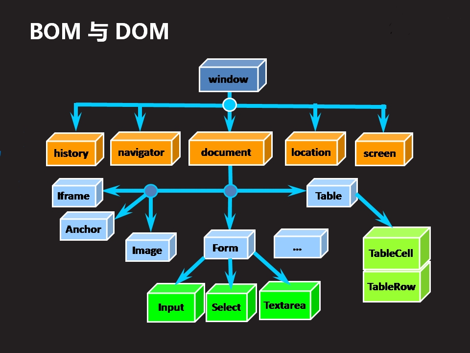
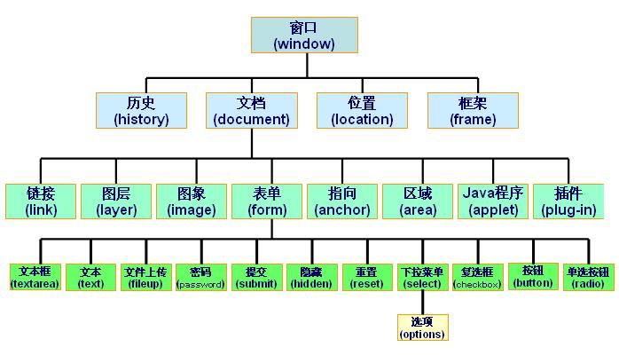

# BOM对象和DOM对象的区别

## 什么是BOM

- BOM是Browser Object Model的简写， 即浏览器对象模型
- BOM由一系列对象组成， 是访问、 控制、 修改浏览器
  的属性的方法 
- BOM没有统一的标准(每种客户端都可以自定标准)。 
- BOM的顶层是window对象 

## 什么是DOM

- DOM是Document Object Model的简写，即文档对象
  模型。 
- DOM用于XHTML、 XML文档的应用程序接口(API) 
- DOM提供一种结构化的文档描述方式， 从而使HTML内
  容使用结构化的方式显示 
- DOM由一系列对象组成，是访问、检索、修改XHTML
  文档内容与结构的标准方法。 
- DOM标准是由w3c制定与维护。 DOM是跨平台与跨语言
  的。 
- DOM的顶层是document对象 

