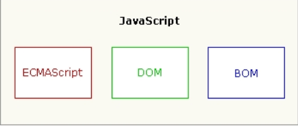

# JavaScript简介

## 为什么学习JavaScript(作用)

1. html+css 只是可以实现静态的页面无法实现动态的效
   果 
2. 表单的校验
3. 背景图片的更换
4. 操作节点的信息

## JavaScript 概念

JavaScript 一种直译式脚本语言， 是一种动态类型、 弱类型、
基于原型的语言，内置支持类型 

## JavaScript组成

- ECMAScript: JavaScript的核心
- 文档对象模型(DOM): DOM(文档对象模型)是HTML和XML的应用接口(API). DOM将把整个页面规划成由节点层级构成的文档
- 浏览器对象模型（ BOM）对浏览器窗口进行访问和操作 

## JavaScript语言的特点

### 特点

1. 脚本语言
   - 脚本语言是一种简单的程序， 是由一些ASCII字符构
     成，可以使用任何一种文本编辑器编写。一些程序
     语言（如C、 C++、 Java等）都必须经过编译，将源
     代码编译成二进制的可执行文件之后才能运行，而
     脚本语言不需要事先编译，只要有一个与其相适应
     的解释器就可以执行。 
   - 脚本语言是指在web浏览器内有解释器解释执行的
     编程语言，每次运行程序的时候，解释器会把程序
     代码翻译成可执行的格式。 
2. 基于对象的语言
   - 面向对象有三大特点（封装，继承，多态）却一不
     可。 
   - 通常“基于对象”是使用对象，但是无法利用现有的
     对象模板产生新的对象类型，也就是说“基于对象”
     没有继承的特点。没有了继承的概念也就无从谈论
     “多态 "
3. 事件驱动
   - 在网页中执行了某种操作的动作，被称为“事
     件”(Event)，比如按下鼠标、移动窗口、选择菜单
     等都可以视为事件。当事件发生后，可能会引起相
     应的事件响应。 
4. 简单性
   - 变量类型是采用弱类型， 并未使用严格的数据类型。
     var a,b,c; a=123; b=“abc”; a=b; 
5. 安全性
   - JavaScript不能访问本地的硬盘，不能将数据存入
     到服务器上，不能对网络文档进行修改和删除，只
     能通过浏览器实现信息浏览或动态交互 
6. 跨平台性
   - JavaScript依赖于浏览器本身，与操作平台无关 
   - 只要计算机安装了支持JavaScript 的浏览器（装有
     JavaScript解释器）， JavaScript 程序就可以正
     确执行 

### 缺点

各种浏览器支持JavaScript的程度是不一样的，支
持和不完全支持JavaScript的 浏览器在浏览同一
个带有JavaScript脚本的网页时，效果会有一定的
差距，有时甚至会显示不出来。 