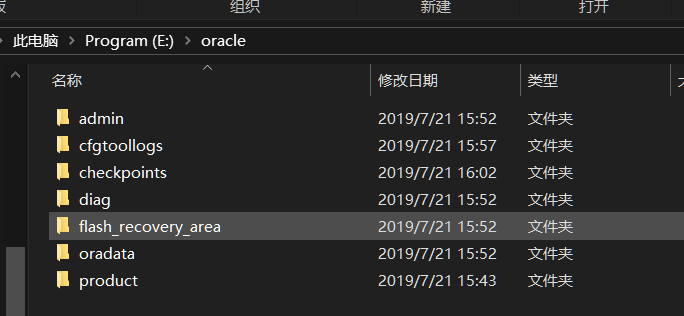
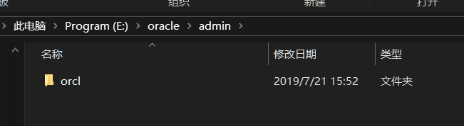
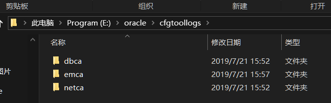
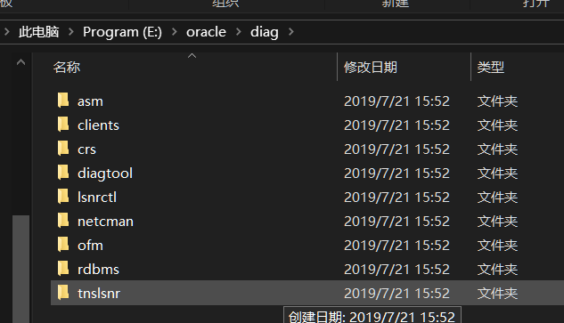
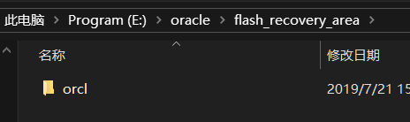
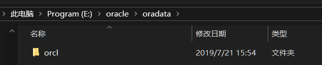
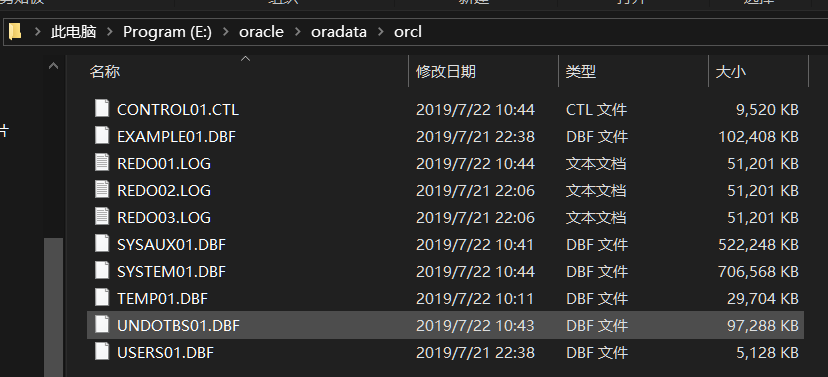
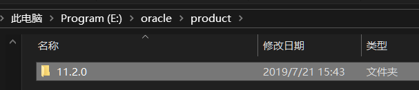

[TOC]

# Oracle的目录结构

## 1. admin目录

记录Oracle实例的配置, 运行日志等文件, 每个实例一个目录(上图只有一个实例, 所以只有一个目录).

SID: System IDentifier的缩写, 是Oracle实例的唯一标记. 在Oracle中一个实例只能操作一个数据库. 如果安装多个数据库, 那么就会有多个实例, 我们可以通过实例SID来区分. 由于Oracle中一个实例只能操作一个数据库的原因oracle中也会使用SID来作为库的名称

## 2. cfgtoologs目录

分别存放当运行dbca, emca, netca等图形化配置程序的log

## 3. Checkpoints目录

存放检查点文件

## 4. diag目录

Oracle11g 新添加的一个重组目录. 其中的子目录, 基本上Oracle每个组件都有了自己的单独目录, 在Oracle10g中我们一直诟病的log文件散放在四处的问题终于得到解决, 无论是asm还是crs还是rdbms, 所有组件需要被用来诊断的log文件都存放在类这个新的目录下

## 5. flash_recovery_area(闪回区)目录

闪回区: 分配一个特定的目录位置来存放一些特定的恢复文件, 用于集中和简化管理数据库恢复工作, 闪回区可存储完全的数据库文件备份, 增量备份, 数据文件副本, 当前的控制文件, 备份的控制文件, spfile文件, 快照控制文件, 联机日志文件, 归档文件, 块跟踪文件, 闪回日志

## 6. oradata目录

存放数据文件

1.  CONTROL01.CTL

   Oracle数据库的控制文件

2. EXAMPLE01.DBF

   Oracle数据库表空间文件

3. REDO01.LOG

   Oracle数据库的重做日志文件, 01, 02, 03均为重做日志文件

4. SYSAUX01.DBF

   11g 新增的表空间. 主要用于存储数据字典以外的其他数据对象, 由系统内部自动维护

5. SYSTEM01.DBF

   用于存放Oracle系统内部表和数据字典的数据, 比如, 表名, 列名, 用户名等

6. TEMP01.DBF

   临时表空间文件

7. UNDOTBS01.DBF

   撤销表空间文件, 用来保存回滚数据

8. USER02.DBF

   用户表空间

## 7. product目录

Oracle RDBMS的软件存放目录. RDBMS即关系数据库管理系统(Relational Database Management System).

# 系统用户介绍

## sys用户

sys: sys是Oracle中的超级用户, 拥有的权限最大, 可以完成数据库的所有管理任务

## system用户

system: 没有sys权限大, 通常用来创建一些用户查看管理员信息的表或者视图, 不建议使用system用户来创建一些与管理无关的表或者视图

## sys和system在登录时候的区别

sys和system在登录Oracle时, sys只能以系统管理员(sysdba)或系统操作员(sysoper)的权限登录, 而system可以直接登录(normal)

## scott用户

scott: 时oracle提供的实例用户, 提供了一些学习Oracle操作的数据表, 如emp, dept, salgrade, bonus表等