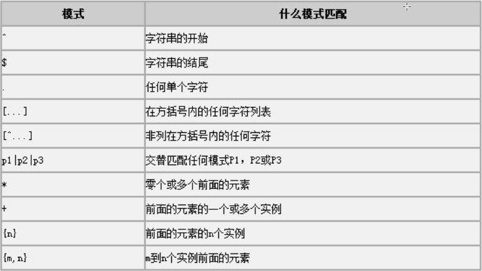

# MySQL中的正则表达式

- MySQL 中允许使用正则表达式定义字符串的搜索条件， 性能要高于 like。
- MySQL 中的正则表达式可以对整数类型或者字符类型检索。
- 使用 REGEXP 关键字表示正则匹配。
- 默认忽略大小写， 如果要区分大小写， 使用 BINARY 关键字 



## 示例

查询雇员表中名字是以 k 开头的雇员名字与薪水。

```sql
select last_name,salary from employees where last_name REGEXP binary '^K' 
```

查询以 x 结尾的数据(忽略大小写)

```sql
SELECT 列名 FROM 表名 WHERE 列名 REGEXP 'x$';
```

查询雇员表中名字含有 o 的雇员的姓名与薪水。

```sql
select last_name,salary from employees where last_name REGEXP 'o.'
```

查询雇员表中名字包含 x、 y、 z 字符的雇员的名字和薪水。

```sql
select last_name,salary from employees where last_name REGEXP '[x-z]' 
```

查询雇员名字是 t、 f 开头的雇员名字与薪水。

```sql
select last_name,salary from employees where last_name REGEXP '^[t|f]' 
```

查询雇员的名字与薪水， 不包含 oldlu。

```sql
select last_name,salary from employees where last_name REGEXP '[^oldlu] '
```

查询雇员名字中包含 1 个或者两个 o 的雇员姓名与薪水。

```sql
select last_name,salary from employees where last_name REGEXP 'o.{1,2}' 
```

