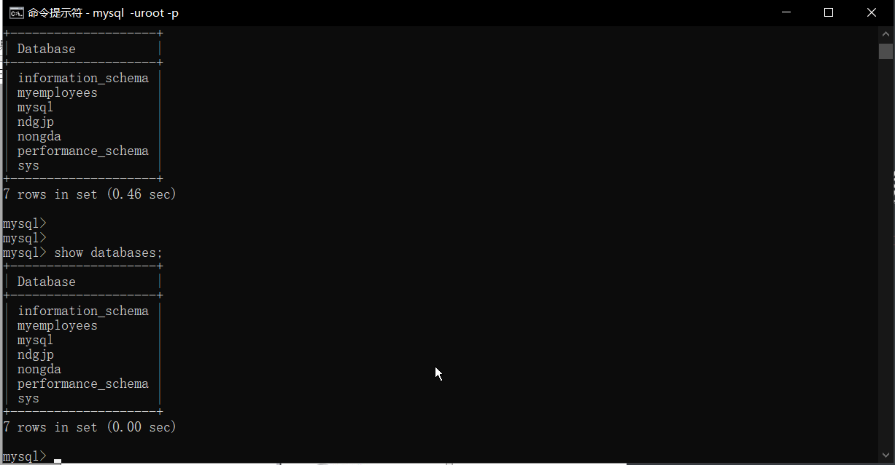

# 查看Mysql中的数据库

使用show databases;查看数据库



# MySql与Oracle的区别

## 1. 实例区别

- Mysql是轻量级数据库, 开源免费. Oracle是收费的而且价格相对较高
- MySQL 一个实例可以操作多个库， 而 Oracle 一个实例只能对应一个库。 
- MySQL 安装完后 300M 而 Oracle 有 3G 左右。 

## 2. 操作区别

1. 主键： MySQL 一般使用自动增长类型， 而 Oracle 则需要使用序列对象。
2. 单引号的处理： MySQL 里可以用双引号包起字符串， ORACLE 里只可以用单引号包起字符串。
3. 分页的 SQL 语句： MYSQL 用 LIMIT， 而 Oracle 需要使用内建视图和 rownum 伪列。
4. 事务处理： MySQL 默认是自动提交， 而 Oracle 默认不自动提交， 需要用户 CTL 语言
   进行事务提交。 

#  操作数据库

## 创建数据库

### 使用命令创建数据库

create database 数据库名 default character set 字符编码

### 实例:

创建一个test的数据库, 并查看该数据库, 以及该数据库的编码

```sql
-- 创建数据库
create database test default character set utf8;

-- 查看数据库
show databases;

-- 查看数据库编码
select schema_name, default_character_set_name from information_schema.schemata where schema_name='test';
```

## 删除数据库

```sql
drop database test;
```

## 选择数据库

需要在哪个数据库中创建表, 需要选择数据库

use 数据库名

### 实例

选择test数据库

```sql
mysql> use test;
Database changed
```

## MySql中的数据类型

### 数值类型

MySQL 支持所有标准 SQL 数值数据类型。

作为 SQL 标准的扩展， MySQL 也支持整数类型 TINYINT、 MEDIUMINT 和 BIGINT。

| MySQL 数据类型 | 含义(有符号)                         |
| -------------- | ------------------------------------ |
| tinyint(m)     | 1个字节 范围(-128~127)               |
| smallint(m)    | 2个字节 范围(-32768~32767)           |
| mediumint(m)   | 3个字节 范围(-8388608~8388607)       |
| int(m)         | 4个字节 范围(-2147483648~2147483647) |
| bigint(m)      | 8个字节 范围(+-9.22*10的18次方)      |

数值类型中的长度 m 是指显示长度， 并不表示存储长度， 只有字段指定 zerofill 时有用

例如： int(3)， 如果实际值是 2， 如果列指定了 zerofill， 查询结果就是 002， 左边用 0 来
填充 

### 浮点型

| Mysql数据类型 | 含义                                          |
| ------------- | --------------------------------------------- |
| float(m,d)    | 单精度浮点型 8位精度(4字节) m总个数, d小数位  |
| double(m, d)  | 双精度浮点型 16位精度(8字节) m总个数, d小数位 |

### 字符串型

| MySql数据类型 | 含义                            |
| ------------- | ------------------------------- |
| char(n)       | 固定长度 最多255个字符          |
| varchar(n)    | 可变长度, 最多65535个字符       |
| tinytext      | 可变长度, 最多255个字符         |
| text          | 可变长度, 最多65535个字符       |
| mediumtext    | 可变长度, 最多2的24次方-1个字符 |
| longtext      | 可变长度, 最多2的32次方-1个字符 |

#### char 和 varchar

1. char(n) 若存入字符数小于 n， 则以空格补于其后， 查询之时再将空格去掉。 所以 char
   类型存储的字符串末尾不能有空格， varchar 不限于此。
2. char 类型的字符串检索速度要比 varchar 类型的快。

#### varchar 和 text

1. varchar 可指定 n， text 不能指定， 内部存储 varchar 是存入的实际字符数 +1 个字
   节（n<=255） 或 2 个字节(n>255)， text 是实际字符数 +2 个字节。
2. text 类型不能有默认值。
3. varchar 可直接创建索引， text 创建索引要指定前多少个字符。 varchar 查询速度快
   于 text, 在都创建索引的情况下， text 的索引似乎不起作用。 

### 日期类型

| MySql数据类型 | 含义                         |
| ------------- | ---------------------------- |
| date          | 日期'2018-10-1'              |
| time          | 时间'11:23:56'               |
| datetime      | 日期时间'2008-10-1 11:23:54' |
| timestamp     | 自动存储记录修改时间         |

### 二进制数据BLOB

1. BLOB 和 TEXT 存储方式不同， TEXT 以文本方式存储， 英文存储区分大小写， 而 Blob
   是以二进制方式存储， 不分大小写。
2. BLOB 存储的数据只能整体读出。 
3. TEXT 可以指定字符集， BLOB 不用指定字符集。 

# 创建表

### 创建语句DDL

与Oracle操作相同

### 查看表

```sql
show table;
```


# 删除表

## DDL语言

与Oracle删除表相同

```sql
drop table employees;
```

# 修改表

## 使用DDL语句

### 改表名

alter table table_name rename new_table_name;

```sql
mysql> create table employee(
    -> id int,
    -> name varchar(20)
    -> );
Query OK, 0 rows affected (0.74 sec)

mysql> show tables;
+----------------+
| Tables_in_test |
+----------------+
| employee       |
+----------------+
1 row in set (0.18 sec)

mysql> alter table employee rename to emp;
Query OK, 0 rows affected (0.42 sec)
```

### 改列名

ALTER TABLE 表名 CHANGE COLUMN 旧列名 新列名 类型

```sql
mysql> alter table emp change column name last_name varchar(20);
Query OK, 0 rows affected (0.23 sec)
Records: 0  Duplicates: 0  Warnings: 0
```

### 改类型长度

```sql
alter table emp modify name varchar(40)
```

## 添加列

```sql
alter table add column commission_pct float(2,4);
```

## 删除列

```sql
alter table emp drop column commission_pct;
```

# MySQL中的约束

## 约束类型

- 非空约束(not null)
- 唯一性约束(unique)
- 主键约束(primary key) PK
- 外键约束(foreign key) FK
- 检查约束(目前 MySQL 不支持、 Oracle 支持) 

创建表时添加约束

查询表的约束信息

```sql
show keys from 表名
```

## 示例

创建 departments 表包含 department_id 该列为主键且自动增长，department_name 列不
允许重复， location_id 列不允含有空值。 

```sql
create table departments(department_id int primary key auto_increment,dep
artment_name varchar(30) unique,location_id int not null);
```

创建 employees 表包含 employees_id 该列为主键且自动增长， last_name 列不允许含有
空值， email 列不允许有重复不允许含有空值， dept_id 为外键参照 departments 表的主键。

```sql
create table employees(employees_id int primary key auto_increment,last_n
ame varchar(30) not null,email varchar(40) not null unique,dept_id int,constrain
t emp_fk foreign key(dept_id) references departments(department_id)); 
```

## 修改表实现约束的添加和删除

### 添加主键约束

```sql
alter table table_name add primary key(列名)
```

将 emp 表中的 employee_id 修改为主键且自动增长
添加主键： alter table emp add primary key(employee_id);
添加自动增长： 

```sql
alter table emp modify employee_id int auto_increment; 
```

### 删除主键约束

删除employee_id的主键约束

```sql
-- 去掉自动增长: 
alter table emp modify employee_id int;
-- 删除主键
alter table emp drop primary key;
```

### 添加非空约束

向 emp 表中的 salary 添加非空约束。

```sql
alter table emp modify salary float(8,2) not null;
```

### 删除非空约束

删除 salary 的非空约束。

```sql
alter table emp modify salary float(8,2) null; 
```

### 添加唯一约束

```sql
ALTER TABLE 表名 ADD CONSTRAINT 约束名 UNIQUE(列名)
```

示例
向 emp 表中的 name 添加唯一约束。

```sql
alter table emp add constraint emp_uk unique(name);
```

### 删除唯一约束

删除 name 的唯一约束。

```sql
alter table emp drop key emp_uk; 
```

### 添加外键约束

向 emp 表中的 dept_id 列添加外键约束。

```sql
alter table emp add constraint e_fk foreign key(dept_id) references departments(department_id); 
```

### 删除外键约束

删除 dept_id 的外键约束。

```sql
-- 删除外键： 
alter table emp drop foreign key e_fk;
-- 删除索引： 
alter table emp drop index e_fk; 
```

#  MySQL中的DML操作

## Insert添加数据

与Oracle添加数据操作一致, 语法为: Insert into departments(...) values(….) ;

### 完全插入

Mysql插入数据的时候, 可以使用default, null, 0来进行占位

```sql
-- id可以使用default, null, 0来进行占位. 当然, 前提是主键自增
例如: insert into departments(id, name) values (default, ‘market’);
```

## 自动增长(auto_increment)

### MySQL 中的自动增长类型要求：

1. 一个表中只能有一个列为自动增长。
2. 自动增长的列的类型必须是整数类型。
3. 自动增长只能添加到具备主键约束与唯一性约束的列上。
4. 删除主键约束或唯一性约束， 如果该列拥有自动增长能力， 则需要先去掉自动增长然
   后在删除约束。 

如果想让某一列自动增长, 那么需要创建表的时候在列的最后进行auto_increment约束.

```sql
create table emp2(id int primary key ,name varchar(30),seq_num int unique
auto_increment);
```

## 默认值处理

在 MySQL 中可以使用 DEFAULT 为字段设定一个默认值。 如果在插入数据时并未指
定该列的值， 那么 MySQL 会将默认值添加到该列中。 

### 创建表时指定默认值

创建 emp3 表， 该表包含 emp_id 主键且自动增长， 包含 name， 包含 address 该列默认
值为”未知”。

```sql
create table emp3(emp_id int primary key auto_increment,name varchar(30),
address varchar(50) default 'Unknown'); 
```

### 修改表添加列的默认值

修改 emp3 表， 添加 job_id 该列默认值为 0。

```sql
alter table emp3 add column job_id int default 0; 
```

### 插入数据时的默认数据处理

如果在插入数据时并未指定该列的值， 那么 MySQL 会将默认值添加到该列中。 如果是
完全项插入需要使用 default 来占位。 

示例; 向 emp3 表中添加数据， 要求 address 列与 job_id 列使用默认值作为该列的值 

```sql
insert into emp3 values(default, 'oldlu', default, default);
```

## 更新数据(UPDATE)

```sql
update 表名 set 列名=值, 列名=值 where 条件
```

### mysql的update的特点

- **更新的表**不能再set和where中用于子查询
- update后面可以做任意的查询

### 示例一: 

更新emp3表中的id为1的数据, 添加address为BeiJing

```sql
update emp3 set address = 'BeiJing' where id = 1;
```

### 示例二: 

更新emp3中id为2的数据, 将地址修改为id为1的用户相同的地址

```sql
-- Oracle查询: 
update emp3 e set e.address = (select address from emp3 where emp_id = 1) where e.emp_id = 2;
-- MySQL 查询
update emp3 e, (select address from emp3 where emp_id = 1) t set e.address = t.address where e.emp_id = 2;
```

## 删除数据(DELETE)

###  使用DELETE语句

```sql
delete from emp where emp_id = 1;
```

### 使用Truncate清楚数据

truncate相当于格式化表. 所有都清空

### delete 和 truncate区别

1. truncate 是整体删除（速度较快） ， delete 是逐条删除（速度较慢） ；
2. truncate 不写服务器 log， delete 写服务器 log， 也就是 truncate 效率比 delete 高的原因；
3. truncate 是会重置自增值， 相当于自增列会被置为初始值， 又重新从 1 开始记录， 而
   不是接着原来的值。 而 delete 删除以后， 自增值仍然会继续累加。 

# MySQL中的事务处理

在 MySQL 中， 默认情况下， 事务是自动提交的， 也就是说， 只要执行一条 DML 语句
就开启了事物， 并且提交了事务 

##  关闭MySQL的事务自动提交

向emp3表中添加一条数据, 要求手动提交事务

```sql
start transaction;
insert into emp3 values(default, 'oldlu', default, default);
commit;
```
