[TOC]

#  执行计划

## 什么是执行计划

执行计划是一条查询语句在Oracle中的执行过程或者访问路径的描述

## 配置执行计划需要显示的项

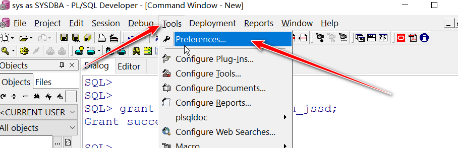

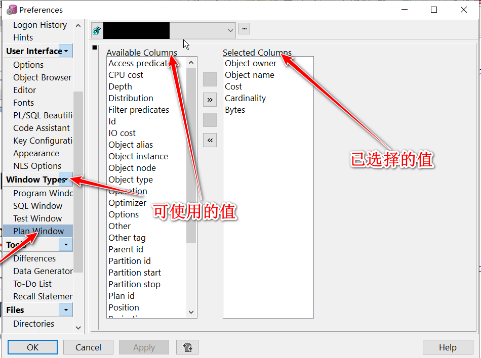

## 执行计划的常用列字段解释

1. 基数(Cardinality): Oracle估计的当前操作的返回结果集行数
2. 字节(Bytes): 执行计划该步骤后返回的字节数
3. 耗费(COST): CPU耗费: Oracle估计的该步骤的执行成本, 用于说明SQL执行的代价, 理论上越小越好(该值可能与实际有出入)
4. 时间(TIME): Oracle估计的当前操作所需要的时间

## 使用执行计划

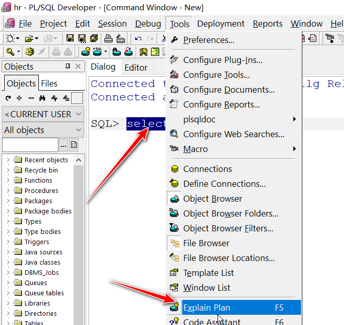

选中执行语句, 按F5, 即可打开执行计划

### 查看执行顺序

- 缩进越多的, 越先执行
- 缩进相同的, 在上面的先执行

### 表访问的几种方式(非全部): 

- TABLE ACCESS FULL (全表扫描)
- TABLE ACCESS BY INDEX ROWID(通过ROWID的表存取)
- TABLE ACCESS BY INDEX SCAN(索引扫描)

#### table access full 全表扫描

Oracle 会读取表中所有的行, 并检查每一行是否满足SQL语句的Where限制条件;

使用建议: 数据量太大的表不建议使用全表扫描, 除非本身需要取出的数据较多, 占到表数据总量的5%~10%或以上

比如: LIKE关键字使用, 会扫描全表

#### table access by index rowid 用过rowid的表存取

伪列, 表中不会存储伪列的值. 

你可以像使用其他列一样使用它, 只是不能对该列的值进行增删改操作.

一旦一行数据插入后, 则其对应的ROWID在该行的生命周期是唯一的, 即使发生行迁移, 该行的ROWID值也不变

#### table access by index scan(索引扫描)

在索引块中, 即存储每个索引的键值, 也存储具有该值的行的ROWID

索引扫描分为两步

1. 扫描索引得到对应的ROWID
2. 通过ROWID 定位到具体的行读取数据

五种索引扫描

- INDEX UNIQUE SCAN 索引唯一扫描
- INDEX RANGE SCAN 索引范围扫描
- INDEX FULL SCAN 索引全扫描
- INDEX FAST FULL SCAN 索引快速扫描
- INDEX SKIP SCAN 索引跳跃扫描

##### INDEX UNIQUE SCAN 索引唯一扫描

针对唯一性索引(UNIQUE INDEX)的扫描, 每次至多返回一条记录, 表中某字段存在UNIQUE, PRIMARY KEY约束时, Oralce常实现唯一性扫描

##### INDEX RANGE SCAN 索引范围扫描

使用一个索引存取多行数据: 

发生索引列存取多行数据

1. 使用了范围操作符(如: > < <> >= <= between);
2. 在组合索引上, 只使用部分列进行查询 ( 查询时必须包含前导列, 否则会走全表扫描)
3. 对非唯一索引列上进行的任何查询

##### INDEX FULL SCAN 索引全扫描

进行全索引扫描时, 查询出的数据都必须从索引中可以直接得到

##### INDEX FAST FULL SCAN 索引快速扫描

扫描索引中的所有的数据块, 与index full scan类似, 但是一个显著的区别是他不对查询出的数据进行排序( 级数据不是以排序顺序被返回);

##### Index SKIP SCAN (索引跳跃扫描)

表有一个复合索引, 且在查询时有除了前导列(索引中第一列)外的其他列作为条件

## Oracle 的优化器

- RBO (Rule-Based Optimization) 基于规则的优化器
- CBO (Cost-Based Optimization) 基于代价的优化器

### RBO优化器

沿用到Oracle9i  从Oracle 10g开始, 已被弃用

### CBO优化器

CBO是一种比RBO更加合理, 可靠的优化器, 在Oracle 10g中完全取代RBO, CBO通过计算各种可能的执行计划的"代价", 即COST最低的执行方案作为实际运行方案.

## 执行计划的使用

### 单表

#### 分析表中的所有数据

示例: 查询employees表中的所有数据

```sql
select * from employees;
```

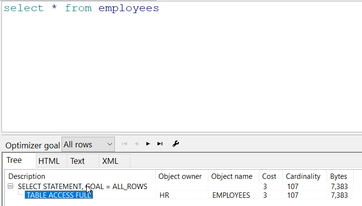

可以看到, 分析结果为, 此表进行了全表扫描, 代价值为3. 共搜索了107条数据, 搜索字节为7383字节

#### 分析主键作为条件的查询

示例: 查询employees表中employees_id为100的员工

```sql
select * from employees where employee_id = 100
```

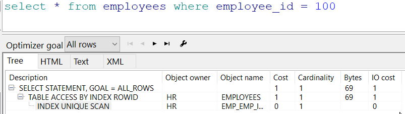

cost代价为1, 为什么这次这么少呢? 可以看到, 这次扫描使用了唯一约束扫描, 消耗的代价非常低. 故而如果想优化sql, 那么使用唯一约束进行查询是个很好的选择. 

#### 分析非主键列作为查询条件

示例: 查询雇员名字为Tarloy的雇员

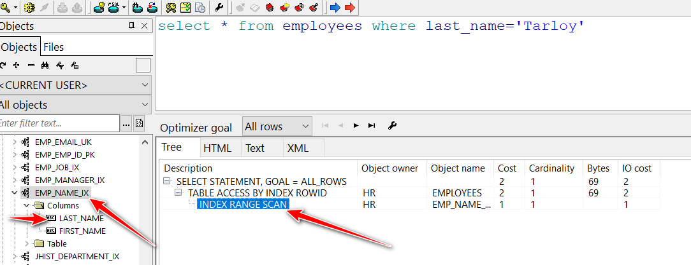

索引中有一个复合索引, 而且查询的时候使用的是前导列, 那么此次搜索使用的便是范围索引扫描, 代价消耗还是可以的

示例: 查询first_name为Steven的雇员

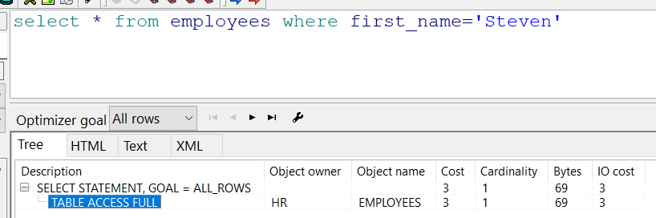

虽然表中有复合索引, 但是查找的时候没有包含前导列, 所以就变成了全表扫描.

#### 分析LIKE条件

示例: 查询名字当中含有a的雇员

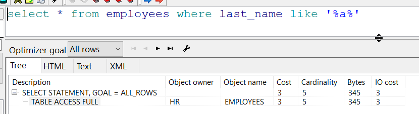

like 条件肯定会进行全表扫描, 他需要一个一个比对查找

#### 分析非唯一性索引列作为条件的查询

示例: 对雇员薪水做=, >, < , <> 条件 (salary并没有索引)

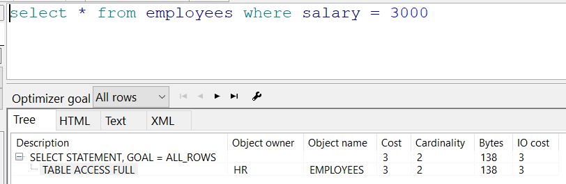

全表扫描, 代价为3

现在为salary建立一个索引

```sql
SQL> create index emp_salary_ix on employees(salary);
Index created
```

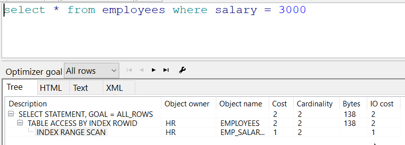

创建索引之后, 进行的是索引范围扫描, 代价值变小了

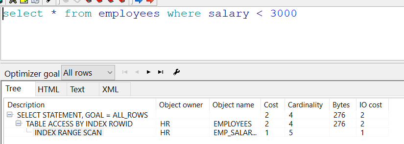

小于比较也一样

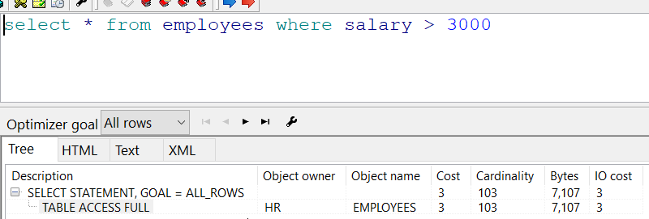

虽然有索引, 但是 大于比较是进行全表扫描的. 因为数据库不能确定大于多少, 所以必须进行全表扫描

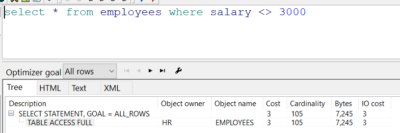

不等于比较和大于比较一样, 都是全表扫描. 

所以, 虽然一个列有索引, 我们对他进行不同的比较运算, 消耗的性能是不同的. 

### 多表

#### 内连接

示例; 使用等值连接, 查询所有部门以及所有部门下的雇员

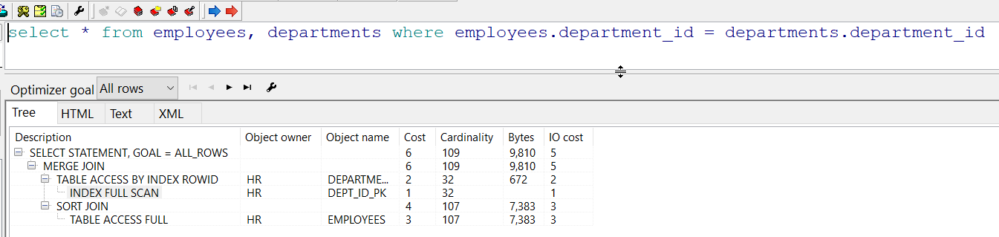

分析一下此次查询, 首先, 进行了一次索引全表扫描, 因为先搜索了department_id, 而department_id 是departments表的主键. 之后进行了一次全表扫描. 这次查找的是employees表中的department_id. 因为此列没有索引, 所以是全表扫描. 然后就是合并连接. 如果想优化此次查询, 我们可以给employees.department_id新建一个索引. 

#### 子查询

使用子查询, 查询所有部门以及所有部门下的雇员.

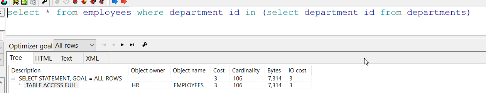

同样是查询所有部门和部门员工, 子查询代价比内连接小了一半. 所以我们说, 子查询某些情况下, 性能要优于内连接. 

#### 外连接

查询所有部门和部门员工, 包括没有部门的员工

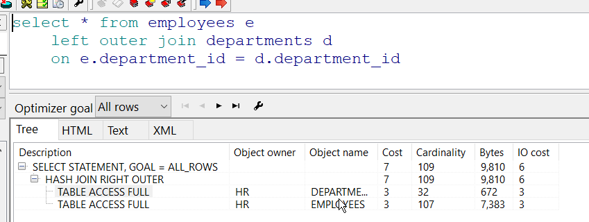

此次扫描进行了两次全表扫描, 可是哟代价是很低的. 

查询所有雇员和部门, 包含没有雇员的部门

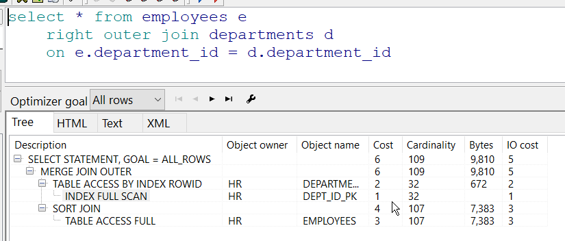

这次代价比上次低, 因为这次进行了一次索引全表扫描.

**为什么两次搜索连接不一样呢?**

因为外连接和内连接不同, 他需要吧主表中不包含副表的信息也查询出来. 所以数据库先搜索主表, 然后搜索副表与之进行匹配. 上边两次情况一次是先搜索employees表的department_id, 一次是先搜索departments表中的department_id. 而departments表中的id是主键, 所以效率会稍微高一点点.

