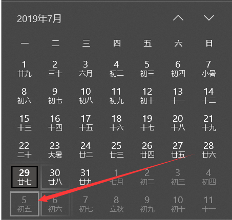

[TOC]

# Oracle函数

## 1. 函数介绍

> 函数: 是数据库产品中提供的能够处理查询结果的方法, 函数能够用于下面的目的
>
> - 执行数据计算
> - 修改单个数据项
> - 格式化显示的日期和数字
> - 转换数据类型
> - 函数有输入参数, 并且总有一个返回值

## 2. 函数分类

1. 单行函数: 这些函数仅对单个行进行运算, 并且每行返回一个结果
2. 多行函数(聚合函数): 这些函数能够操纵成组的行, 每个行组给出一个结果, 这些函数也被称为组函数

### 单行函数

#### 单行函数的特性

- 作用于每一个返回行, 每行返回一个结果
- 可能需要一个或多个参数
- 可以修改结果集的数据类型
- 可以嵌套
- 可能返回一个与参数不同类型的数据值
- 能够用在SELECT, WHERE, 和ORDER BY字句中

#### 单行函数的分类

- 字符函数: 接受字符输入, 可以返回字符或者数字值
- 数字函数: 接受数字输入, 返回数字值
- 日期函数: 对DATE数据类型的值进行运算(除了 MONTHS_BETWEEN 函数返回一个数字, 所有的日期函数都返回一个DATE数据类型的值)
- 转换函数: 从一个数据类型到另一个数据类型的转换
- 通用函数
  - NVL
  - NVL2
  - NULLIF
  - COALSECE
  - CASE
  - DECODE

## 3. 字符函数

> 单行字符函数接受字符数据作为输入, 既可以返回字符值, 也可以返回数字值

### 字符函数分类

- 大小写处理函数
- 字符处理函数

### 大小写处理函数

> 需要一个参数, 参数类型为字符串类型, 返回一个字符串

- LOWER('SQL Course’): 转换大小写混合的字符串为小写的字符串
- UPPER('sql Course’): 转换大小写混合的字符串为大写的字符串
- INITCAP(‘SQL Course’): 将每个单词的首字母转换为大写, 其他字母小写.

实例一: 查询员工表, 使用"The Job id for” 链接转换大写格式后的员工姓名, 并使用"is" 字符串链接他们工作ID, 要求将工作ID转换小写格式, 修改列名为"Employee Details"

```sql
SQL> select ' The Job ID for ' || upper(last_name) || ' is ' || lower(job_id) as "EMPLOYEE DETAILS"
  2  from employees;
EMPLOYEE DETAILS
-------------------------------------------------------
 The Job ID for ABEL is sa_rep
 The Job ID for ANDE is sa_rep
 The Job ID for ATKINSON is st_clerk
 The Job ID for AUSTIN is it_prog
 The Job ID for BAER is pr_rep
 The Job ID for BAIDA is pu_clerk
```

实例二: 显示雇员higgins 的雇员号, 姓名和部门号( 注: 表中所有的雇员姓名都是首字母大写的)

```sql
SQL> select employee_id, last_name, department_id
  2  from employees
  3  where last_name=initcap('higgins');
EMPLOYEE_ID LAST_NAME                 DEPARTMENT_ID
----------- ------------------------- -------------
        205 Higgins        						11
```

### 字符处理函数

首先介绍一个表, dual表. dual是一张只有一个字段, 一行记录的表, dual表也称之为'伪表', 因为他不存主题数据. 如果我们不需要从具体的表来取得表中的数据, 而是单纯的想要得到一些我们想要得到的信息, 并通过select完成时, 就要借助dual表来满足结构化查询语言的格式

1. concat(‘Hello’, ‘World’): 返回HelloWorld, 连接字符串

   示例: 

   ```sql
   SQL> select concat('Hello','world') from dual; 
   CONCAT('HELLO','WORLD')
   -----------------------
   Helloworld
   ```

2. substr(arg1, arg2, arg3): arg1: 要截取的字符串, arg2: 截取的开始位置, 负数表示从后往前数, arg3: 截取的字符串长度

   示例:

   ```sql
   SQL> select substr('HelloWorld', 1, 5) from dual;
   SUBSTR('HELLOWORLD',1,5)
   ------------------------
   Hello
   
   SQL> select substr('HelloWorld', -2, 5) from dual;
   SUBSTR('HELLOWORLD',-2,5)
   -------------------------
   ld
   ```

3. substr(arg1, arg2): arg1: 要截取的字符串, arg2: 截取的位置, 可以为负数. 截取到末尾

   实例:

   ```sql
   SQL> select substr('HelloWorld', -2) from dual;
   SUBSTR('HELLOWORLD',-2)
   -----------------------
   ld
   ```

4. length(arg1): 计算字符串的长度

   实例:

   ```sql
   SQL> select length('HelloWorld') from dual;
   LENGTH('HELLOWORLD')
   --------------------
                     10
   ```

5. instr(arg1, arg2): 相当于java中的indexOf, 查找新串在原字符串的位置, 返回一个数字

   示例:

   ```sql
   SQL> select instr('HelloWorld', 'Wo') from dual;
   INSTR('HELLOWORLD','WO')
   ------------------------
                          6
   ```

6. instr(arg1, arg2, arg3, arg4): arg1: 原字符串, arg2:查找的字符串内容, arg3: 整数类型, 开始位置, arg4: 整数类型, 第几次出现

   示例:

   ```sql
   SQL> select instr('helloworld', 'l', 1, 2) from dual;
   INSTR('HELLOWORLD','L',1,2)
   ---------------------------
                             4
   ```

7. lpad(arg1, arg2, arg3): 用给定的字符左填充字符串到给定的长度

   arg1: 字符串类型, 原字符串

   arg2: 整数类型, 总长度

   arg3: 字符串类型, 填充的子字符串

   示例: 

   ```sql
   SQL> select lpad('hello', 10, '*') from dual;
   LPAD('HELLO',10,'*')
   --------------------
   *****hello
   
   SQL> select lpad('hello', 10, 'nihaoaa') from dual;
   LPAD('HELLO',10,'NIHAOAA')
   --------------------------
   nihaohello
   ```

8. rpad, 向右侧填充, 和lpad用法相同

9. trim(arg1): 从一个字符串中去除头(leading)或尾(tailing)或头尾两侧(both)的字符(默认为头尾两侧) 如果trim_character或trim_source是一个文字字符, 必须放在单引号中. 

   arg1: 需要操作的字符串, FROM为关键字

   格式1: 需要去掉的内容 FROM 原字符串

   格式2: leading|trailing|both 需要去掉的内容 FROM 原字符串

   示例: 

   ```sql
   SQL> select trim(leading 'a' from 'aHelloWorlda') from dual;
   TRIM(LEADING'A'FROM'AHELLOWORL')
   ------------------------------
   HelloWorlda
   
   SQL> select trim(trailing 'a' from 'aHelloWorlda') from dual;
   TRIM(TRAILING'A'FROM'AHELLOWOR')
   ------------------------------
   aHelloWorld
   
   SQL> select trim(both 'a' from 'aHelloWorlda') from dual;
   TRIM(BOTH'A'FROM'AHELLOWORLDA')
   ------------------------------
   HelloWorld
   
   SQL> select trim(' ' from '  HelloWorld   ') from dual;
   TRIM(''FROM'HELLOWORLD')
   ------------------------
   HelloWorld
   ```

10. replace(arg1, arg2, arg3): 替换指定字符串

    arg1: 字符串类型, 原字符串

    arg2: 字符串类型, 需要替换的字符串

    arg3: 字符串类型, 替换的内容

    实例:

    ```sql
    SQL> select replace('HelloWorld', 'll', 'LL') from dual;
    REPLACE('HELLOWORLD','LL','LL'
    ------------------------------
    HeLLoWorld
    ```

### 数字函数

1. ROUND(arg1, arg2): 四舍五入一个指定的数字

   arg1: 原数字

   arg2. 保留小数的位数, 负数表示保留整数的位数

   示例:

   ```sql
   SQL> select round(123.2666, 2) from dual;
   ROUND(123.2666,2)
   -----------------
              123.27
   
   SQL> select round(123.2666, -1) from dual;
   ROUND(123.2666,-1)
   ------------------
                  120
                  
   SQL> select round(123.55, 0) from dual;
   ROUND(123.55,0)
   ---------------
               124
   ```

2. TRUNC(arg1, arg2); 与round用法相同, 不同的是不会做四舍五入处理

   示例:

   ```sql
   SQL> select trunc(123.55, 1) from dual;
   TRUNC(123.55,1)
   ---------------
             123.5
   ```

3. MOD(arg1, arg2): 取余

   示例:

   ```sql
   SQL> select mod(101, 100) from dual;
   MOD(101,100)
   ------------
              1
   ```

## 4. 日期函数

### 日期的使用

1. SYSDATE函数, 直接使用, 不需要加括号, 返回系统当前时间

2. 使用日期进行计算

   - 从日期加或健一个数, 结果是一个日期值

   - 两个日期相减, 得到两个日期之间的天数

   - 用小时数除以24, 可以加小时到日期上

     | 运算           | 结果 | 说明                                 |
     | -------------- | ---- | ------------------------------------ |
     | date+number    | 日期 | 加一个天数到一个日期上               |
     | date-number    | 日期 | 减一个天数到一个日期上               |
     | date-date      | 天数 | 一个日期减另一个日期, 返回相减的天数 |
     | date+number/24 | 日期 | 加一个小时数到日期上                 |

3. 使用日期做算数运算

   示例: 显示所有在部门90中的雇员的名字和从业的周数. 雇员的总工作时间一周计算

   ```sql
   SQL> select last_name, (sysdate - hire_date)/7 from employees where department_id=90;
   LAST_NAME                 (SYSDATE-HIRE_DATE)/7
   ------------------------- ---------------------
   King                           840.954981812169
   Kochhar                        722.812124669312
   De Haan                        967.383553240741
   ```

### 日期函数

| 函数           | 说明               |
| -------------- | ------------------ |
| months_between | 两个日期之间的月数 |
| add_months     | 加几个日历月       |
| next_day       | 下一个星期几是几号 |
| last_day       | 本月最后一天是几号 |
| round          | 对日期进行四舍五入 |
| trunc          | 对日期进行截断     |


1. months_between(date1, date2): 计算date1和date2之间的月数, 如果date1 > date2 结果是正数, 否则结果是负数

   示例: 

   ```sql
   SQL> select months_between(sysdate, hire_date) from employees;
   MONTHS_BETWEEN(SYSDATE,HIRE_DA
   ------------------------------
                 193.410034348865
                   166.2810020908
                  222.53906660693
                 162.861647252091
                   146.2810020908
   ```

2. add_months(date, n): 添加n个日历月到date上

   示例:

   ```sql
   SQL> select sysdate from dual;
   SYSDATE
   -----------
   2019/7/29 1
   
   SQL> select add_months(sysdate, 1) from dual;
   ADD_MONTHS(SYSDATE,1)
   ---------------------
   2019/8/29 17:05:35
   ```

3. next_day(date, ‘char’): 计算在date之间的下一个周('char')的指定天的日期. char的值可能是一个表示一天的数, 或者是一个字符串. 如果使用数字表示星期, 1是从星期日开始, 数字范围是1-7

   date: 日期类型

   char: 数字或字符串

   示例: 

   

   ```sql
   SQL> select next_day(sysdate, '星期一') from dual;
   NEXT_DAY(SYSDATE,'星期一')
   -----------------------
   2019/8/5 17:08:52
   
   SQL> select next_day(sysdate, 2) from dual;
   NEXT_DAY(SYSDATE,2)
   -------------------
   2019/8/5 17:09:57
   ```

   

4. last_day(date); 返回当前月份的最后一天

   示例:

   ```sql
   SQL> select last_day(sysdate) from dual;
   LAST_DAY(SYSDATE)
   -----------------
   2019/7/31 17:11:5
   ```

5. round(date, 'fmt'): 返回用格式化模式, fmt四舍五入到指定单位的date, 如果格式模式fmt被忽略, date被四舍五入到最近的天. 比如今天过去一半了, 返回的就是明天

   示例:

   ```sql
   SQL> select round(sysdate) from dual;
   ROUND(SYSDATE)
   --------------
   2019/7/30
   ```

   对年或月做四舍五入处理

   ```sql
   SQL> select round(sysdate, 'yy') from dual;
   ROUND(SYSDATE,'YY')
   -------------------
   2020/1/1
   
   SQL> select round(sysdate, 'mm') from dual;
   ROUND(SYSDATE,'MM')
   -------------------
   2019/8/1
   ```

6. trunc(date, 'fmt') 和round使用方法相同, 不同的是只是截断日期, 不会对日期进行四舍五入处理

## 5. 转换函数

### 转换函数分类

####  隐式转换, 自动转换

##### 隐式转换的问题

1. 性能影响: 转换时会导致索引的无效, 进而可能导致全表扫描. 当表的数据量很大的时候, 产生很大的性能问题, 比如说, varcahr2和nvarchar2隐式数据类型转换导致的性能问题
2. 不便于阅读: 由于隐式转换使得数据库编程人员和DBA难以了解到究竟发生了怎样的类型转换, 而且如果代码很多很长的话, 很难找到错误.

##### 隐式转换函数

| 从               | 到       |
| ---------------- | -------- |
| varchar2 or char | number   |
| varchar2 or cahr | date     |
| number           | varchar2 |
| date             | varchar2 |

#### 显示转换

通过数据库中的转换函数完成类型的转换

1. to_char(arg1, ‘fmt’): 日期转换

   日期格式模板元素

   | YYYY  | 数字全写年         |
   | ----- | ------------------ |
   | YEAR  | 年的拼写           |
   | MM    | 月的两数字         |
   | MONTH | 月的全名           |
   | MON   | 月的三个字母       |
   | DY    | 周中天的三字母缩写 |
   | DAY   | 周中天的全名       |
   | DD    | 月的数字天数       |

   时间格式模板元素

   | 元素           | 说明                  |
   | -------------- | --------------------- |
   | AM或PM         | 正午指示              |
   | A.M或P.M       | 带句点的正午指示      |
   | HH或HH12或HH24 | 天的小时              |
   | MI             | 分钟                  |
   | SS             | 秒                    |
   | SSSSS          | 午夜之后的秒(0-86399) |

   其他格式

   | 元素         | 说明                                    |
   | ------------ | --------------------------------------- |
   | TH           | 序数(例如, DDTH, 显示为4RTH)            |
   | SP           | 拼写出数字 (例如: DDSP, 显示为FOUR)     |
   | SPTH or THSP | 拼写出序数 (例如: DDSPTH, 显示为FOURTH) |

   示例: 

   ```sql
   SQL> select to_char(sysdate, 'yyyy-mm-dd, day HH24:MI:SS') from dual;
   TO_CHAR(SYSDATE,'YYYY-MM-DD,DA')
   ---------------------------------
   2019-07-29, 星期一 18:08:57
           
   SQL> select to_char(sysdate, 'yyyy-mm-dd, day "时间为: " HH24:MI:SS') from dual;
   TO_CHAR(SYSDATE,'YYYY-MM-DD,DA')
   ---------------------------------------------
   2019-07-29, 星期一 时间为:  18:10:17
   ```

2. to_char(arg, ‘fmt'’) 将数字转换为字符串

   | 表示 | 说明                            |
   | ---- | ------------------------------- |
   | 9    | 表示一个数                      |
   | 0    | 强制显示为零                    |
   | $    | 放置一个浮动美元符号            |
   | L    | 使用浮动本地货币符号            |
   | .    | 打印一个小数点                  |
   | ,    | 打印一个千位指示                |
   | FM   | 代表去掉返回结果中的前后空格和0 |

   注意实际的数的长度不能大于模板的长度

   示例

   ```sql
   SQL> select to_char(123452.5555, '999,999,999.99') from dual;
   TO_CHAR(123452.5555,'999,999,9')
   ------------------------------
        123,452.56
        
   SQL> select to_char(123452.5555, 'FM999,999,999.99') from dual;
   TO_CHAR(123452.5555,'FM999,999')
   ------------------------------
   123,452.56
        
   SQL> select to_char(123452.5555, '000,000,999.99') from dual;
   TO_CHAR(123452.5555,'000,000,9')
   ------------------------------
    000,123,452.56
   ```

3. to_number(arg1, ‘fmt')  字符串转到数字, 也是通过数字模板进行转换, 只是与to_char相反, 同样的, 模板长度不能比转换的字符短

   示例: 

   ```sql
   SQL> select to_number('$123.54', '$9999.999') from dual;
   TO_NUMBER('$123.54','$9999.999')
   ------------------------------
                           123.54
                           
   SQL> select to_number('￥100.23', 'L9999.9999') from dual;
   TO_NUMBER('￥100.23','L9999.99')
   -----------------------------
                          100.23 
   ```

4. to_date(‘arg1’, ‘fmt’): 将字符串转换成日期格式, 是to_char的逆格式

   示例:

   ```sql
   SQL> select to_date('2019-5-29', 'yyyy-mm-dd') from dual;
   TO_DATE('2019-5-29','YYYY-MM-D')
   ------------------------------
   2019/5/29
   
   
   SQL> select to_date('2019年7月29日 21点22分', 'yyyy"年"mm"月"dd"日" HH24"点"MI"分"') from dual;
   TO_DATE('2019年7月29日21点22分')
   -------------------------
   2019/7/29 21:22:00
   ```

## 6. 通用函数

1. NVL(expr1, expr2), 如果expr1为空, 则返回expr2, 一般用于作为null值的转换

   示例:

   ```sql
   SQL> select employee_id, 12 * nvl(commission_pct, 0) as "一年的佣金" from employees;
   EMPLOYEE_ID      一年的佣金
   ----------- ----------
           100          0
           101          0
           102          0
           103          0
           104          0
   ```

   算数运算中, 一个数与null进行运算, 总是获得空值, 我们先把NVL转换成0 在进行运算, 就有值了.

2. NVL2(expr1, expr2, expr3) 类似于java中的三目运算符, 如果expr1不为空, 则返回expr2, 否则返回expr3

   示例:

   ```sql
   SQL> select employee_id, 12 * nvl2(commission_pct, 1, 0) as "一年的佣金" from employees;
   EMPLOYEE_ID      一年的佣金
   ----------- ----------
           141          0
           142          0
           143          0
           147         12
           148         12
           149         12
   ```

3. NULLIF(expr1, expr2) 比较两个表达式, 如果相等返回NVL, 如果不相等, 返回第一个表达式

4. coalesce(expr1, expr2, expr3…exprn), 比较表达式, 返回第一个不为空的表达式

5. 条件表达式

   - 在SQL语句中提供IF-THEN-ELSE 逻辑的使用
   - 两种用法: case表达式, DECODE函数

   case表达式:

   ```plsql
   case expr when comparision_expr1 then return_expr1
   [when comparision_expr2 then return_expr2
   ...
   else else_expr]
   end
   ```

   示例: 查询雇员, 显示last_name, job_id, salary 如果JOB_ID是IT_PROG, 薪水增加10%; 如果JOB_ID是ST_CLERK, 薪水增加15%; 如果JOB_ID是SA_REP, 薪水增加20%. 对于其他所有的工作角色, 不增加薪水

   ```plsql
   SQL> select last_name, job_id, salary,
     2  CASE job_id WHEN 'IT_PROG' THEN salary * 1.1
     3  WHEN 'ST_CLERK' THEN salary * 1.15
     4  WHEN 'SA_REP' THEN salary * 1.2
     5  ELSE salary
     6  END
     7  from employees;
   LAST_NAME                 JOB_ID         SALARY CASEJOB_IDWHEN'IT_PROG'THENSAL
   ------------------------- ---------- ---------- ------------------------------
   King                      AD_PRES      24000.00                          24000
   Kochhar                   AD_VP        17000.00                          17000
   De Haan                   AD_VP        17000.00                          17000
   Hunold                    IT_PROG       9000.00                           9900
   Ernst                     IT_PROG       6000.00                           6600
   Austin                    IT_PROG       4800.00                           5280
   Pataballa                 IT_PROG       4800.00                           5280
   ```

   decode表达式: 简化case表达式

   DECODE(col | expression, search1, retruen1, [search2, retruen2, …, default]);

   示例: 还是上面case表达式的示例, 使用decode表达式

   ```plsql
   SQL> select last_name, job_id, salary,
     2  decode(job_id, 'IT_PROG', salary*1.1, 'ST_CLERK', salary*1.15, 'SA_REP', salary*1.2, salary)
     3  from employees;
   LAST_NAME                 JOB_ID         SALARY DECODE(JOB_ID,'IT_PROG',SALARY
   ------------------------- ---------- ---------- ------------------------------
   King                      AD_PRES      24000.00                          24000
   Kochhar                   AD_VP        17000.00                          17000
   De Haan                   AD_VP        17000.00                          17000
   Hunold                    IT_PROG       9000.00                           9900
   Ernst                     IT_PROG       6000.00                           6600
   Austin                    IT_PROG       4800.00                           5280
   ```

   