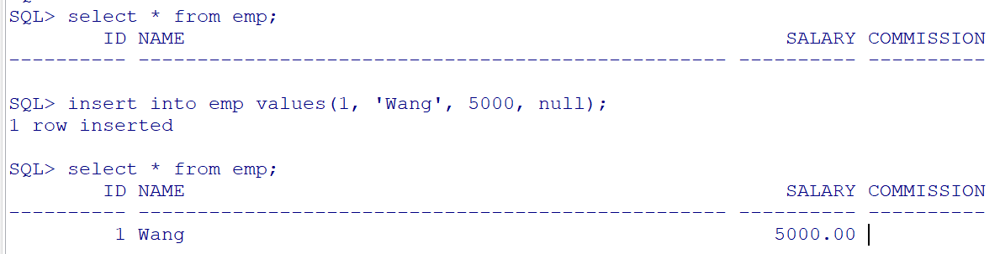
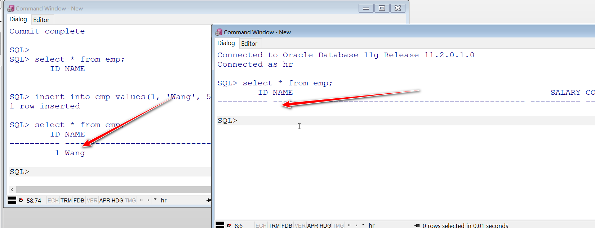
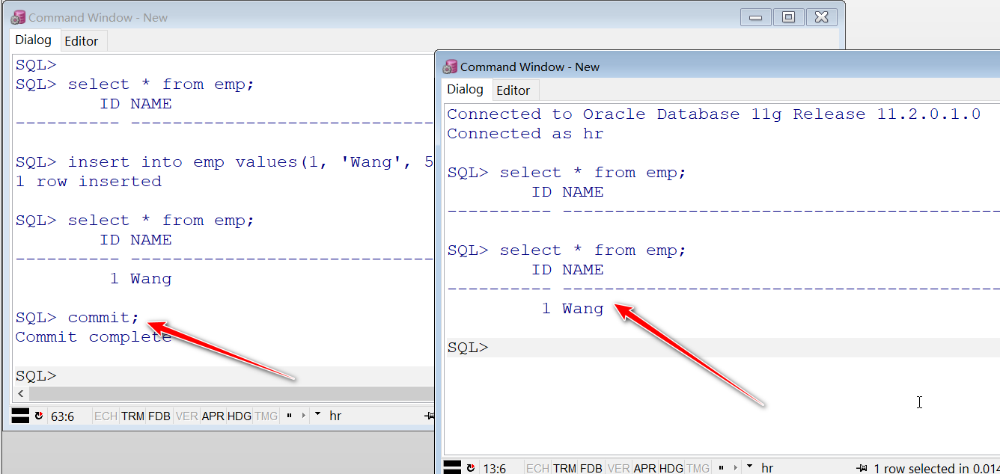
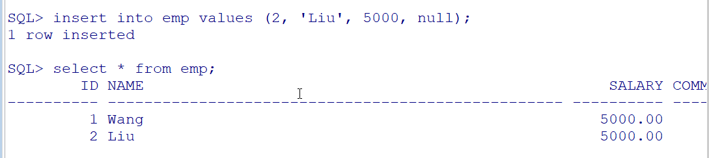
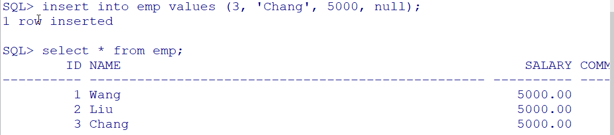
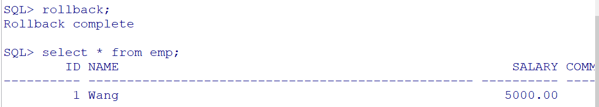
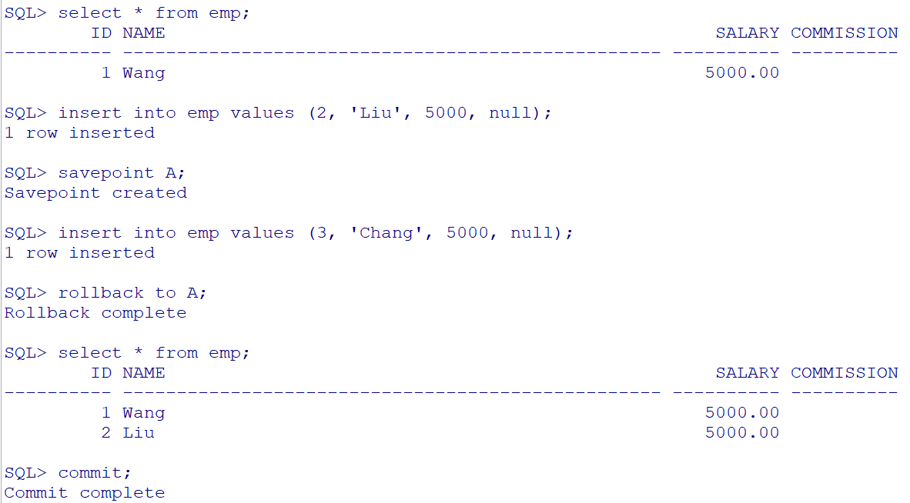

[TOC]

# 事务处理语言[TCL]

## 什么式事务

指作为单个逻辑工作单元执行的一系列操作, 要么完全的执行, 要么完全的不执行.

## 什么是事务特性

1. 原子性(ATOMICITY)

   事务中的操作要么都不做, 要么就全做

2. 一致性(CONSISTENCY)

   一个事务应该保护所有定义在数据上的不变的属性(例如完整性约束). 在完成一个成功的事务时, 数据应该处于一致的状态

3. 隔离性(ISOLATION)

   一个事务的执行不能被其他事务干扰

4. 持久性(DURABILITY)

   一个事务一旦提交, 他对数据库中数据的改变就是永久性的

## 使用事务

commit: 事务提交

rollback: 事务回滚

savepoint: 设置回滚点

### 事务类型

#### 显示事务

需要我们手动提交或回滚. DML语言中所有的操作都是显示事务操作

#### 隐式事务

数据库自动提交不需要我们做任何处理, 同时也不具备回滚性. DDL, DC语言都是隐式事务操作.

### 事务提交和回滚使用

示例: 测试提交操作

我在PL/SQL Developer中向emp表中添加了一条数据, 但是没有提交事务

我们知道, 数据库会有多用户使用, 假如此时有另一个用户访问数据库, 查询emp表. 我们打开另一个窗口进行测试

可以看到, 一个有数据, 一个没有数据. 这是因为我们一个窗口虽然添加了数据, 但是他只是存储在了临时表中, 并没有持久性添加到emp表中. 那么我们提交一下

提交之后, 另一个窗口也能查询到添加的数据了. 事务提交之后, 数据会持久化在emp表中.

示例: 测试回滚操作

我又添加了一行id为2的数据, 但是没有提交, 可以看到, 能够查询的到. 

再次添加一行id为3的数据, 注意, 添加id为2和id为3的操作都没有提交

这时, 我认为先添加id=2的操作在添加id为3的操作之前不妥, 我想撤销一下. rollback!

可以看到, rollback之后, 会回滚到上一次提交的情况. 当然, 以上操作在另一个用户或者另一个窗口(session)都是不可见的, 因为并没有提交.

### 设置回滚点回滚

故名思意, 回滚点就是回滚到指定位置. 我们通过使用savepoint来设置回滚点. 使用rollback to来回滚到指定回滚点.

示例:

我在第一步的时候保存了一个回滚点, 那么回滚的时候就能回滚到指定回滚点. 