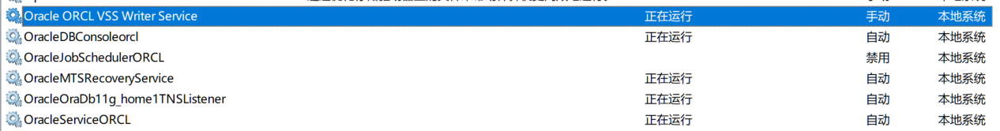

[TOC]

# Oracle启动

> Oracle启动是通过系统服务进行启动的

## 1. OracleServiceORCL 服务 (必须启动)

数据库服务(数据库实例), 是Oracle核心服务, 该服务是数据库启动的基础, 只有该服务启动, Oracle数据库才能正常启动.

## 2. OracleOraDb11g_home1TNSListener (启动为好)

OracleOraDb11g_home1TNSListener是一种监听服务, 一般是大块的. 但是只有的数据库需要远程访问或者使用PL/SQL, Developer等第三方工具时候才会需要

## 3. Oracle ORCL VSS Vriter Service(非必须启动)

Oracle 卷映射拷贝写入服务, VSS(Volume Shadow Copy Service) 能够让存储基础设备(比如磁盘, 阵列等) 创建高保真的时间点映像, 即映射拷贝(shadow copy). 它可以再多卷或者单个卷上创建映射拷贝, 同时不会影响到系统的系统性能

## 4. OracleDBConsoleorcl(非必须启动)

Oracle数据库控制台服务, orcl是Oracle的实际标识, 默认的实例为orcl. 再运行Enterprise Manager(企业管理器OEM)的时候, 需要启动这个服务

## 5. OracleJobSchedulerORCL (非必须启动)

Oracle作业调度(定时器)服务, ORCL是Oracle实例标识

## 6. OracleMTSRecoveryService(非必须启动)

服务端控制, 该服务允许数据库充当一个微软事物服务器MTS, COM/COM+对象和分布式环境下的事物的资源管理器

# Oracle关闭

只需要停止服务即可