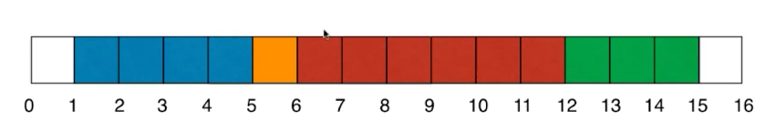
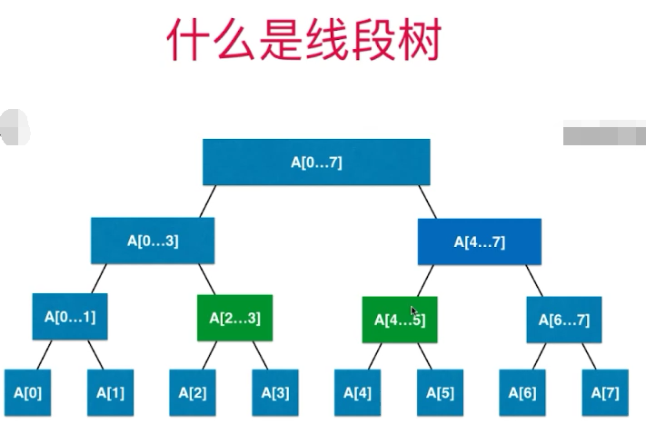
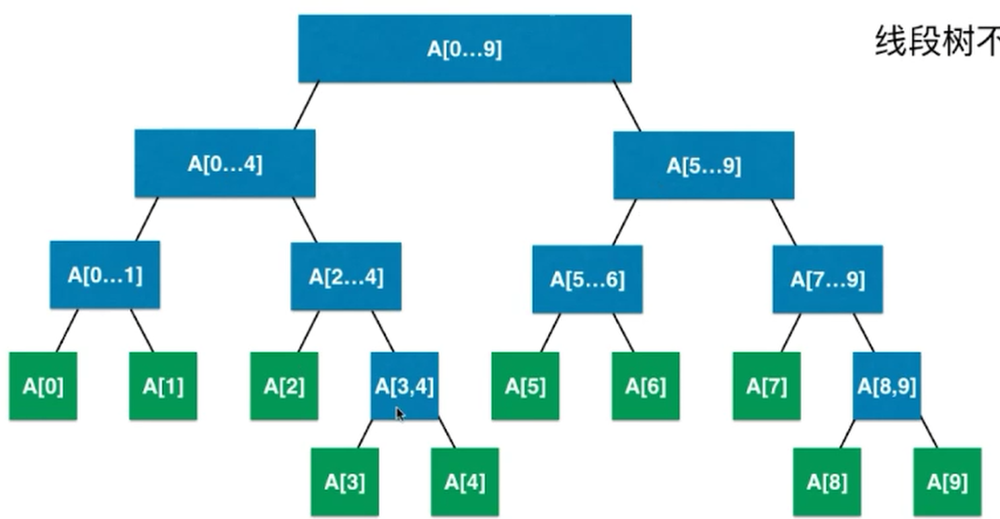
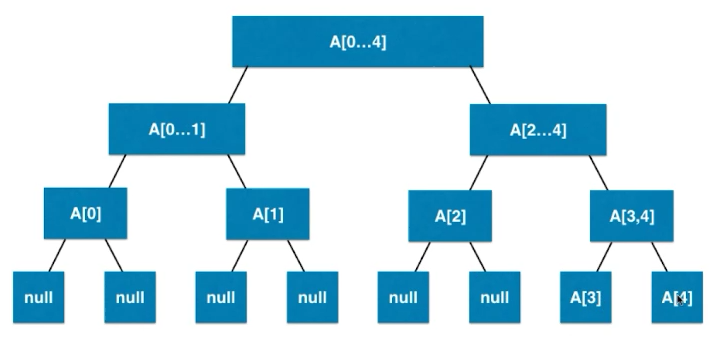

# 线段树

也被称作区间树(Segment Tree)

## 为什么使用线段树

### 一类问题

对于有一类问题, 我们关心的时线段(或者区间)

经典的线段树问题: 区间染色

有一面墙, 长度为n, 每次选择一段墙进行染色, m次操作之后, 可以看见多少种颜色



### 数组解决复杂度

假如我们使用数组解决这个问题, 那么. 每次染色(更新区间), 需要O(n)的操作.

每次查询(查询区间) 需要O(n)的操作

### 另一类问题

区间查询

查询一个区间[i, j] 的最大值, 最小值, 或者区间数字和

实质: 基于区间的统计查询

比如: 2018年注册用户中消费最高的用户? 消费最少的用户? 学习时间最长的用户? 某个太空区间中的天体数量?

### 线段树解决复杂度

那么我们使用线段树解决此类问题. 更新只需要O(n)的操作. 查询也只需要O(n)的操作.

## 什么是线段树





- 线段树不是完全二叉树
- 线段树是平衡二叉树
- 堆也是平衡二叉树

## 假如数组作为底层数据结构

一个完全二叉树. 第k层的节点个数一般是2^(k - 1)个节点

一共有2^k-1个节点

线段树不是完全二叉树. 所有他的叶子节点就可能在最后一层, 或者倒数第二层. 而线段树的叶子节点, 就是区间的最小间隔. 所以, 如果我们需要统计范围为n的区间, 我们需要开辟4n的数组长度, 才有可能在最坏的情况下把所有的数据存储进去.



## 代码实现

线段树线段合并接口

```java
package pers.jssd.segmenttree;

/**
 * @author jssdjing@gmail.com
 */
public interface Merger<E> {
    E merger(E left, E right);
}
```

线段树

```java
package pers.jssd.segmenttree;

import java.util.Arrays;

/**
 * @author jssdjing@gmail.com
 */
public class SegmentTree<E> {

    private E[] data;
    private E[] tree;
    private Merger<E> merger;

    @SuppressWarnings("unchecked")
    public SegmentTree(E[] arr, Merger merger) {
        this.merger = merger;
        data = (E[]) new Object[arr.length];
        System.arraycopy(arr, 0, data, 0, arr.length);
        tree = (E[]) new Object[arr.length * 4];
        buildSegmentTree(0, 0, data.length - 1);
    }

    /**
     * 获取指定位置的元素
     *
     * @param index 指定的位置
     * @return 返回获取到的元素
     */
    public E get(int index) {
        if (index < 0 || index >= data.length) {
            throw new IllegalArgumentException("get error, index is out of range");
        }
        return data[index];
    }

    /**
     * 获取指定位置的左孩子位置
     *
     * @param index 指定父节点位置
     * @return 返回获取的左孩子位置
     */
    private int getLeftChild(int index) {
        return index * 2 + 1;
    }

    /**
     * 获取指定位置的右孩子位置
     *
     * @param index 指定父节点位置
     * @return 返回获取到的指定位置的右孩子位置
     */
    private int getRightChild(int index) {
        return index * 2 + 2;
    }

    /**
     * 获取数组大小
     *
     * @return 返回数组的大小
     */
    public int getSize() {
        return data.length;
    }

    /**
     * 构建线段树
     *
     * @param index 线段树的下标
     * @param left  数组中区间左下标
     * @param right 数组中区间右下标
     */
    private void buildSegmentTree(int index, int left, int right) {
        if (left == right) {
            tree[index] = data[left];
            return;
        }
        int middle = left + (right - left) / 2;
        int leftChild = getLeftChild(index);
        int rightChild = getRightChild(index);

        buildSegmentTree(leftChild, left, middle);
        buildSegmentTree(rightChild, middle + 1, right);
        tree[index] = merger.merger(tree[leftChild], tree[rightChild]);
    }

    public E query(int queryL, int queryR) {
        return query(0, 0, data.length - 1, queryL, queryR);
    }

    /**
     * 从树中查询元素, 查询的范围是以treeIndex代表的[l,r]的范围
     *
     * @param treeIndex 线段树节点
     * @param l         节点代表的左边界
     * @param r         节点代表的右边界
     * @param queryL    查询的范围左边界
     * @param queryR    查询的范围右边界
     * @return 返回查询的范围内容
     */
    private E query(int treeIndex, int l, int r, int queryL, int queryR) {
        if (l == queryL && r == queryR) {
            return tree[treeIndex];
        }
        int mid = l + (r - l) / 2;
        int leftChild = getLeftChild(treeIndex);
        int rightChild = getRightChild(treeIndex);

        if (queryR <= mid) {
            return query(leftChild, l, mid, queryL, queryR);
        } else if (queryL > mid) {
            return query(rightChild, mid + 1, r, queryL, queryR);
        }
        E leftResult = query(leftChild, l, mid, queryL, mid);
        E rightResult = query(rightChild, mid + 1, r, mid + 1, queryR);
        return merger.merger(leftResult, rightResult);
    }

    public void set(int index, E value) {
        if (index < 0 || index >= data.length) {
            throw new IllegalArgumentException("set error, index is out of bound");
        }
        data[index] = value;
//        System.out.println(Arrays.toString(data));
        set(0, 0, data.length - 1, index, value);
    }

    private void set(int treeIndex, int left, int right, int index, E value) {
        if (left == right) {
            tree[treeIndex] = value;
            return;
        }
        int mid = left + (right - left) / 2;
        int leftChild = getLeftChild(treeIndex);
        int rightChild = getRightChild(treeIndex);

        if (index <= mid) {
            set(leftChild, left, mid, index, value);
        } else {
            set(rightChild, mid + 1, right, index, value);
        }


        tree[treeIndex] = merger.merger(tree[leftChild], tree[rightChild]);
    }

    @Override
    public String toString() {
        return "SegmentTree{" +
                "tree=" + Arrays.toString(tree) +
                '}';
    }
}
```

## leetcode问题

第303号问题  [区域和检索 - 数组不可变](https://leetcode-cn.com/problems/range-sum-query-immutable/)

解题代码

```java
package pers.jssd.leetcode;

import pers.jssd.segmenttree.Merger;
import pers.jssd.segmenttree.SegmentTree;

class NumArray {

    private SegmentTree<Integer> segmentTree;
    public NumArray(int[] nums) {
        if (nums != null && nums.length != 0) {
            Integer[] data = new Integer[nums.length];
            for (int i = 0; i < nums.length; i++) {
                data[i] = nums[i];
            }

            segmentTree = new SegmentTree<Integer>(data, (Merger<Integer>) Integer::sum);
        }
    }
    
    public int sumRange(int i, int j) {
        if (i < 0 || j > segmentTree.getSize()) {
            throw new IllegalArgumentException("error");
        }
        return segmentTree.query(i, j);
    }
}

/*
 * Your NumArray object will be instantiated and called as such:
 * NumArray obj = new NumArray(nums);
 * int param_1 = obj.sumRange(i,j);
 */
```

不使用线段树解题代码

```java
package pers.jssd.leetcode;

import pers.jssd.segmenttree.Merger;
import pers.jssd.segmenttree.SegmentTree;

/**
 * @author jssdjing@gmail.com
 */
public class NumArray2 {
    private int[] sum;
    public NumArray2(int[] nums) {
        sum = new int[nums.length + 1];
        for (int i = 0; i < nums.length; i++) {
            sum[i + 1] = sum[i] + nums[i];
        }
    }

    public int sumRange(int i, int j) {
        return sum[j + 1] - sum[i];
    }
}
```

307号问题. 添加更新之后的区域和检索

```java
package pers.jssd.leetcode;

import pers.jssd.segmenttree.Merger;
import pers.jssd.segmenttree.SegmentTree;

class NumArray3 {

    private SegmentTree<Integer> segmentTree;
    public NumArray3(int[] nums) {
        if (nums != null && nums.length != 0) {
            Integer[] data = new Integer[nums.length];
            for (int i = 0; i < nums.length; i++) {
                data[i] = nums[i];
            }

            segmentTree = new SegmentTree<Integer>(data, (Merger<Integer>) Integer::sum);
        }
    }
    
    public int sumRange(int i, int j) {
        if (i < 0 || j > segmentTree.getSize()) {
            throw new IllegalArgumentException("error");
        }
        return segmentTree.query(i, j);
    }

    public void update(int i, int val) {
        segmentTree.set(i, val);
    }
}
```

