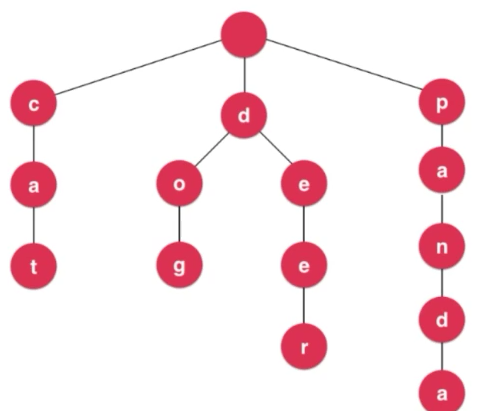

# Trie 字典树前缀树

## 一个字典的复杂度

对于一个字典来说, 如果有n个条目

使用树结构, 查询的时间复杂度是O(longn)

如果有100万个条目(2^20)

logn 大约为20

## Tire的复杂度

查询每个条目的时间复杂度和字典中一共有多少条目无关

时间复杂度为O(w) w为查询单词的长度

大多数单词的长度小于10

## Tire图示



每个节点有若干指向下个节点的指针

```java
class Node{
    boolean isWord;
    Map<char, Node> next;
}
```

## 实现代码

```java
package pers.jssd.trie;

import java.util.Map;
import java.util.TreeMap;

/**
 * @author jssdjing@gmail.com
 */
public class Trie {

    /**
     * Trie节点Node
     */
    private static class Node{
        boolean isWord;
        Map<Character, Node> next;

        Node(boolean isWord) {
            this.isWord = isWord;
            next = new TreeMap<>();
        }

        Node() {
            this(false);
        }

    }

    /**
     * Trie根节点
     */
    private Node root;
    /**
     * Trie大小
     */
    private int size;

    public Trie() {
        size = 0;
        root = new Node();
    }

    /**
     * 是否为空
     * @return true则Trie为空, false则不为空
     */
    public boolean isEmpty(){
        return size == 0;
    }

    /**
     * 取得字典树的大小
     * @return 字典树的大小, 如果为空则返回0
     */
    public int getSize() {
        return size;
    }

    /**
     * 添加一个新的单词
     * @param word 要添加的单词
     */
    public void addWord(String word) {
        Node cur = root;
        for (int i = 0; i < word.length(); i++) {
            char c = word.charAt(i);
            if (cur.next.get(c) == null) {
                cur.next.put(c, new Node());
            }
            cur = cur.next.get(c);
        }
        if (!cur.isWord) {
            size ++;
            cur.isWord = true;
        }
    }

    /**
     * 查看Trie中是否含有某个单词
     * @param word 是否包含的单词
     * @return true则包含此单词, false则不包含此单词
     */
    public boolean contain(String word) {
        Node cur = root;
        for (int i = 0; i < word.length(); i++) {
            char c = word.charAt(i);
            if (cur.next.get(c) == null) {
                return false;
            }
            cur = cur.next.get(c);
        }
        return cur.isWord;
    }

    /**
     * 是否含有一个前缀
     * @param prefix 查看是否含有的前缀
     * @return true则含有此前缀, false则不含有此前缀
     */
    public boolean prefix(String prefix) {
        Node cur = root;
        for (int i = 0; i < prefix.length(); i++) {
            char c = prefix.charAt(i);
            if (cur.next.get(c) == null) {
                return false;
            }
            cur = cur.next.get(c);
        }
        return true;
    }
}
```

## leetCode 例题

### 211号问题

添加与搜索单词 [https://leetcode-cn.com/problems/add-and-search-word-data-structure-design/](https://leetcode-cn.com/problems/add-and-search-word-data-structure-design/)

```java
package pers.jssd.leetcode;

/**
 * 211. 添加与搜索单词 - 数据结构设计
 */
class WordDictionary {

    private static class Node {
        boolean isWord;
        //        Map<Character, Node> next;
        Node[] next;


        Node() {
            isWord = false;
//            next = new HashMap<>();
            next = new Node[26];
        }

    }

    private Node root;

    /**
     * Initialize your data structure here.
     */
    public WordDictionary() {
        root = new Node();
    }

    /**
     * Adds a word into the data structure.
     */
    public void addWord(String word) {
        Node cur = root;
        for (int i = 0; i < word.length(); i++) {
            char c = word.charAt(i);
            if (cur.next[c - 'a'] == null) {
                cur.next[c - 'a'] = new Node();
            }
            cur = cur.next[c - 'a'];
//            if (cur.next.get(c) == null) {
//                cur.next.put(c, new Node());
//            }
//            cur = cur.next.get(c);
        }
        cur.isWord = true;
    }

    /**
     * Returns if the word is in the data structure. A word could contain the dot character '.'
     * to represent any one letter.
     */
    public boolean search(String word) {
        return match(root, word, 0);
    }

    private boolean match(Node node, String word, int index) {

        if (index == word.length()) {
            return node.isWord;
        }

        char c = word.charAt(index);
        if (c != '.') {
            if (node.next[c - 'a'] == null) {
                return false;
            }
            return match(node.next[c - 'a'], word, index + 1);
        } else { // c == '.'

            for (int i = 0; i < 26; i++) {
                if (node.next[i] != null && match(node.next[i], word, index + 1)) {
                    return true;
                }
            }
            return false;

            /*for (Character character : node.next.keySet()) {
                if (match(node.next.get(character), word, index + 1)) {
                    return true;
                }
            }
            return false;*/
        }
    }
}
```

### 677号问题

[键值映射](https://leetcode-cn.com/problems/map-sum-pairs/)

```java
class MapSum {

    private static class Node{
        int value;
        Map<Character, Node> next;

        Node(int value) {
            this.value = value;
            next = new TreeMap<>();
        }

        Node() {
            this(0);
        }

    }
    private Node root;

    /** Initialize your data structure here. */
    public MapSum() {
        root = new Node();
    }
    
    public void insert(String word, int val) {
        Node cur = root;
        for (int i = 0; i < word.length(); i++) {
            char c = word.charAt(i);
            if (cur.next.get(c) == null) {
                cur.next.put(c, new Node());
            }
            cur = cur.next.get(c);
        }
        cur.value = val;
    }
    
    public int sum(String prefix) {
        Node cur = root;
        for (int i = 0; i < prefix.length(); i++) {
            char c = prefix.charAt(i);
            if (cur.next.get(c) == null) {
                return 0;
            }
            cur = cur.next.get(c);
        }
        return sum(cur);
    }

    private int sum(Node node) {
        int res = node.value;
        for (Character c : node.next.keySet()) {
            res += sum(node.next.get(c));
        }
        return res;
    }
}
```

