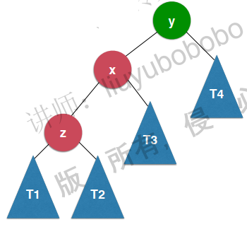
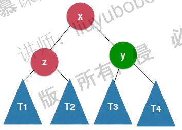
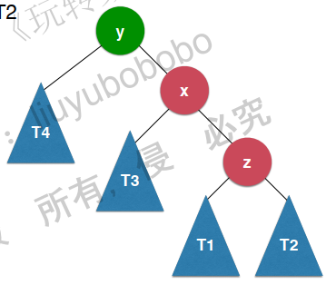
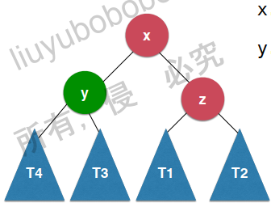
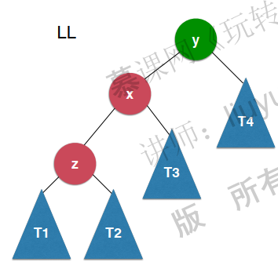
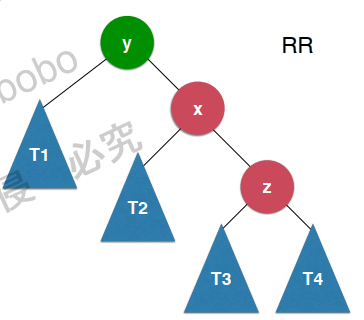
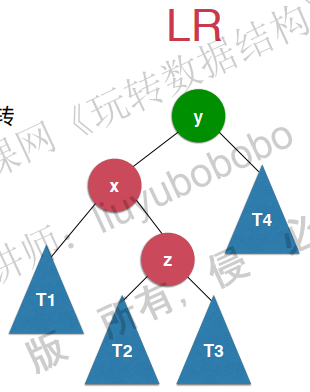
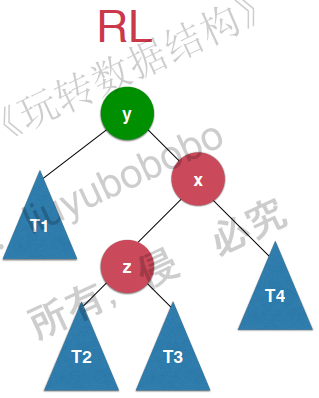

[TOC]

# AVL 平衡二叉树

## 树的深度

对于每个节点来说, 其存在的层数就是以此节点来表示的二叉树的深度.

二叉树的深度定义如下: 

	- 只有一个节点的树, 他的深度为1
	- 一个节点的深度等于它的左孩子深度;和右孩子深度的最大值加1

## 平衡因子

每一个平衡树都会维护一个平衡因子, 使用此平衡因子可以检测此树是否为平衡树.

平衡树听起来很高大上, 其实就是左子树和右子树的深度查. 根据平衡树的定义, 一棵平衡的树, 它的左子树和右子树深度差不会超过1, 即如果一棵树的平衡因子大于1, 那么此树不是一棵平衡树.

## 如何将二叉搜索树改进成AVL

### 什么时候改进

对于二叉搜索树来说, 他的搜索复杂度是基于树的深度的, 树的深度越大, 二叉搜索树的查询效率越低. AVL改进了二叉树, 将二叉树的深度降低. 那么, 什么时候维护二叉树的平巷呢? 怎样才能让二叉搜索树变成AVL呢?

对于二叉树来说, 增加树的深度的操作, 无非是再添加一个节点的时候. 所以, 在增加一个节点的时候, 我们可以进行二叉树的维护, 让它始终是平衡的, 当然, 增加有了, 在删除的时候, 也要维护一下, 因为删除的时候树的深度也可能会降低.

### 怎么维护

AVL的平衡维护是基于树的旋转

#### 右旋转

假如存在如下一棵树



可以看到, 此树是不平巷的, 旋转之后为这样



细想一下, 此树的二分搜索树的性质没有改变, 同时, 它变得平衡了.

#### 左旋转

与右旋转相对, 左旋转是这样的





### 树的不平衡情况

一棵树如果不平衡了, 无非一下四种情况

#### LL

对y执行右旋转操作, 即可将此树变成平衡树



#### RR

对y进行左旋转, 即可让此树变成平衡树



#### LR

先对x进行左旋转, 可发现, 此树变成了LL的情况

再对y进行右旋转, 即可将此树变成平衡树



#### RL

先对x进行右旋转, 再对y进行左旋转



## 代码实现

```java
package pers.jssd.avl;

import java.util.ArrayList;

/**
 * Map的平衡二叉树实现, 即AVL实现. 对于一个avl来说, 每个节点都会有一个表示节点在书中高度的记录值. 如果一棵
 * 二叉树的左子树和右子树的高度差大于1, 那么此树是不平衡的.
 *
 * @author jssdjing@gmail.com
 */
public class AVLMap<K extends Comparable<K>, V> implements Map<K, V> {

    private class Node {
        /**
         * 存储Key
         */
        K key;

        /**
         * 存储value
         */
        V value;

        /**
         * 左孩子
         */
        Node left;
        /**
         * 右孩子
         */
        Node right;

        // 记录此节点在数中的高度
        int height;

        Node(K key, V value, Node left, Node right) {
            this.key = key;
            this.value = value;
            this.left = left;
            this.right = right;

            // 高度默认为1
            height = 1;
        }
    }

    /**
     * 根节点
     */
    private Node root;
    /**
     * map的大小
     */
    private int size;

    @Override
    public boolean isEmpty() {
        return size == 0;
    }

    @Override
    public int getSize() {
        return size;
    }

    /**
     * 取得此二叉树的高度, 如果此二叉树是一棵空树, 返回0
     *
     * @return 返回二叉树的高度
     */
    private int getHeight(Node node) {
        if (node == null) {
            return 0;
        }
        return node.height;
    }

    /**
     * 取得相应节点的平衡因子
     *
     * @param node 需要取得平衡因子的节点
     * @return 返回此二叉树的平衡因子
     */
    private int getBalanceFactor(Node node) {
        if (node == null) {
            return 0;
        }
        return (getHeight(node.left) - getHeight(node.right));
    }

    // 验证是否为二叉搜索树
    public boolean isBST() {
        ArrayList<K> list = new ArrayList<>();
        inOrder(root, list);

        for (int i = 0; i < list.size() - 1; i++) {
            if (list.get(i).compareTo(list.get(i + 1)) > 0) {
                return false;
            }
        }
        return true;
    }

    private void inOrder(Node node, ArrayList<K> list) {
        if (node == null) {
            return;
        }

        if (node.left != null) {
            inOrder(node.left, list);
        }
        list.add(node.key);
        if (node.right != null) {
            inOrder(node.right, list);
        }
    }

    // 验证是否为平衡树
    public boolean isBalance() {
        return isBalance(root);
    }

    private boolean isBalance(Node node) {
        if (node == null) {
            return true;
        }

        int balanceFactor = getBalanceFactor(node);
        if (Math.abs(balanceFactor) > 1) {
            return false;
        }
        return isBalance(node.left) && isBalance(node.right);
    }

    @Override
    public void add(K key, V value) {
        root = add(root, key, value);
    }

    /**
     * 右旋转方法
     * <pre>
     *      对节点y进行向右旋转操作，返回旋转后新的根节点x
     *             y                              x
     *            / \                           /   \
     *           x   T4     向右旋转 (y)        z     y
     *          / \       - - - - - - - ->    / \   / \
     *         z   T3                       T1  T2 T3 T4
     *        / \
     *      T1   T2
     * </pre>
     *
     * @param y 要旋转的节点
     * @return 返回旋转之后的树
     */
    private Node rightRotate(Node y) {
        Node x = y.left;
        Node t3 = x.right;
        // 旋转
        x.right = y;
        y.left = t3;

        // 更新height
        y.height = Math.max(getHeight(y.left), getHeight(y.right)) + 1;
        x.height = Math.max(getHeight(x.left), getHeight(x.right)) + 1;

        return x;
    }

    /**
     * 左旋转方法
     * <pre>
     *      对节点y进行向左旋转操作，返回旋转后新的根节点x
     *             y                              x
     *            / \                           /   \
     *           T4  x     向右旋转 (y)         y     z
     *              / \  - - - - - - - ->    / \    / \
     *             T3  z                    T4 T3  T1 T2
     *                / \
     *               T1 T2
     * </pre>
     *
     * @param y 要旋转的节点
     * @return 返回旋转之后的树
     */
    private Node leftRotate(Node y) {
        Node x = y.right;
        Node t3 = x.left;

        // 旋转
        x.left = y;
        y.right = t3;

        // 维护高度
        y.height = Math.max(getHeight(y.left), getHeight(y.right)) + 1;
        x.height = Math.max(getHeight(x.left), getHeight(x.right)) + 1;

        return x;
    }

    /**
     * 二分搜索树的递归实现
     *
     * @param node  二分搜索树添加的根节点
     * @param key   添加的key
     * @param value 添加的value
     * @return Node 返回添加节点之后的二分搜索树
     */
    private Node add(Node node, K key, V value) {
        if (node == null) {
            size++;
            return new Node(key, value, null, null);
        }
        if (key.compareTo(node.key) < 0) {
            node.left = add(node.left, key, value);
        } else if (key.compareTo(node.key) > 0) {
            node.right = add(node.right, key, value);
        }

        // 维护一下node在树中的的高度
        node.height = Math.max(getHeight(node.right), getHeight(node.left)) + 1;

        // 维护二叉树的平衡
        int balanceFactor = getBalanceFactor(node);

        // LL情况, 进行右旋转
        if (balanceFactor > 1 && getBalanceFactor(node.left) >= 0) {
            return rightRotate(node);
        }

        // RR情况
        if (balanceFactor < -1 && getBalanceFactor(node.right) <= 0) {
            return leftRotate(node);
        }

        // LR情况, 需要先将node的左节点进行左旋转 再对node进行右旋转才行
        if (balanceFactor > 1 && getBalanceFactor(node.left) < 0) {
            node.left = leftRotate(node.left);
            return rightRotate(node);
        }

        // RL情况, 需要先将node的右节点进行左旋转, 再对node进行右旋转才行
        if (balanceFactor < -1 && getBalanceFactor(node.right) > 0) {
            node.right = rightRotate(node.right);
            return leftRotate(node);
        }

        return node;
    }

    /**
     * 查看map中是否包含某个键
     *
     * @param key 查看是否重复的键
     * @return true则包含, false则不包含
     */
    @Override
    public boolean contains(K key) {
        return contains(root, key);
    }

    /**
     * 包含某个键的递归处理
     *
     * @param node 二分搜索树的根节点
     * @param key  查看的键
     * @return true则包含此键, false则不包含
     */
    private boolean contains(Node node, K key) {

        if (node == null) {
            return false;
        }

        if (node.key.compareTo(key) < 0) {
            return contains(node.left, key);
        } else if (node.key.compareTo(key) > 0) {
            return contains(node.right, key);
        } else {
            return true;
        }
    }

    @Override
    public V remove(K key) {
        V value = get(key);
        root = remove(root, key);

        return value;
    }

    /**
     * 取得最小值
     *
     * @return E 返回最小值
     */
    public K minimum() {
        if (size == 0) {
            throw new IllegalArgumentException("the bst is empty");
        }
        return minimum(root).key;
    }

    /**
     * 取得最小值的递归处理
     *
     * @param node 取得最小值的根节点
     * @return 返回取得的最小值
     */
    private Node minimum(Node node) {
        if (node.left == null) {
            return node;
        }
        return minimum(node.left);
    }

    /**
     * 取得最大值
     *
     * @return E 返回最大值
     */
    public K maximum() {
        if (root == null) {
            throw new IllegalArgumentException("the bst is empty");
        }
        return maximum(root).key;
    }

    /**
     * 取得最大值的递归处理
     *
     * @param node 取得最大值的根节点
     * @return 返回取得的最大值
     */
    private Node maximum(Node node) {
        if (node.right == null) {
            return node;
        }
        return maximum(node.right);
    }

    /**
     * 删除最小值, 并返回删除的元素
     *
     * @return 删除的最小值元素
     */
    public K removeMin() {
        K ref = minimum();
        root = removeMin(root);
        size--;
        return ref;
    }

    /**
     * 删除最小节点的递归处理
     *
     * @param node 根节点
     * @return 返回删除最小节点之后的根节点
     */
    private Node removeMin(Node node) {
        if (node.left == null) {
            Node rightNode = node.right;
            node.right = null;
            return rightNode;
        }
        node.left = removeMin(node.left);
        return node;
    }

    /**
     * 删除最大值, 并返回删除的元素
     *
     * @return 删除的最大值元素
     */
    public K removeMax() {
        K ref = maximum();
        root = removeMax(root);
        size--;
        return ref;
    }

    /**
     * 删除最大节点的递归处理
     *
     * @param node 根节点
     * @return 返回删除最大节点之后的根节点
     */
    private Node removeMax(Node node) {
        if (node.right == null) {
            Node leftNode = node.left;
            node.left = null;
            return leftNode;
        }
        node.right = removeMax(node.right);
        return node;
    }

    /**
     * 删除指定节点的递归处理
     *
     * @param node 要删除的根节点
     * @param key  要删除的元素的键
     * @return 返回删除元素之后的节点
     */
    private Node remove(Node node, K key) {
        if (node == null) {
            return null;
        }
        if (key.compareTo(node.key) < 0) {
            node.left = remove(node.left, key);
        } else if (key.compareTo(node.key) > 0) {
            node.right = remove(node.right, key);
        } else {
            if (node.left == null) {
                Node rightNode = node.right;
                node.right = null;
                size--;
                node = rightNode;
            } else if (node.right == null) {
                Node leftNode = node.left;
                node.left = null;
                size--;
                node = leftNode;
            } else {
                Node accessor = minimum(node.right);
                accessor.right = remove(node.right, accessor.key);
                accessor.left = node.left;
                node.left = node.right = null;
                node = accessor;
            }
        }

        // 维护node的平衡性
        int balanceFactor = getBalanceFactor(node);

        if (Math.abs(balanceFactor) < 2) {
            return node;
        }

        // LL情况, 进行右旋转
        if (balanceFactor > 1 && getBalanceFactor(node.left) >= 0) {
            return rightRotate(node);
        }

        // RR情况
        if (balanceFactor < -1 && getBalanceFactor(node.right) <= 0) {
            return leftRotate(node);
        }

        // LR情况, 需要先将node的左节点进行左旋转 再对node进行右旋转才行
        if (balanceFactor > 1 && getBalanceFactor(node.left) < 0) {
            node.left = leftRotate(node.left);
            return rightRotate(node);
        }

        // RL情况, 需要先将node的右节点进行左旋转, 再对node进行右旋转才行
        if (balanceFactor < -1 && getBalanceFactor(node.right) > 0) {
            node.right = rightRotate(node.right);
            return leftRotate(node);
        }

        return node;
    }

    @Override
    public void set(K key, V value) {
        Node node = getNode(root, key);
        if (node != null) {
            node.value = value;
        }
    }

    @Override
    public V get(K key) {
        Node node = getNode(root, key);
        return null == node ? null : node.value;
    }

    private Node getNode(Node node, K key) {
        if (node == null) {
            return null;
        }
        if (key.compareTo(node.key) < 0) {
            return getNode(node.left, key);
        } else if (key.compareTo(node.key) > 0) {
            return getNode(node.right, key);
        } else {
            return node;
        }
    }
}
```

